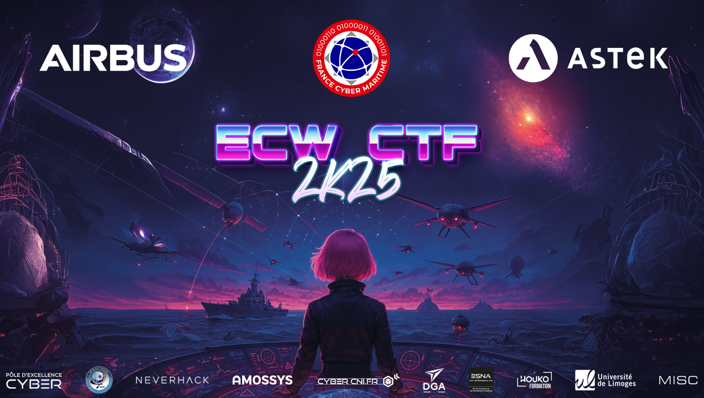

# ECW 2025 CTF Write-Ups

**[Crypto]**
- SecureVault_II : Brent Cycle detection, AES-GCM nonce reuse
- Rsa_Rsa_Rsa : RSA, Euler's Theorem
- RSAd : RSA, Euler's Theorem

**[Forensics]**
- SecureVault_I : Memory dump analysis, Windows
- Alice In The Ransom Land: Network Traffic analysis, Windows

