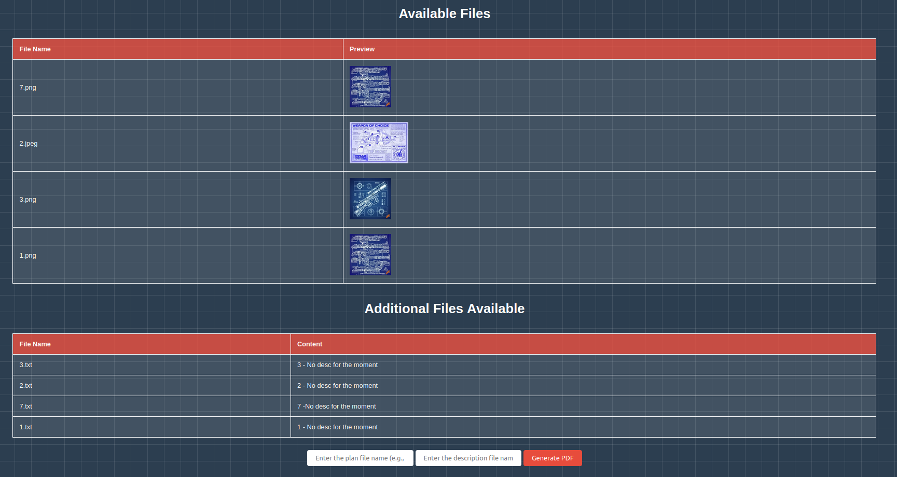
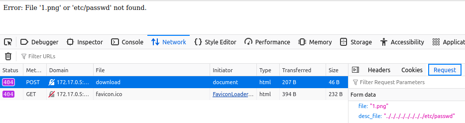
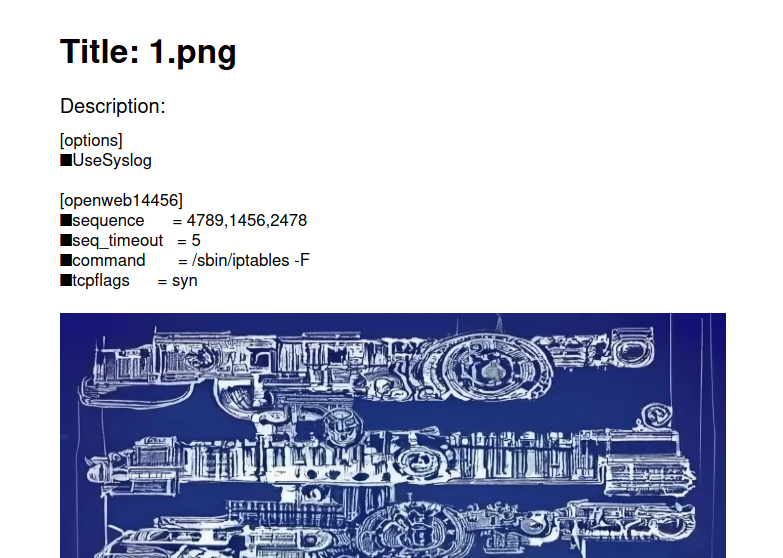
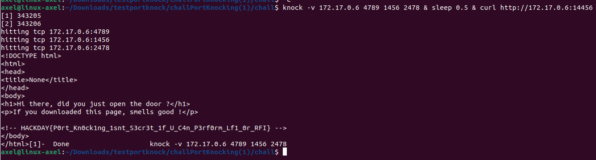

# Open The Door 
<p align="justify"> In this challenge the goal was to open port 14456 on the server machine, which was initially closed. To do so, disclose of /etc/knockd.conf was necessary to reveal the port knocking sequence and open the port for a few seconds. Hence the goal here was to perform an LFI attack, allowing load of knockd configuration files. </p>

<p align="justify">Looking at the website deployed, it appeared that it was possible to create/generate PDF based on 1 image file, and 1 text file. Actually injecting image field was useless insofar as an image was expected and pushing an other file type to PDF generation was triggering an internal server error. </p>

<p align="center">

</p>

<p align="justify">Trying to load /etc/passwd file led to a server error, which showed that the input was submitted to clearing function which was escaping specific chars : </p>

<p align="center">

</p>

<p align="justify">Nonetheless by doubling the dot and the slash it was possible to bypass filter. Actually it looked like filter was escaping the whole motif ../ at PDF generation, but not the . and the / separated. With the payload below it was possible to download a PDF containing knockd configuration file located at /etc/knockd.conf : </p>

````text
....//....//....//....//....//....//....//....//etc/knockd.conf
````

<p align="center">

</p>

<p align="justify">Loading knockd configuration file revealed the sequence required to open the targeted port. Finally using the payload below, it triggered port openning and printed the flag once the HTML page downloaded : </p>

````bash
knock -v 172.17.0.6 4789 1456 2478 & sleep 0.5 & curl http://172.17.0.6:14456
````

<p align="center">

</p>

Flag : _HACKDAY{P0rt_Kn0ck1ng_1snt_S3cr3t_1f_U_C4n_P3rf0rm_Lf1_0r_RFI}_ <a href="https://github.com/Ax8457/HACKDAY/tree/main/Hackday2025/Qualif">Source and Docker files available here</a>
