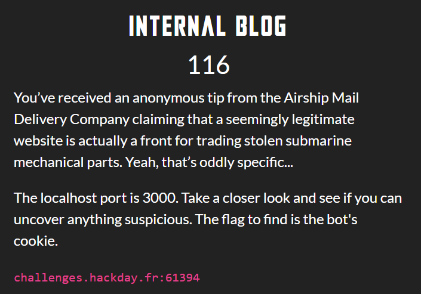
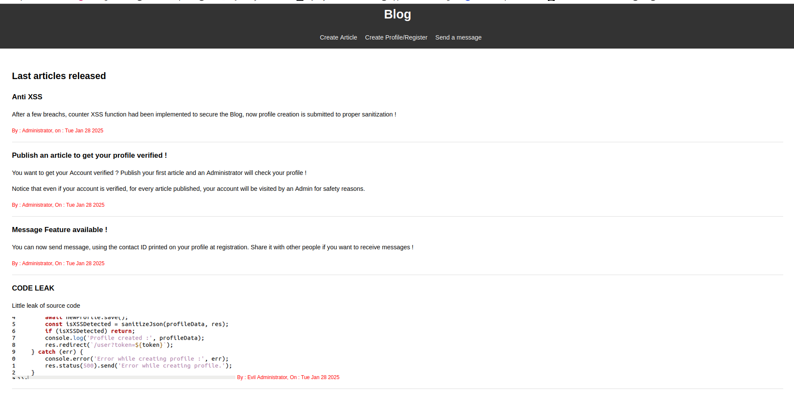
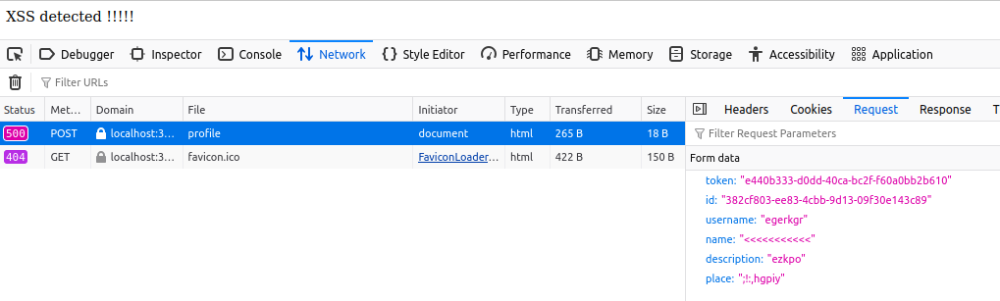

# The Internal Blog 
<p align="justify">The goal of this Web challenge was to find a way to steal bot's cookies. To do so, a blog website was deployed and vulnerable to XSS attack. No specific informations were provided in the description of the challenge, no source files. Even if the source code wasn't provided this WU will include source snippets for more precision in explanations </p>

<p align="center"> 
  
</p>

<p align="justify">The first step was the recon stage. Indeed, before perform any XSS and trick the bot, the field vulnerable had to be found. Actually the blog site offered many possible fields : </p>

- **Registration route** : Profiles were created with token here, contact ID, Name, Username, Location, Description
- **Article route** : Article were released here. To publish account token, content andtitle were required
- **Message route** : Messages were sent here. To send message contact ID and content were required

<p align="justify">Hence it seemed that many fields could have potentientially been exploited to perform XSS. Nonetheless given the hints printed on the home page, it reduced the scope to the profile : </p>

<p align="center"> 
  
</p>

<p align="justify">Indeed, regarding articles released by Administrator, the bot was visiting the profile only. So it meant the payload should have been stored on user profile. At this step, the goal was to identify the target field. Hence the first thing to do was to inject simple javascript tag in each field at registration to see how they were reflected once the profile created. Injecting the profile creation, it appeared that the profile creation was  submitted to sanitize fonction, to counter XSS injection : </p>

<p align="center"> 
  
</p>

````javascript
await newProfile.save();

        const isXSSDetected = sanitizeJson(profileData, res);
        if (isXSSDetected) return;

        console.log('Profile created :', profileData);
        res.redirect(`/user?token=${token}`);
    } catch (err) {
        console.error('Error while creating profile :', err);
        res.status(500).send('Error while creating profile.');
    }
````
