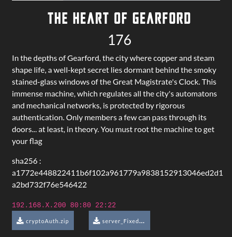
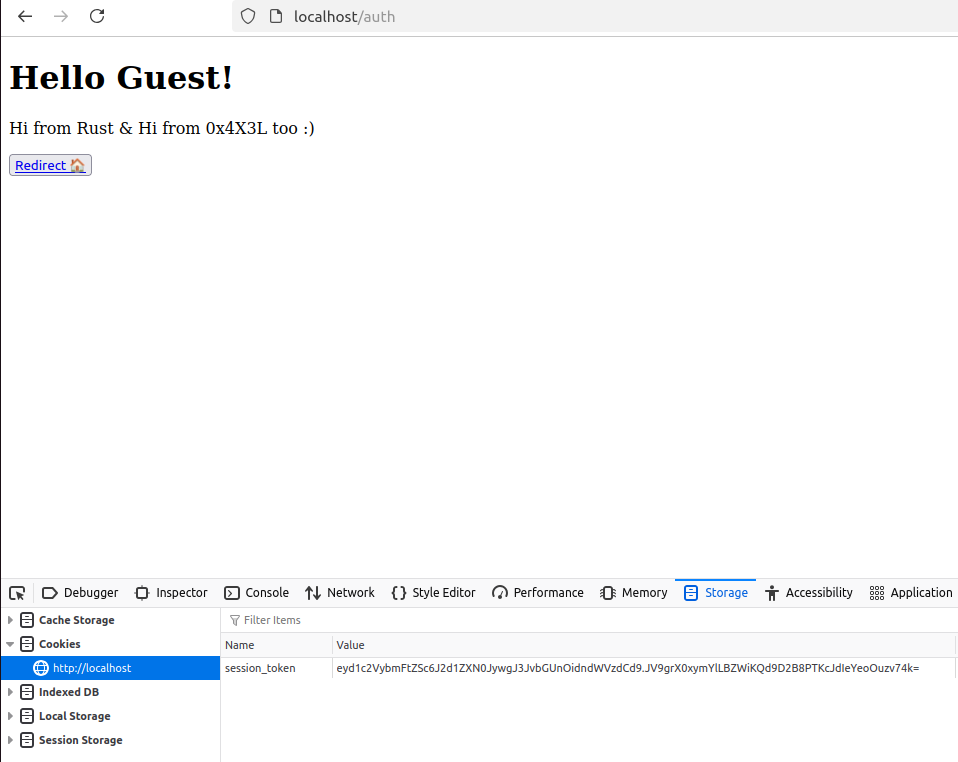
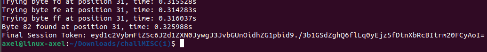

# The Hearth of the Gearford Write-Up

<p align="justify">This challenge was a MISC one, in which the server machine must have been rooted to read the flag. To do so authentication mecanism source code was provided and is attached in this repo under cryptoAuth/... . The challenge was made of 3 parts: </p>

- Step 1 : Get an admin access (token signed with HMAC), attacking the authentication mecanism
- Step 2 : Get a RCE (and a webshell) on the admin panel using log poisoning method
- Step 3 : Get a revshell and perform a privesc to read the flag located in /root/flag.txt

<p align="center">

</p>

<h2> Step 1 : Time based attack on rust server </h2>

<p align="justify">Once on the page of the challenge, a message was redirecting on the /auth route so that the client could have received his token authentication computed and signed by a rust authentication server. By default all clients were authenticated as Guest as shown in the snippet below : </p>

<p align="center">

</p>

<p align="justify">Actually, those tokens were signed with HMAC authentication algorithm. As show in the snipper below, token was composed of two parts; the first one which is the plaintext payload containing username and role, and the second one which was the authentication tag computed for the plaintext payload using the following function : </p>

````rust
pub fn receive_token(key: &[u8], plaintext_token: &[u8], authentication_tag: &[u8]) -> bool {
    let mut mac = Hmac::<Sha256>::new(key.into()); //format conversion
    mac.update(plaintext_token);
    let computed_tag = mac.finalize().into_bytes();
    verify(&computed_tag, authentication_tag)  
}
````
<p align="justify"> Looking at the rust files, it appeared that the actual verify() function of rust HMAC crypto libs had been overwritten by the following function, which was vulnerable to timing attack because of token verification which wasn't made in constant time. Indeed each token bytes of the token authentication tag were compared byte to byte and as early as a matching byte was detected, the function was entering sleeping mod for 10 ms, which was actually very helpful to realize timing attack : </p>
    
````rust
pub fn verify(expected: &[u8], received: &[u8]) -> bool {
    if expected.len() != received.len() {
        return false;
    }
    for (a, b) in expected.iter().zip(received.iter()) {
        if a != b {
            return false;
        }
        println!("Byte is valid.");
        thread::sleep(time::Duration::from_millis(10)); //longer check to make bruteforce attacks harder
    }
    true
}
````
<p align="justify"> Hence, in order to retreive a valid token, authentication tag must have been retreived using time reponse when submitting a token to /auth and triggering verify() function. A python script is avalaible in this repository under HMAC_timeattack.py, to perfom the exploit localy. Unfortunately because of too much latency over VLANs, this part of the challenge has been neutralized and the admin access granted for everybody, since it was ti hard to retreive all authentication bytes using time responses from the server. </p>

<p align="justify"> Running the server localy (it means with no latency in the response) it was possible to retreive the token, and then access the admin panel. Below is an example of token for 'guest' username with admin role you could have retreived with a local time attack : </p>

<p align="center">

</p>

<h2> Step 2 : RCE & Webshell on the admin panel using log poisoning exploit</h2>

<p align="justify">Once logged on in the admin panel using the admin token, it seemed that panel was kind of administrative panel coded in php, offering various features including : </p>

- Overview of auth.log file
- Load of other log file such as access log
- Text field and notes upload
- Log line visualization
- Enumeration of ssh users whom failed to log in on the server machine

<p align="justify">For this step and this part of the chall, no source code was provided and it was kind of blackbox part. Nontheless in the load feature, an LFI was easily exploitable and allowed to extract php source code as shown the snippet below : </p>

````php
// load file feature
        function load_external_log($logfile = '') {
            return isset($logfile) && !empty($logfile) ? include($logfile) : "No file specified.";
        }
````
<p align="justify">At this point it was interesting because this weakness in the php (which wasn't sanitizing the input) also allowed to use php wrappers, for instance base64 encode/decoe which revealed useful for the exploit. Below is a POC with /etc/passwd: </p>

<p align="justify">To perform a log poisoning as expected to get a webshell, there were 2 possibilities : poison access.log file and load it and poison auth
