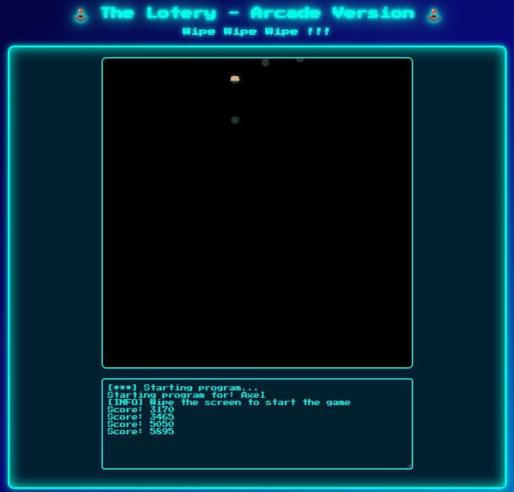
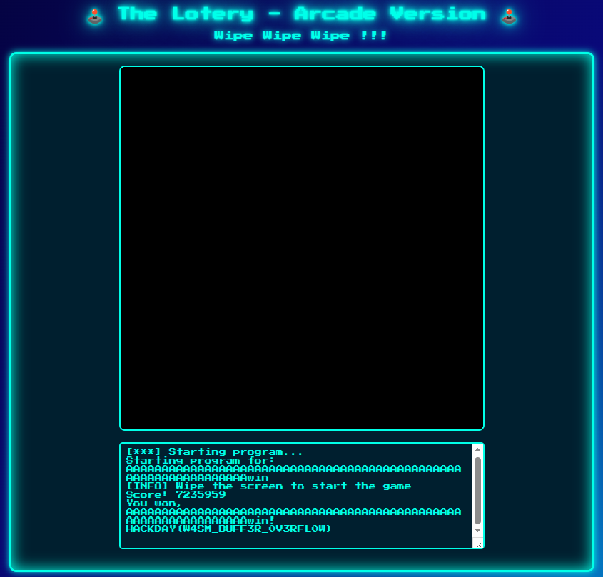

# The Lotery Challenge WU
<p align="center"></p>
<p align="justify">In this challenge, a webgame was deployed, and the idea was to find a way to solve this game and win. The game was a kind of scratch game and for each pixel scratched, score increased.</p>
  
## Solv1 : Reverse WASM binary to identify a buffer overflow

<p align="justify">The first step was to understand how the game worked and how to hit the expected score to get the flag. To do so, the WASM binary must be decompiled to be analyzed. This
<a href="https://github.com/nneonneo/ghidra-wasm-plugin">plugin</a> once loaded and installed on ghidra disassembles the WASM binary. </p>

<p align="center"></p>

<p align="justify">The game first asks users to enter a username before the game starts. One it's done the program launches the game and prints a few elements in the console. Hence to find the main function of 
the program, those strings could potentialy be used. Searching for strings, the following error message can be found:</p>

<div align="center">
  
| Adresse | Fonction | Preview |
| --- | --- | --- |
| `ram:80004154` | `unnamed_function_241` | "Failed to open flag.txt" |

</div>

<p align="justify">Looking at this function (241), a lot of elements about the way the score is computed and the winning condition can be found. First, the if statement below shows the score required to win and also show where the flag is located and how it is printed if the player wins:  </p>
  
````c
      ***

      if ((player.score == 0x6e6977) && (DAT_ram_0015d0f5 == '\0')) {
        local_150[0] = &player.username;
        print_str(s_You_won,_%s!_ram_00005c57,local_150);
        flag = open_file(s_Failed_to_open_flag.txt_ram_00000a58 + 0xf,s_glClear_ram_00001f24 + 6);
        uVar4 = DAT_ram_0015af58;
        uVar3 = DAT_ram_0015af18;

      ***
````
<p align="justify">Hence, if the player's score hits 0x6e6977 (7235959) the party is over and the player wins. Now let's understand how the socre is computed and how the binary could be 
exploited to cheat and win. It looks like each pixel is worth 5 points; a circle with a radius of 10 is calculated around the cursor's position to reveal pixels and update the score accordingly. Besided, the frame seems to be of height 800 and width 800 too, meaning the max score a user can expects hit is 3200000 (far less then 7235959) and that the game can't actually be solved.</p>

````c
    else if (local_138[0] == 0x400) {
      cursor_y = local_124 + local_120 * 800;
      cursor_x = cursor_y / 800;
      cursor_y = cursor_y % 800;
      x = cursor_x - 10;
      do {
        if (x < 800) {
          y = cursor_y - 10;
          do {
            if ((y < 800) &&
               ((y - cursor_y) * (y - cursor_y) + (x - cursor_x) * (x - cursor_x) < 0x65)) {
              iVar11 = (y + x * 800) * 4;
              piVar10 = (int *)(flag + iVar11);
              iVar11 = *(int *)(iVar11 + iVar7);
              if (*piVar10 != iVar11) {
                *piVar10 = iVar11;
                DAT_ram_0015d10c = DAT_ram_0015d10c + 1;
                player.score = player.score + 5;
              }
            }
            bVar2 = y != cursor_y + 10U;
            y = y + 1;
          } while (bVar2);
        }
        bVar2 = x != cursor_x + 10U;
        x = x + 1;
      } while (bVar2);
    }
````
<p align="justify">Nonetheless, looking at the way the username and the score are handled in memory, it seems that the score variable and the username are contiguous. Furthermore, the buffer allocated to the username is static rather than dynamic, which could eventually lead to a buffer overflow vulnerability. Indeed, the username inputed by the user is very likely to be unsafley copeid into a buffer os size 64.</p>
  
````c
                             player.username                                 XREF[1]:     main:80004226(*)  
    ram:0015d110 00              ??         00h
    ram:0015d111 00              ??         00h
    ram:0015d112 00              ??         00h

********* (58)

    ram:0015d14d 00              ??         00h
    ram:0015d14e 00              ??         00h
    ram:0015d14f 00              ??         00h
                             player.score                                    XREF[5]:     unnamed_function_241:80004053(R), 
                                                                                          unnamed_function_241:80004059(W), 
                                                                                          unnamed_function_241:80004093(R), 
                                                                                          unnamed_function_241:800040c0(R), 
                                                                                          main:80004218(W)  
    ram:0015d150 00 00 00 00     undefined4 00000000h
````
<p align="justify">The username and the score are actually very likely to be handled in a c structure, like the one below. It means that if the user enter a name longer than 64 bytes, he can 
overwritte his score: </p>
  
````c
typedef struct {
    char username[64];
    int score;
} Player;
````

<p align="justify">Considering that 0x6e6977 is 'niw' in ascii and that the payload must follow little endian format, the following payload must override the score with the expected one to flag:

````bash
python3 -c "print(64* 'A' + 'win')"

## AAAAAAAAAAAAAAAAAAAAAAAAAAAAAAAAAAAAAAAAAAAAAAAAAAAAAAAAAAAAAAAAwin
````

<p align="center"></p>

## Solv2: Exploit emscripten compilation file structure

<p align="justify">Looking at the index.html, it's clear that the project was compiled with emscripten. Considering the following structure of project, the flag must be loaded in virtual memory, namely in index.data generated by emscripten: </p>
  
````txt
WASM_PROJECT/
├── index.html
├── index.js
├── index.wasm
└── index.data
````
<p align="justify">Hence, if the index.data can be downloaded, the flag can be very easily retreived: </p>

````bash
wget https://4ey7oup3c2.hackday.fr/index.data && strings index.data | grep 'HACKDAY{'

## ***
##HACKDAY{W4SM_BUFF3R_0V3RFL0W}
````
<p align="justify">Another solution was to load it directly from the Javascript browser console with the following payload: </p>

````javascript
var f = FS.readFile('./flag.txt', {encoding: 'utf8'});
console.log(f)
````
<p align="center"></p>


## Flag

_FLAG: HACKDAY{W4SM_BUFF3R_0V3RFL0W}_
