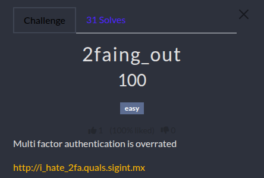
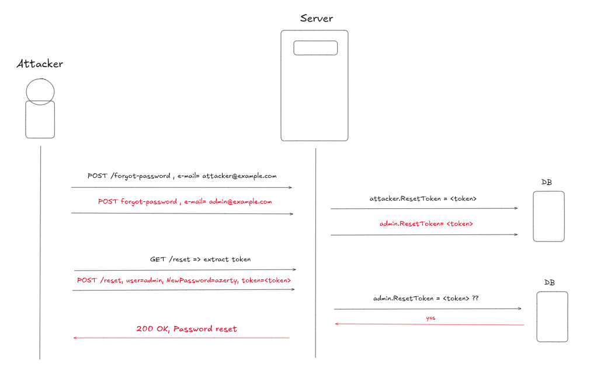
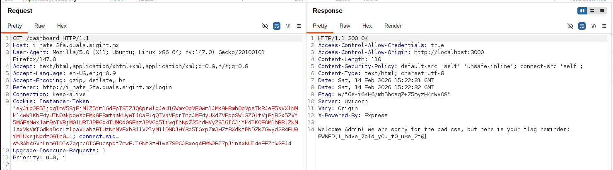

# 2Faing Out Challenge WU

<p align="center"></p>

<p align="justify">In the challenge the goal was to log in as admin user to retreive the flag. To do so, the solution was to reset the admin password and access his account. The source code was provided as well as simple user account: </p>

````bash
username: attacker
password: attacker
````

## Source code analysis

<p align="justify">The application deployed implements a simple reset password feature based on a token. Once logged in user can click on password reset and then: </p>

- A token is generated and written into db associated entry of the user (based on the email provided)
- The user is redirected on a reset link and can enter a new password
- In the reset form submitted, if the token matches the one written in DB, the password is updated in DB

<p align="justify">According the source code, below is the way user profiles are handled in DB: </p>

````javascript
    {
        username: 'attacker',
        password: 'attacker',
        email: 'attacker@example.com',
        resetToken: null
    }
````

<p align="justify">And this is the way the server handles forgot password POST requests. When the user POST-requests this route, a token is generated and written in his DB profile (based on the email address in the input). Then the user is redirected on /reset route. Because there is no sanitization on the email provided, the attacker user can perfectly trigger a password reset process for admin@example.com: </p>

````javascript
app.post('/forgot-password', (req, res) => {
    const { email } = req.body;
    const user = users.find(u => u.email === email);

    if (!user) {
        return res.status(401).send("You must be logged in.");
    }

    const token = crypto.createHash('sha256')
        .update((Date.now() >> 3).toString() + SECRET_KEY)
        .digest('hex');

    user.resetToken = token;

    res.send(`Token generated! <a href="/reset">Click here to reset password</a>`);
});
````
<p align="justify">After the token was successfuly generated, the user can access reset page and submit his new password thanks to a autocompleted form containing his username, his token and the NewPassord he entered. If the username and the token submitted don't match DB entry associated to user, the process fails: </p>

````javascript
app.post('/reset', (req, res) => {
    const { username, newPassword, resetToken} = req.body;

    const currentUser = users.find(u => u.username === username && u.resetToken === resetToken);

    if (currentUser) {
        console.log(`Resetting ${currentUser.username} password`);
        currentUser.password = newPassword;
        currentUser.resetToken = null;
        return res.redirect('/dashboard');
    }

    res.status(403).send("Error updating password: No valid reset session found.");
});
````

## The exploit: Race condition to reset admin password

<p align="justify">To solve the challenge the idea is to trigger admin rester password process and to find a way to get the token to successfuly reset his password and impersonate him at login. The weakness actually lies in the fact that token are generated and differentiated based on time shifting :</p> 

````javascript
    const token = crypto.createHash('sha256')
        .update((Date.now() >> 3).toString() + SECRET_KEY)
        .digest('hex');
````

<p align="justify">Actually Date.now() return milliseconds and the 3 bits right shift divides by $$2^3 = 8 ms$$, which means thaht token change every 8ms (because the numerator increases by 1 every 1 ms, as long as the numerator does not increase by 8, the quotient remains the same). This flaw lets 8 ms to an attacker to generate same token for both admin and standard user. The steps of the exploit are summarized on the chart below:</p>

- The attacker send 2 closed (8ms window) requests to reset password for attacker@example.com and admin@example.com
- The server writes ResetToken in DB for both admin and attacker (same token)
- The legitimate attacker user access the /reset page and can retreived the token in the form
- The attacker uses the token to reset admin password

<p align="center"></p>

## Flag:

<p align="justify">The script attached to this repository implements race condition and prints the token associated. Once the token is retreived, the following cmldine reset the password of the admin using the token: </p>

````bash
curl -X POST "http://i_hate_2fa.quals.sigint.mx/reset" \
     -H "Content-Type: application/json" \
     -b "Instancer-Token=token_instance" \
     -b "connect.sid=sid_token" \
     -d '{
       "username": "admin@example.com",
       "newPassword": "azerty",
       "resetToken": "<token>"
     }'
````

<p align="justify">Finally accessing the /dashboard once logged in as admin displays the flag: </p>

<p align="center"></p>

FLAG: _PWNED{_!_h4ve_7o1d_y0u_t0_u$e_2f@}_
