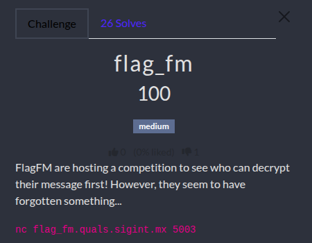

# Flag FM challenge WU

<p align="center"></p>
<p align="justify">In this challenge the idea was to exploit a misconfiguration in a RSA orcale and guess the flag message. The source code was provided and is attached this repository.</p>

## Source code analysis and RSA cryptosystem

<p align="justify">Looking at source code it seems that RSA parameter $e$ is initialized once and are persistent along the connection. Also primes used are stored in a dynamic list, deterring the use of RSA common primes attack.As a matter of fact, $e$ is generated using 9 random bytes:</p>

````python
class FlagFMChallenge():
    def __init__(self):
        self.e = getPrime(9)
        self.msg = get_random_bytes(64)
        self.primes = []

    def encrypt_flag(self):
        while True:
            p = getPrime(1024)
            q = getPrime(1024)
            if p == q or p in self.primes or q in self.primes:
                continue
            phi = (p-1) * (q-1)
            if GCD(self.e, phi) == 1:
                M = bytes_to_long(self.msg)
                self.primes.extend([p, q])
                N = p * q
                C = pow(M, self.e, N)
                return (C, N)
````

<p align="justify">The handler function shows that the user can encrypt up to 1337 messages with the same $e$, which actually represents a huge security weakness because an attacker could use Chinese remainder theorem to retreive $$M^e$$ and find the squarred root to guess the message encrypted.</p>
 
````python
def handle_client(conn):
    chall = FlagFMChallenge()
    conn.sendall(b"This is FlagFM! Decrypt our message to win our prize!\n")
    conn.sendall(b"You can request to encrypt the message as much as you like!\n")

    for _ in range(1337):
        menu = "\n1. Encrypt message\n2. Guess message\n3. Quit\nChoice: "
        conn.sendall(menu.encode())
        
        choice = conn.recv(1024).decode().strip()
        
        if "1" in choice:
            C, N = chall.encrypt_flag()
            conn.sendall(f"C = {C:x}\nN = {N:x}\n".encode())
        elif "2" in choice:
            conn.sendall(b"Guess message in hex: ")
            msg_hex = conn.recv(1024).decode().strip()
            try:
                if chall.msg == bytes.fromhex(msg_hex):
                    conn.sendall(b"Congratulations! Here is your prize: pwnEd{LOCAL_FLAG_TEST}\n")
                else:
                    conn.sendall(b"Incorrect!\n")
            except:
                conn.sendall(b"Invalid hex!\n")
            break
        elif "3" in choice:
            conn.sendall(b"Goodbye!\n")
            break
    conn.close()
````

## Hastad Broadcast attack

<p align="justify">The weakness lies in the fact that an attacker could leverage the reuse of $e$ to retreive the message. This is the logic behind the attack called Hastad Broadcast attack:</p>

- The attacker encrypt multiple messages with the same $e$
- The attacker collects enough information (cipher and modulis)
- The attacker then uses the CRT to retreive $$M^e$$
- The attacker computes the squarred root and retreive the message

<p align="justify">Here the difficulty is that e is unknwon so it must be guessed to retreive $M$. Mathematically speaking below is the explaination of the Hastad Attack:</p>

<p align="justify">Combining these ciphers and moduli yields the following system configuration: </p>

$$\begin{cases}
c_1 \equiv m^e \pmod{N_1} \\
c_2 \equiv m^e \pmod{N_2} \\
\vdots \\
c_k \equiv m^e \pmod{N_k}
\end{cases}$$

<p align="justify">Which can be also written as:</p>

$$\begin{cases}
m^e \equiv c_1 \pmod{N_1} \\
m^e \equiv c_2 \pmod{N_2} \\
\vdots \\
m^e \equiv c_k \pmod{N_k}
\end{cases}$$

<p align="justify">And the Chinese Remainder Theorem can be used to retreive $$M^e$$ and the attacker can find the squarred root to retreive the message: </p>

$$C \equiv m^e \pmod{N_{total}}$$

<p align="justify">With: </p>

$$N_{total} = \prod_{i=1}^{k} N_i = N_1 \cdot N_2 \cdot \dots \cdot N_k$$

## Flag

<p align="justify">Because $e$ is 9-bytes long, it is bounded by 257 and 511. Which means that 511 messages would ideally be needed to recover $M$ and apply the CRT. Nonetheless because of the logic of 'Wrap around' of modular arithmetic (and RSA). Because the message is 64 bytes long and given the minimal length of $e$, the number of message ideally needed can be reduced to:</p>
    
$$i \approx \frac{message length \times minimal e length}{sizeofNorinformationbroughtby one sample}  = \frac{512 \times 257}{2048}  = \mathbf{64,25}$$

````bash
python3 hastad2.py

#[+] Starting Optimized Håstad's Broadcast Attack
#[+] Connected to flag_fm.quals.sigint.mx
#[*] Collecting data and testing roots...
#    [***] Samples: 74/135

#[!] SUCCESS AT 74 SAMPLES!
#[+] Found e = 293

#[FLAG]
#Congratulations! Here is your prize: pwnEd{RSA_15_5up3r_53cur3_ade3f7e3c9dc0973377e8e88f3}
````

FLAG: _pwnEd{RSA_15_5up3r_53cur3_ade3f7e3c9dc0973377e8e88f3}_
