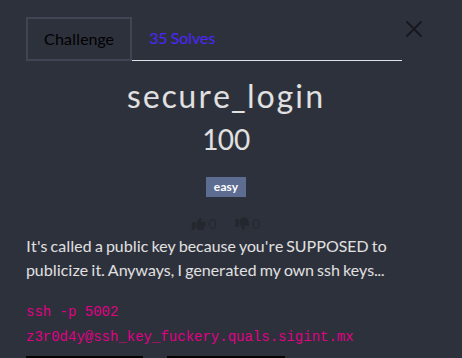

# Secure Login Challenge WU

<p align="center"></p>

<p align="justify">In this challenge the idea was to retreive prime integers $p$ and $q$ used to compute ssh format RSA keys and to use it to connect to a server.To do so, the script used to generate keys (as well as a pubkey) was provided and is attached to this repository :</p>

````python
from Crypto.PublicKey import RSA
from Crypto.Util.number import getPrime
from sympy import nextprime

p = getPrime(2048)
q = nextprime(p)
e = 0x10001

key = RSA.construct((p*q, e))
pem = key.export_key(format="PEM")
with open("public_key.pem", "wb") as f:
    f.write(pem)
````

## The Weakness

<p align>The Weakness in the script used to generate RSA keys lies on the fact that $p$ and $q$ are very closed because $q$ is actually the first prime found after $p$. The <a href="https://en.wikipedia.org/wiki/Fermat's_factorization_method">Fermat's Factorization</a> states that if $p$ and $q$ are closed enough, it's easy to factorize $N$. $N$ can be written as an odd integer: </p>

$$n=a^{2}-b^{2} = (a-b)(a+b)$$

<p align="justify">if $$N = pq$$ then : </p>

$$n = \left(\frac{p+q}{2}\right)^2 - \left(\frac{p-q}{2}\right)^2$$

<p align="justify"> So it means that $$a = \left(\frac{p+q}{2}\right) \approx \sqrt{n} $$ and $$b = \left(\frac{p-q}{2}\right) $$ is very small. So the logic of the Fermat's Fatcorization is to assign to $a$ the value of $$\sqrt{n}$$ and to check if $$b^2 = (a^2 - n)$$ is a perfect squarre. If it's the case then $n$ has been factorized. Once $a$ and $b$ have been retreived (namely $p$ and $q$), Euler's Totient and $d$ can be computed using:</p>

$$\phi(n) = (p - 1)(q - 1)$$
$$e \cdot d \equiv 1 \pmod{\phi(n)}$$

## Flag

<p align="justify"> The first thing to do is to extract $n$ from the pubkey file :</p>

````python3
from Crypto.PublicKey import RSA
print(RSA.import_key(open("public_key.pem").read()).n)
````
<p align="justify">Once $n$ is extracted, the script attached to this repo performs the Fermat's factorization and uses $d$ to craft the SSH private key. Then the following cmdline can be used to bind remote server and get the flag:</p>

````bash
ssh -i id_rsa.key -p 5002 z3r0d4y@ssh_key_fuckery.quals.sigint.mx

#Linux ssh-key-fuckery-deployment-7f74944fd4-6wx4x 6.12.62-talos #1 SMP Mon Dec 15 12:22:39 UTC 2025 x86_64

#The programs included with the Debian GNU/Linux system are free software;
#the exact distribution terms for each program are described in the
#individual files in /usr/share/doc/*/copyright.

"Debian GNU/Linux comes with ABSOLUTELY NO WARRANTY, to the extent
#permitted by applicable law.
#Last login: Sat Feb 14 10:27:54 2026 from 10.0.128.92
#pwnEd{d4mn_55h_k3y5_e6ea220a635e8aa45ecfdb7e91e371ad}Connection to ssh_key_fuckery.quals.sigint.mx closed.
````

FLAG: _pwnEd{d4mn_55h_k3y5_e6ea220a635e8aa45ecfdb7e91e371ad}_
