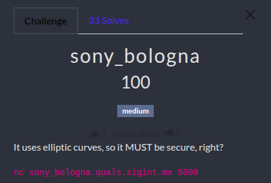

# Sony Bologna Challenge WU

<p align="center"></p>

<p align="justify">In this challenge the idea was to be able to sign a message using elliptic curve signature algorithm ECDSA. The source code was provided and is attached to this repository.</p>

## ECDSA algorithm

$$[n]G = \mathcal{O}$$

$$Q_A = [d_A]G$$

$e = H(m)$

$P(x_1, y_1) = [k]G$

$$r = x_1 \pmod{n}$$

$$s = k^{-1}(z + r \cdot d_A) \pmod{n}$$

## Source code analysis

````python
curve = EllipticCurve(p=0xffffffffffffffffffffffffffffffff000000000000000000000001,
                          a=0xfffffffffffffffffffffffffffffffefffffffffffffffffffffffe,
                          b=0xb4050a850c04b3abf54132565044b0b7d7bfd8ba270b39432355ffb4,
                          G=Point(0xb70e0cbd6bb4bf7f321390b94a03c1d356c21122343280d6115c1d21,
                                   0xbd376388b5f723fb4c22dfe6cd4375a05a07476444d5819985007e34),
                          n=0xffffffffffffffffffffffffffff16a2e0b8f03e13dd29455c5c2a3d,
                          h=0x1)
    dA, k = getRandomInteger(curve.n.bit_length()), getRandomInteger(curve.n.bit_length())
    QA = curve.multiply_point(dA, curve.G)

    r, s1 = sign_message(b"I'm a cat!", dA, curve, k=k)
    r, s2 = sign_message(b"Wuff! Wuff!", dA, curve, k=k)
````
## The attack

$s_1 \equiv k^{-1}(z_1 + r \cdot d_A) \pmod{n}$

$s_2 \equiv k^{-1}(z_2 + r \cdot d_A) \pmod{n}$

$$s_1 - s_2 \equiv k^{-1}(z_1 + r \cdot d_A) - k^{-1}(z_2 + r \cdot d_A) \pmod{n}$$$$s_1 - s_2 \equiv k^{-1}(z_1 - z_2) \pmod{n}$$

$$k \equiv \frac{z_1 - z_2}{s_1 - s_2} \pmod{n}$$

$$s_1 \cdot k \equiv z_1 + r \cdot d_A \pmod{n}$$

$$r \cdot d_A \equiv s_1 \cdot k - z_1 \pmod{n}$$

$$d_A \equiv r^{-1}(s_1 \cdot k - z_1) \pmod{n}$$

## Flag

<p align="justify">The script attached to this repository implements the attack and send the expected message signed using Alice private key retreived.</p>

````bash
python3 ecdsa_exploit.py

#[+] Opening connection to sony_bologna.quals.sigint.mx on port 5000: Done
#[*] Received r and s: r=14468831014805258531945638619826945719876004899592876288452021172713, s1=24365923044581179960849942456501013265368913188341807380080818975757, #s2=2817072497174165802620443728168503651435217382368230041290440823575
#[+] Privkey extracted: dA = 0xe01c14c7b966bd4c6e57a2c358ff680729d288aa8703216eccea879d
#[*] Sending forged signature: r=14468831014805258531945638619826945719876004899592876288452021172713, s=14983007258041658397961331280413012797129933534229001047012713683263
#[+] Receiving all data: Done 
#[*] Closed connection to sony_bologna.quals.sigint.mx port 5000

#pwnEd{m3_wh3n_7h3_ps3_us3s_7h3_s4m3_n0nc3_c62d73caf4a9356bb0205fdc442defa2}
````

FLAG: _pwnEd{m3_wh3n_7h3_ps3_us3s_7h3_s4m3_n0nc3_c62d73caf4a9356bb0205fdc442defa2}_
