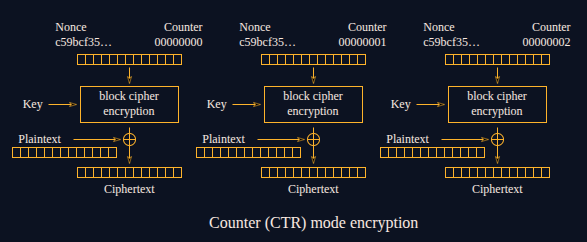

# Crypto - Secure Vault II

<p align="justify">This challenge is linked to <a href="../SecureVault_I/">Secure Vault I</a> challenge which must be completed to solve this one. As a recall, in the first part an encrypton script has been extracted from the memory dump. This script was used to encrypt another PNG file and the goal in this challenge is to break encryption of a PNG by cryptanalyzing the encryption algorithm retreived. </p>

### Encryption mechanism
<p align="justify">Below is the python script used to encrypt the PNG file containing the flag. This script is a simple implementation of AES-GCM encryption mode, which is a stream
cipher based on CTR logic. To make the key more robust agains't guessing or bruteforce attack, a SHA3 hash is used to compute the key used for encryption :</p>

````python3
from Crypto.Hash import SHA3_512
from Crypto.Cipher import AES

filename = "0TT4fjq1BN8k.png"

#SHA3-512 so very secure! :)
def very_secure_hash(state):
	h = SHA3_512.new()
	h.update(state)
	return h.digest()[:6]

steps = 306210010937948737844847939557021440793	

state = bytes.fromhex("67342b2ebc70")

for i in range(steps):
	state = very_secure_hash(state)

key = state + state + state[:4]
nonce = bytes.fromhex("cafedecadeadbeef8badf00d000ff1ce")
cipher = AES.new(key, AES.MODE_GCM, nonce=nonce)
open(filename + ".enc", "wb").write(cipher.encrypt(open(filename, "rb").read()))
````

### Identify the cryptographic flaw in the implementation of the AES-GCM encryption
<p align="center"></p>
<p align="justify">To understand how the flag has been encrypted and how to retreive it without knowing the key, let's dive into AES-GCM encryption mechanism. AES-GCM is symmetric stream cipher algorithm based on the CTR logic where a random and secured nonce is used to compute the keystream. The the keystream is used to encrypt plaintext bytes stream. The encryption is performed using the logic below: </p>

$$
Cipher_i = Plaintext_i \oplus E_K(\text{nonce} \| \text{counter})
$$

<p align="justify">Mutally, decryption is then performed using: </p>

$$
Plaintext_i = E_K(\\text{nonce} \| \text{counter}) \oplus Cipher_i
$$

<p align="justify">It means the security lies on the fact that the key and different nonces used to compute keytream are keept secret, and also on the rotation of nonce at each encryption. Indeed, nonce reuse represents a huge security flaw in CTR mod encryption implementation because keystream can easily retreived if a malicious actor can process multiple encryption (for instance with an AES-GCM oracle). </p>

<p align="justify">But what if the same nonce is reused for multiple encryptions ? Let's defined the keystream with:</p>

$$
Keystream = E_K(\\text{nonce} \| \text{counter}) 
$$

<p align="justify">Let's now take two encryption tasks :</p>

* Plaintext1 is encrypted into Cipher1
* Plaintext2 is encrypted into Cipher2

<p align="justify">Let's assume that Plaintext1 and Cipher1 are known as well as Cipher2 but not Plaintext2. Because the nonce is reused and as a result the keystreal relains ucnhanged; the encryption scheme defines relations below: </p>

$$
Cipher1 = Keystream \oplus Plaintext1
$$

$$
Cipher2 = Keystream \oplus Plaintext2
$$

<p align="justify"> Hence keystream can be retreived and plaintext2 decrypted without knowing key or nonce used :</p> 

$$
\text{Keystream} = \text{Cipher}_1 \oplus \text{Plaintext}_1 \quad \text{and} \quad \text{Keystream} = \text{Cipher}_2 \oplus \text{Plaintext}_2
$$

$$
\iff Cipher1 \oplus Plaintext1  =  Cipher2 \oplus Plaintext2 
$$

$$
\iff Plaintext2  =  Cipher1 \oplus Plaintext1 \oplus Cipher2
$$

<p align="justify">Finally looking at the script used to encrypt the PNG file containing the flag, it appears that the encrypted file can be easily decrypted using this logic (because the nonce is reused)! Nonetheless, the hash function raises a major problem. Indeeed, the 306210010937948737844847939557021440793 hashing tasks performed would be way too long to compute, to let anybody encrypt a second file and then extract the keystream to decrypt the flag file. </p> 

### Cycle detection using Brent Algorithm 
<p align="justify">The idea to solve this challenge is to now reduce the number of steps performed to compute the key. To do so, <a href ="https://en.wikipedia.org/wiki/Cycle_detection#Brent's_algorithm">the Brent cycle detection algorithm</a> can be used to identify cycle lengh in hash function. Because the function very_secure_hash describes an endomorphism (it means it associates an element of a finite field to an other in the same finite field), cycle can be identified using Brent algorithm. Below is the characterization of the elements of the iterated sequence on the finite set S: </p>

$$
f : S \to S | x_{i+1} = f(x_i)
$$

$$
x_\mu = x_{\mu + \lambda}
$$

$$
x_{\mu + ((n - \mu) \bmod \lambda)}
$$

<p align="justify">Where : </p>

* lambda is the cycle length
* mu the position of the beginning ot the cycle
* n the index of any element

````python3
#SHA3-512 so very secure! :)
def very_secure_hash(state):
	h = SHA3_512.new()
	h.update(state)
	return h.digest()[:6]
````

<p align="justify">Hence, given mu and lambda, a huge element N of the set S can be reduced to: </p>

$$
N_r = \mu + ((\text{N} - \mu) \bmod \lambda)
$$

### Solv
<p align="justify">To sum up, below are the steps to follow to retreive the decrypted PNG and the flag:</p>

* Run the Brent cycle detection algorihtm to retreive mu and lambda (Brent_cycle_detection.py)
* Reduce the steps using mu and lambda (reduce_steps.py)
* Encrypt a file of the size of the encrypted PNG flag.png.enc with new steps variable reduced
* Extract Keystream following logic below and decrypt the PNG

$$
DecFlagPNG =  CipherControlled \oplus PlaintextControlled \oplus FlagPNGEnc 
$$

<p align="justify">After running the cycle detection and reducing the steps, the solv script attached finally outputs the Flag PNG decrypted!</p>

FLAG : _ECW{B4d_CrypT0_H4SH_fUncT1on...}_, thanks _Université de Limoges_ for this challenge !

<p align="center"></p>
