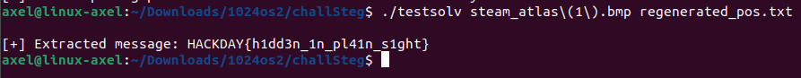

# The Aetheric Map Write Up

<p align="justify">This one was a Steganography challenge, in which the goal was to retreive data embedded in a BMP file attached as steam_atlas.bmp in this repo. To do so, the script used to hide data was provided and is attached to this repo too, under hide.c </p>

<p align="center">

</p>

<p align="justify">To solve this challenge it was necessary to understand how the script used had hidden data into the BMP file. Looking at source code it appears that it was one main function used, which took filename, cursor position , and the message as parameters. </p>

````c
void hide(const char *filename, int start_pos, const char *message)
````

<p align="justify">Looking at the source code, it appeared that the data had been hidden using the loop below. It seemed that this loop randomly replaced some least significant bits of the BMP file with the bits of the message, here the flag. The diferent positions of the bits were saved into an external file named pos.txt, which wasn't provided. Hence it appeared that it was impossible de retreive the flag by simply looking at the LSB of the BMP file because of randomization of positions.</p>

````c
for (int i = 0; i < total_bits; i++) {
		int bit = (message[i / 8] >> (7 - (i % 8))) & 1; 
		int pos;
		do {
			pos = start_pos + (rand() % (file_size - start_pos)); 
		} while (fseek(file, pos, SEEK_SET) != 0); 
		
		if (fread(&byte, 1, 1, file) != 1) {
			perror("[x] Error reading file");
			break;
		}
		byte = (byte & 0xFE) | bit; 
		fseek(file, -1, SEEK_CUR); 
		fwrite(&byte, 1, 1, file); 
		positions[i] = pos; 
		fprintf(pos_file, "%d\n", pos); 
	}
````

<p align="justify">Nonetheless, the line below debunked this idea; insofar as the seed of the random int generation was set with a static value, namely the cursor position. It all boiled down to make the random generation deterministic, because guessing the cursor position meant to be able to regenerate the exact same bits positions list as the one saved by the script when the data had been embedded into the BMP file.</p>

````c
srand(start_pos);
````

<p align="justify">Hence, to solve this challenge it was necessary to :</p>

- Regenerate the file position with enough bits (modulo 8) to catch the size of the flag, , using cursor position as random seed
- Then use the positions file to extract bits
- Try to read the output message
- Iterate over different cursor positions until the correct one was found

<p align="justify">As a matter of fact the intended cursor position was 100. I attached in this repo a file named rand.c which recompute bits positions (I coded it knowing the flag size, which was different for players whom didn't know it). I also attached a file solve.c which take the cursor position and positions list as parameters. Finally after running those script using 100 as cursor position, it possible to retreive the flag :</p>

<p align="center">

</p>

FLAG : _HACKDAY{h1dd3n_1n_pl41n_s1ght}_
