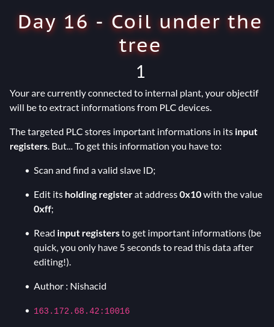
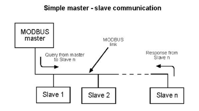
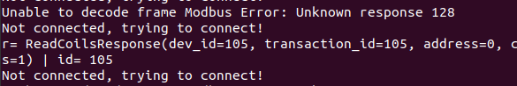
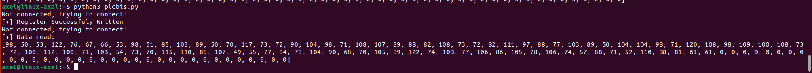
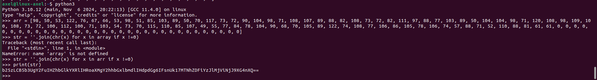
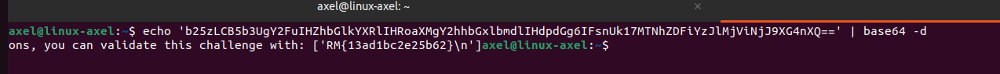

# Coil Under The Tree (day16)

This challenge was an industrial challenge in which we were asked to communicate with a PLC (portable logic controler) through MODBUS protocol in order to modify hodling registers on the target PLC.  

The MODBUS protocol is a communication protocol used in industrial automation systems. As described in the diagram below, a master communicates with each slave, identifying them through unique IDs (up to 255). According to the challenge description, our tasks were:

- Connecting to PLC
- Scaning the PLC to find the target slaveID
- Modifying holding register at address 0x10 and putting 0xff value
- Reading input registers to retreive the flag

Hence the first thing I did was to script something to connect to the master (the IP/PORT provided in the challenge) and scan it to enumerate valid slave IDs. 

Flag : _RM{13ad1bc2e25b62}_ , Thanks _Nishacid_ for this challenge ! 
