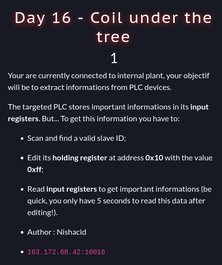
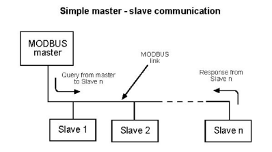
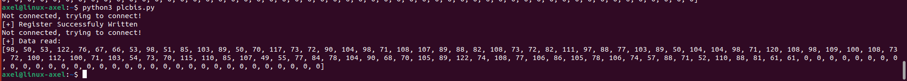
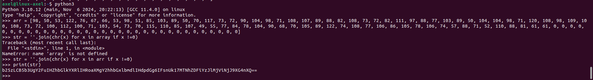
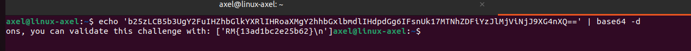

# Coil Under The Tree (day16)

This challenge was an industrial challenge in which we were asked to communicate with a PLC (Programmable logic controler) through MODBUS protocol in order to modify hodling registers on the target PLC. 

The MODBUS protocol is a communication protocol used in industrial automation systems. As described in the diagram below, a master communicates with each slave, identifying them through unique IDs (up to 255). According to the challenge description, our tasks were:

- Connecting to PLC
- Scanning the PLC to find the target slaveID
- Modifying holding register at address 0x10 and putting 0xff value
- Reading input registers to retreive the flag

Hence the first thing I did was to script something to connect to the master (the IP/PORT provided in the challenge) and scan it to enumerate valid slave IDs. The script available under FindSlaveID.py in this repo implements it using Pymodbus library to connect to PLC through TCP and enumerate valid slave ID using readcoils method. After I ran it I managed to identify the valid ID, namely 105th :

 After I retreived the valid slave ID, I used it to connect to the Master and modify the slave's register value at address 0x10 and put the value 0xff. Once it was done, I read input registers as specify in challenge description and got an int array. The script is available under exploit.py in this repo : 

After I converted the list into a string, I got what looked like base64 data encoded : 

Once I decoded the string, I finally got the flag : 

Flag : _RM{13ad1bc2e25b62}_ , Thanks _Nishacid_ for this challenge ! 
