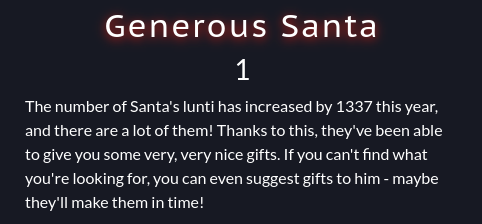
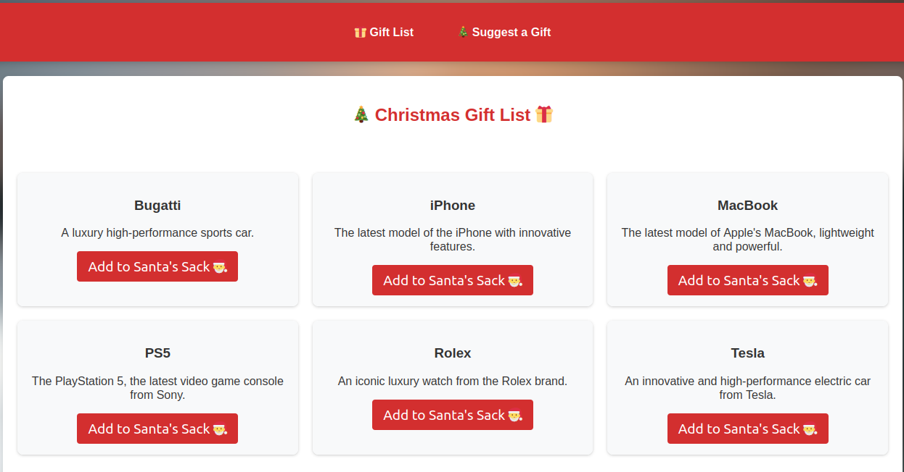
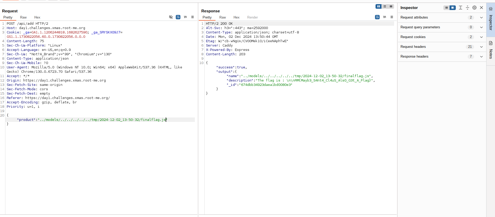

# Generous Santa (day1)

This first challenge is a web challenge in which we are asked to retreive the flag stored in the file flag.txt on the host machine. The server does run under nodejs and the source script is provided, with a docker set-up so you can run the server locally. 

  

The website offer 2 features. The first one which is a selection of gifts, that you can add to your santa sack. Each

  

  

Flag : _RM{Mayb3_S4nt4_Cl4uS_Als0_G3t_A_Flag}_
