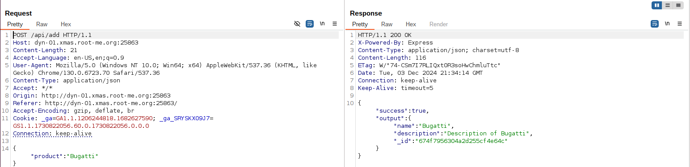
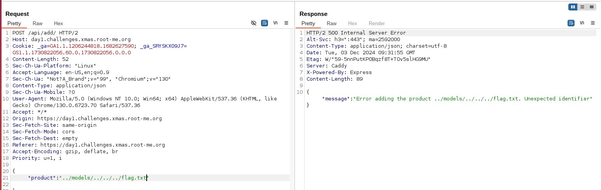
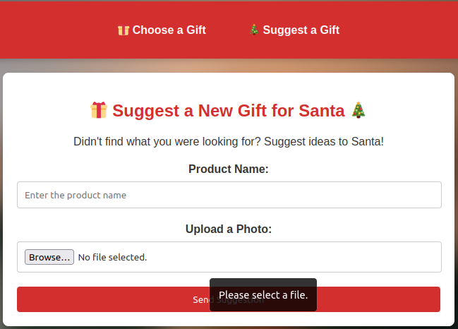
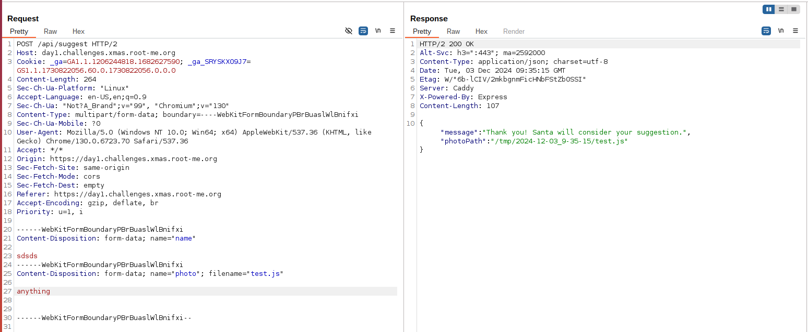

# Generous Santa (day1)

This first challenge is a web challenge in which we are asked to retreive the flag stored in the file flag.txt on the host machine. The server does run under nodejs and the source scripts are provided, with a docker set-up so you can run the server locally. For the first steps, source codes wern't very useful but for the final payload having access to its came very helpful.

<p align="center"></p>

The website offers 2 features. The first one which is a selection of gifts, that you can add to your santa sack. Each gift is added to santa's sack through POST request to /api/add.

<p align="center"></p>

The very first thing I did was intercepting the POST request to understand how my gift choice was sent to server. It appeared that the gift was sent to server through JSON after what the server replies with a JSON containing the name,description, id .. of the gift. An eventual attack could consists in injecting product choice and relaying the choice to server :

<p align="center"></p>

Considering that, I tried to inject a payload to perform a path traversal/LFI attack and load the flag file _flag.txt_ instead of the gift porperties. I managed to trigger the load of the flag but I got the mistake _Unexpected Identifier_ , meaning that an attempt to open the specified file had been triggered but that the content of the file couldn't have been be printed properly.

<p align="center"></p>

Indeed, by looking at the source code in _hotte.js_ it was clear that the json data sent to server wasn't cleared properly and restricted to gifts of the models folder (_cf require function_) which can explains why did I manage to perform perform a LFI attack with path traversal payload :

```javascript
router.post('/add', async (req, res) => {
    const { product } = req.body;

    try {
        const Gift = require(`../models/${product.toLowerCase()}`);
        const gift = new Gift({ name: product, description: `Description of ${product}` });
        output = gift.store();
        res.json({ success: true, output: output });
    } catch (error) {
        res.status(500).json({ message: `Error adding the product ${product}. ${error.message}` });
    }
});
````

This code snippets also explains why the flag content wasn't load. Indeed, the server was expecting a Gift object (so a js file) in input ( by providing the name of a valid product in JSON input) and not a simple plaintext file. So the goal at this time was to find a way to create,load and access a Gift model with the flag in description instead of the proprer gift description. Fortunately, the second feature of this website helped me out. Actually this second feature was an upload form in which you could suggest gift to santa with a picture that you have to upload :  

<p align="center"></p>

So I intercepted again the POST request sent to server while uploading PNG file; so I could analyze the Content-Type. I was looking for a permissive content-type which could had let me upload other file as javacript files for instance. Fortunately, the content-type was set to _Content-Type multipart/form-data_ that did mean that I was authorized to load js files. The location of the uploaded file was also sent in the server response, which was very useful :

<p align="center"></p>

The final step of this challenge was to create a Gift model printing the flag in description, to upload it and to load it from the /tmp/ folder using the field product from the first feature of the website. To load my custom model I replicated the files provided in models folder :

```javascript
const mongoose = require('/usr/app/node_modules/mongoose');
const fs = require('fs');
let flagContent = fs.readFileSync('../../flag.txt', 'utf8');
const flagSchema = new mongoose.Schema({
    name: { type: String, default: 'Flag' },
    description: { 
        type: String, 
        default: flagContent,
        set: (value) => value.startsWith('Description of') ? flagContent : value
    }
});
flagSchema.methods.store = function() {
    console.log('Flag !!!!!!!!');
    return this;
};
module.exports = mongoose.model('xmasflag', flagSchema);
````
I uploaded the script and retreived its location in the server response. Then I added the new gift uploaded to my santa sack and finally managed to load the flag :

<p align="center"></p>

Flag : _RM{Mayb3_S4nt4_Cl4uS_Als0_G3t_A_Flag}_
