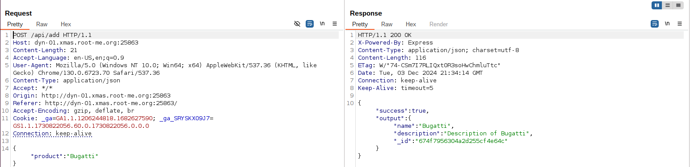
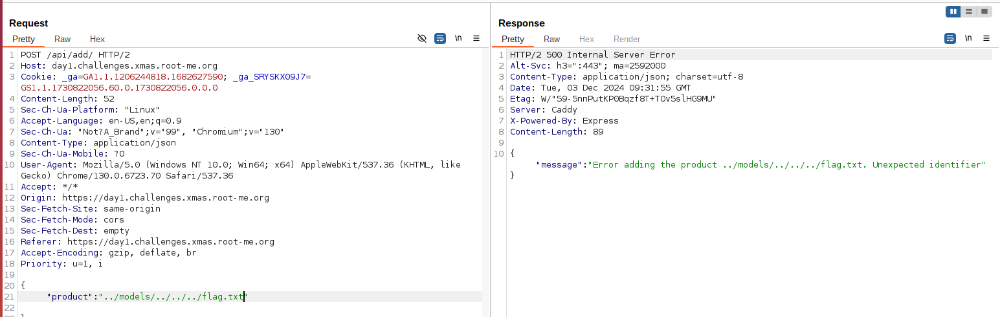
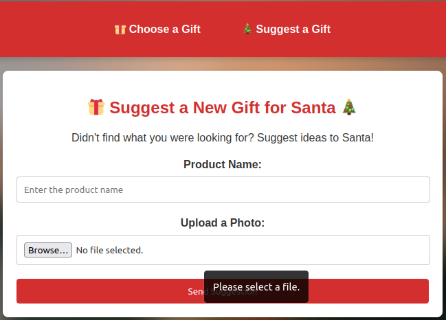
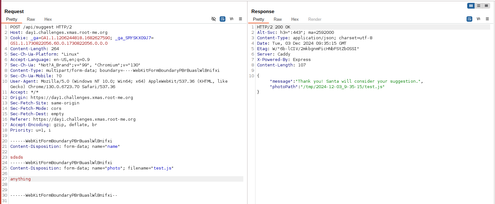
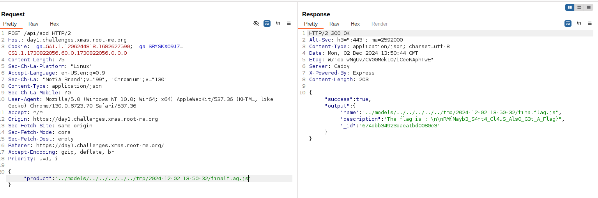

# Generous Santa (day1)

<p align="justify"> This first challenge was a web challenge in which we are asked to retreive the flag stored in the file flag.txt on the host machine. The server did run under nodejs and the source scripts were provided, with a docker set-up so the server could have been ran locally. For the first steps, source codes wern't very useful but for the final payload having access to its came very helpful. </p>

<p align="center"></p>

<p align="justify">The website offered 2 features. The first one which was a selection of gifts, that you could add to your santa sack. Each gift was added to santa's sack through POST request to /api/add.</p>

<p align="center"></p>

<p align="justify">The very first thing I did was intercepting the POST request to understand how my gift choice was sent to server. It appeared that the gift was sent to server through JSON after what the server replied with a JSON containing the name,description, id .. of the gift. An eventual attack could consist in injecting product choice and relaying the choice to server : </p>

<p align="center"></p>

<p align="justify">Considering that, I tried to inject a payload to perform a path traversal/LFI attack and load the flag file flag.txt instead of the gift porperties. I managed to trigger the load of the flag but I got the mistake 'Unexpected Identifier' , meaning that an attempt to open the specified file had been triggered but that the content of the file couldn't have been be printed properly. </p>

<p align="center"></p>

<p align="justify">Indeed, by looking at the source code in hotte.js; it was clear that the json data sent to server wasn't cleared properly and restricted to gifts of the models folder (cf require function) which could explain why I managed to perform a LFI attack with path traversal payload : </p>

```javascript
router.post('/add', async (req, res) => {
    const { product } = req.body;

    try {
        const Gift = require(`../models/${product.toLowerCase()}`);
        const gift = new Gift({ name: product, description: `Description of ${product}` });
        output = gift.store();
        res.json({ success: true, output: output });
    } catch (error) {
        res.status(500).json({ message: `Error adding the product ${product}. ${error.message}` });
    }
});
````

<p align="justify">This code snippets also explains why the flag content wasn't loaded. Indeed, the server was expecting a Gift object (so a js file) in input ( by providing the name of a valid product in JSON input) and not a simple plaintext file. So the goal at this time was to find a way to create,load and access a Gift model with the flag in description instead of the proper gift description. Fortunately, the second feature of this website helped me out. Actually this second feature was an upload form in which I was able to suggest gift to santa with a picture that I had to upload :  </p>

<p align="center"></p>

<p align="justify">So I intercepted again the POST request sent to server while uploading PNG file; so I could analyze the Content-Type. I was looking for a permissive content-type which could had let me upload other file as javacript files for instance. Fortunately, the content-type was set to 'Content-Type multipart/form-data', which meant that I was authorized to load js files. The location of the uploaded file was also sent in the server response, which was very useful : </p>

<p align="center"></p>

<p align="justify">The final step of this challenge was to create a Gift model printing the flag in description, to upload it and to load it from the /tmp/ folder using the field product from the first feature of the website. To load my custom model I replicated the files provided in models folder : </p>

```javascript
const mongoose = require('/usr/app/node_modules/mongoose');
const fs = require('fs');
let flagContent = fs.readFileSync('../../flag.txt', 'utf8');
const flagSchema = new mongoose.Schema({
    name: { type: String, default: 'Flag' },
    description: { 
        type: String, 
        default: flagContent,
        set: (value) => value.startsWith('Description of') ? flagContent : value
    }
});
flagSchema.methods.store = function() {
    console.log('Flag !!!!!!!!');
    return this;
};
module.exports = mongoose.model('xmasflag', flagSchema);
````
<p align="justify">I uploaded the script and retreived its location in the server response. Then I added the new gift uploaded to my santa sack and finally managed to load the flag : </p>

<p align="center"></p>

Flag : _RM{Mayb3_S4nt4_Cl4uS_Als0_G3t_A_Flag}_ , thanks _Elweth_ for this challenge !
