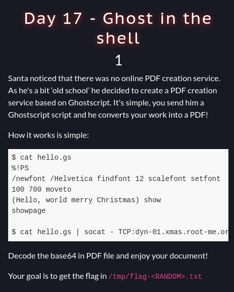
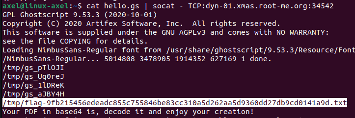
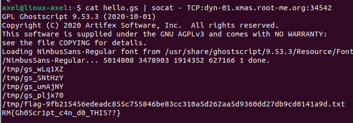

# Gost In The Shell (day17)

<p align="center"></p>


<p align="justify"> This challenge was pretty similar to Build&Drustroy; but the difference was that the service deployed allowed the client to send ghostscript raw code and returned PDF file. The access to the service was made with the bash command line below. The goal was to read the flag located in temp folder at /tmp/flag-*random*.txt : </p>

````bash
$ cat hello.gs | socat - TCP:dyn-01.xmas.root-me.org:PORT
````
<p align="justify"> To solve this challenge, I found an intresting Write-Up showing how to exploit a CVE based on string format in a ghostscript weakness, allowing hackers to gain code execution, and for instance read tmp folder and print its content. More informations are here : <a href="https://codeanlabs.com/blog/research/cve-2024-29510-ghostscript-format-string-exploitation/">CVE-2024-29510</a>

<p align="justify"> Hence, I came up with a first payload that listed the content of the target folder. That's the line below that allow to do so:

````ghostscript
(/tmp/*) { = } 1024 string filenameforall
````

<p align="center"></p>

<p align="justify">The output indicated me that the flag was located at flag-9fb215456edeadc855c755846be83cc310a5d262aa5d9360dd27db9cd0141a9d.txt. Finally I added the line below to my payload and managed to print the flag :</p>

````ghostscript
(/tmp/flag-9fb215456edeadc855c755846be83cc310a5d262aa5d9360dd27db9cd0141a9d.txt) (r) file 1024 string readstring pop =
````

<p align="center"> </p>

Flag : _RM{Gh0Scr1pt_c4n_d0_THIS??}_ , thanks _Elweth_ for this challenge ! 
