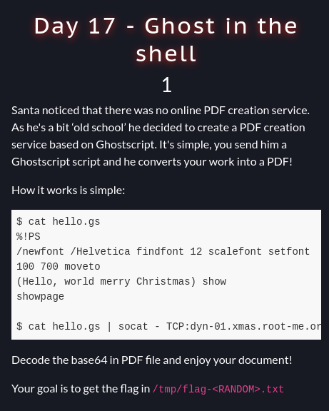
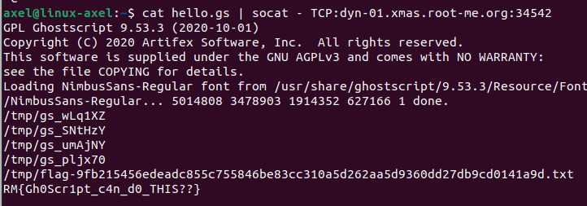
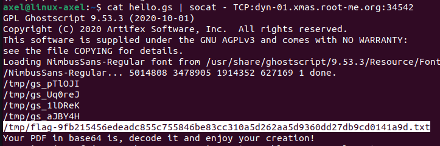

# Gost In The Shell (day17)

<p align="center"></p>

````bash
$ cat hello.gs | socat - TCP:dyn-01.xmas.root-me.org:PORT
````

<p align="center"></p>

<p align="center"> </p>

Flag : _RM{Gh0Scr1pt_c4n_d0_THIS??}_ , thanks _Elweth_ for this challenge ! 
