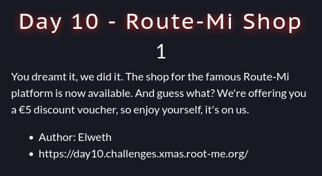
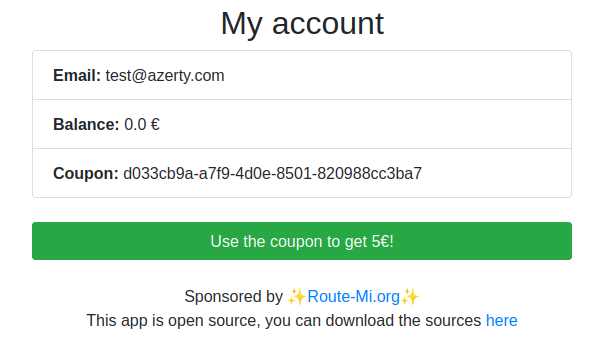
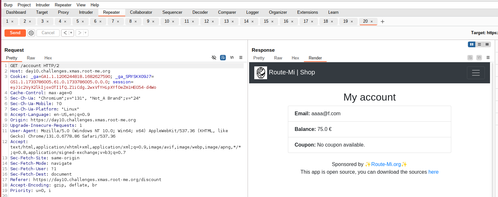
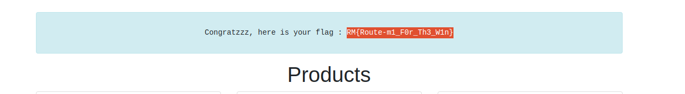

# Route Mi Shop (day10)

This challenge was a Web challenge in which a e-shop was deployed. We were asked to credit enough an account to be able to buy the flag. The source code was provided and is attached in this repo.

