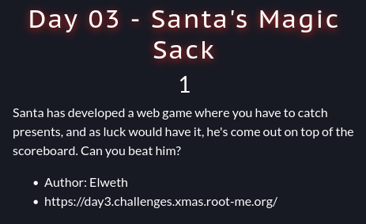
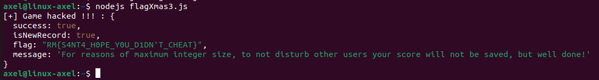

# Challenge Santa's Magic Sack (day3)

In this challenge, a game is deployed on a website. It consists in collected gifts falling by moving a santa sack laterally. The clock is limited to 20 seconds and the goal is to beat Santa's score which is 133337 points. Obviously it's impossible to beat this score within only 20 seconds and a way to cheat must be found to beat it. 

<p align="center"></p>

````javascript
async function Vd(e, t) {
    const {
        checksum: r,
        salt: n
    } = $d(e, t), l = Wd({
        playerName: e,
        score: t,
        checksum: r,
        salt: n
    });
    try {
        return await (await fetch("/api/scores", {
            method: "POST",
            headers: {
                "Content-Type": "application/json"
            },
            body: JSON.stringify({
                data: l
            })
        })).json()
    } catch (i) {
        return console.error("Error submitting score:", i), {
            success: !1
        }
    }
`````

<p align="center"></p>

Flag : _RM{S4NT4_H0PE_Y0U_D1DN'T_CHEAT}_ , thanks again _Elweth_ for this challenge !
