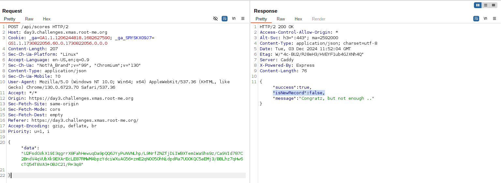
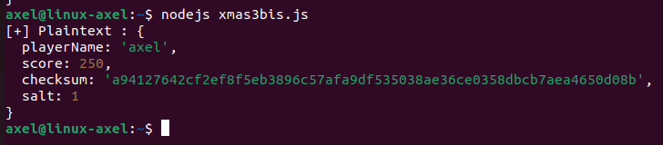

# Challenge Santa's Magic Sack (day3)

<p align="center"></p>

In this challenge, a game written in javascript is deployed on a website. It consists in collected gifts falling by moving a santa sack laterally. The clock is limited to 20 seconds and the goal is to beat Santa's score which is 133337 points. Obviously it's impossible to beat this score within only 20 seconds and a way to cheat must be found to beat it. 

<p align="center"></p>

The source code wasn't porvided directly but was available in the browser inspection section so the very first thing I did had been copy-pasting the code I got inspecting the browser to <a href="https://beautifier.io"> beautifier.io </a> to make the javascript code readable. The source code is provided under Xmas3_Src.js in this repo. I quickly identified the function which was in charge of sending score to server. It appeared that the score was sent through JSON to server, with a crypto algorithm to "garant" its integrity :  

````javascript
async function Vd(e, t) {
    const {
        checksum: r,
        salt: n
    } = $d(e, t), l = Wd({
        playerName: e,
        score: t,
        checksum: r,
        salt: n
    });
    try {
        return await (await fetch("/api/scores", {
            method: "POST",
            headers: {
                "Content-Type": "application/json"
            },
            body: JSON.stringify({
                data: l
            })
        })).json()
    } catch (i) {
        return console.error("Error submitting score:", i), {
            success: !1
        }
    }
`````
Below the algorithm used to "make sure" that the score cant be change, by computing a random checksum and encrypting it using AES :

````javascript
const gf = Rf(Md),
    Ud = "S4NT4_S3CR3T_K3Y_T0_ENCRYPT_DATA";

function Wd(e) {
    const t = JSON.stringify(e);
    return gf.AES.encrypt(t, Ud).toString()
}

function $d(e, t) {
    const r = Math.floor(Math.random() * 9) + 1,
        n = `${e}-${t}-${r}`;
    return {
        checksum: gf.SHA256(n).toString(),
        salt: r
    }
}
````

So the JSON seemed to be sent, with a checksum randomly generated (to ensure the integrity of the score), and encrypted with AES algorithm. Nonetheless, the AES KEY (no IV, it seems to be ECB?) used is handled in plaintext and the checksum can be retreive because the random part is sent to the server as the salt in the JSON payload . Hence what we will be able to do is intercept the POST request sent to the score API, decrypt the payload, modifie it, recalculate the checksum and finally relay the score to the server with our score modified. So I opened Burp and intercepted the POST request : 

<p align="center"></p>

As expected I got the cipher text that I managed to decrypt by implementing a tiny js script available under Xmas3_Decrypt.js in this repo. Hence, I managed to retreive the salt and I finally got the pivot element to recalculate the checksum after I modified my score. 

<p align="center"></p>

After that I automated the payload submission with the script below available under flagXmas3.js. To sum up what I've done is :
- Modifying my score
- Using the salt, my score, and my name to compute a valid checksum
- Encrypting the JSON payload using AES and the AES KEY retreived in source code
- Sending the payload to server and printing response

````javascript

````

<p align="center"></p>

Flag : _RM{S4NT4_H0PE_Y0U_D1DN'T_CHEAT}_ , thanks again _Elweth_ for this challenge !
