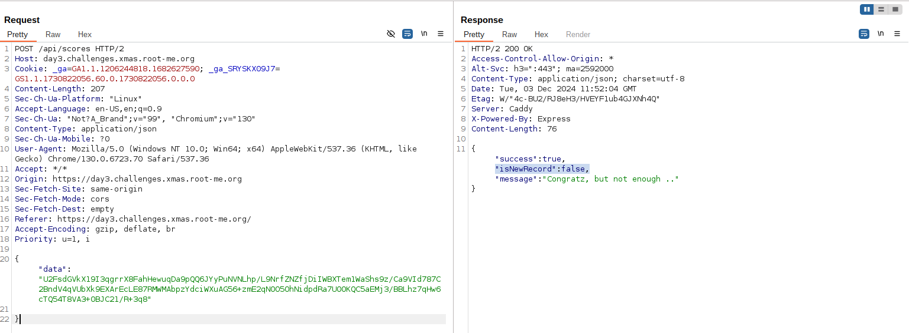
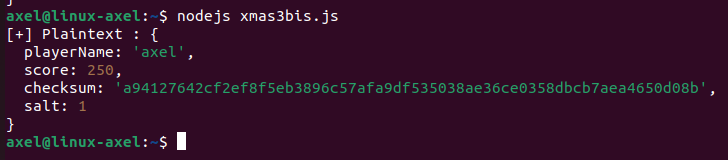
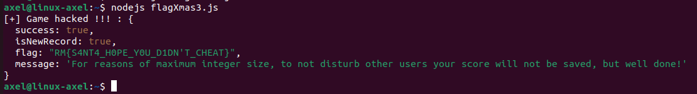

# Santa's Magic Sack (day3)

<p align="center"></p>

<p align="justify"> In this challenge, a game written in javascript had been deployed on a website. It consisted in collecting gifts falling by moving a santa sack laterally. The clock was limited to 20 seconds and the goal was to beat Santa's score which was 133337 points. Obviously it was impossible to beat this score within only 20 seconds and a way to cheat was necessary to beat it. </p>

<p align="center"></p>

<p align="justify"> The source code wasn't provided initialy but was available in the browser inspection section so the very first thing I did had been copy-pasting the code I got by inspecting the browser to <a href="https://beautifier.io"> beautifier.io </a> to make the javascript code readable. The source code is provided under Xmas3_Src.js in this repo. I quickly identified the function which was in charge of sending score to server. It appeared that the score was sent through JSON to server, with a crypto algorithm to "garant" its integrity :  </p>

````javascript
async function Vd(e, t) {
    const {
        checksum: r,
        salt: n
    } = $d(e, t), l = Wd({
        playerName: e,
        score: t,
        checksum: r,
        salt: n
    });
    try {
        return await (await fetch("/api/scores", {
            method: "POST",
            headers: {
                "Content-Type": "application/json"
            },
            body: JSON.stringify({
                data: l
            })
        })).json()
    } catch (i) {
        return console.error("Error submitting score:", i), {
            success: !1
        }
    }
`````
<p align="justify"> Below the algorithm used to "make sure" that the score cant be change, by computing a random checksum and encrypting it using AES : </p>

````javascript
const gf = Rf(Md),
    Ud = "S4NT4_S3CR3T_K3Y_T0_ENCRYPT_DATA";

function Wd(e) {
    const t = JSON.stringify(e);
    return gf.AES.encrypt(t, Ud).toString()
}

function $d(e, t) {
    const r = Math.floor(Math.random() * 9) + 1,
        n = `${e}-${t}-${r}`;
    return {
        checksum: gf.SHA256(n).toString(),
        salt: r
    }
}
````

<p align="justify"> So the JSON seemed to be sent, with a checksum randomly generated (to ensure the integrity of the score), and encrypted with AES algorithm. Nonetheless, the AES KEY (no IV, it seems to be ECB?) used is handled in plaintext and the checksum can be retreive because the random part is sent to the server as the salt in the JSON payload . Hence what was able to do was intercept the POST request sent to the score API, decrypt the payload, modify it, recalculate the checksum and finally relay the score to the server with our score modified. So I opened Burp and intercepted the POST request : </p>

<p align="center"></p>

<p align="justify"> As expected I got the cipher text that I managed to decrypt by implementing a tiny js script available under Xmas3_Decrypt.js in this repo. Hence, I managed to retreive the salt and I finally got the pivot element to recalculate the checksum after I modified my score. </p>

<p align="center"></p>

<p align="justify"> After that I automated the payload submission with the script below available under flagXmas3.js. To sum up what I've done is : </p>

- Modifying my score
- Using the salt, my score, and my name to compute a valid checksum
- Encrypting the JSON payload using AES and the AES KEY retreived in source code
- Sending the payload to server and printing response 

````javascript
const CryptoJS = require("crypto-js");
const fetch = require('node-fetch');
const https = require('https');

//The KEY retrieved in plaintext in the source code
const Ud = "S4NT4_S3CR3T_K3Y_T0_ENCRYPT_DATA";

//functio to encrypt JSON payload using the KEY retreived
function encryptData(data) {
    const jsonString = JSON.stringify(data);  
    const encrypted = CryptoJS.AES.encrypt(jsonString, Ud).toString();
    return encrypted;
}

// The same function as you can find in the source code
function $d(e, t, salt) {
    const n = `${e}-${t}-${salt}`;
    return {
        checksum: CryptoJS.SHA256(n).toString(), 
        salt: salt
    };
}

async function main() {
    const playerName = 'axel';
    const score = 133338; // to beat Santa score 
    const salt = 1; // the salt retreived in the decrypted json 
    const { checksum } = $d(playerName, score, salt); //retreive chekcsum
    if (!checksum) {
        console.log("[x] Checksum not found.");
        return;
    }
    //payload to encrypt using KEY
    const data = {
        playerName: playerName,
        score: score,
        checksum: checksum,
        salt: salt
    };
    //encrypt payload and send data to server 
    const encryptedData = encryptData(data);
    let response = await sendDataToServer(encryptedData);  
    if (response.isNewRecord !== true) {
        console.log("[x] Attempt failed, trying again...");
        return;
    }
    console.log("[+] Game hacked !!! :", response);
}

async function sendDataToServer(encryptedData) {
    // Ignore SSL check 
    const agent = new https.Agent({ //custom Agent to ignore ssl check
        rejectUnauthorized: false // Disable SSL check
    });
    const response = await fetch('https://day3.challenges.xmas.root-me.org/api/scores', {
        method: 'POST',
        headers: {
            'Content-Type': 'application/json'
        },
        body: JSON.stringify({
            data: encryptedData
        }),
        agent: agent  // Use the custom agent with SSL check disabled
    });
    const result = await response.json();
    return result;
}

main();
````

<p align="justify"> For some reasons I got an error with TLS/SSL handshake using fetch or simple curl in my shell so I had to override the HTTP agent and force it to reject/avoid the SSL check while submitting request to the server, which explains the content of the submission function. Finally by running the script I received the flag : </p>

<p align="center"></p>

Flag : _RM{S4NT4_H0PE_Y0U_D1DN'T_CHEAT}_ , thanks again _Elweth_ for this challenge !
