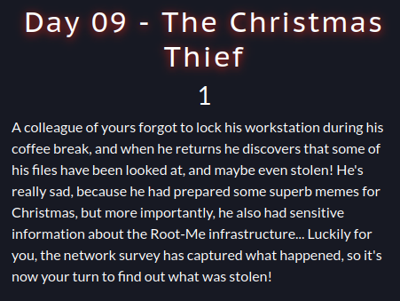
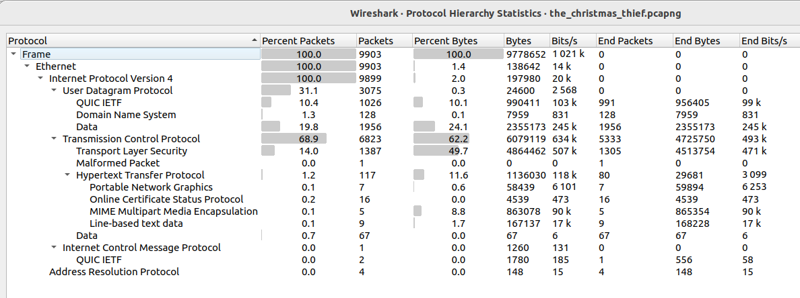
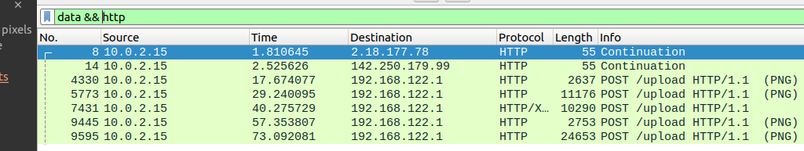
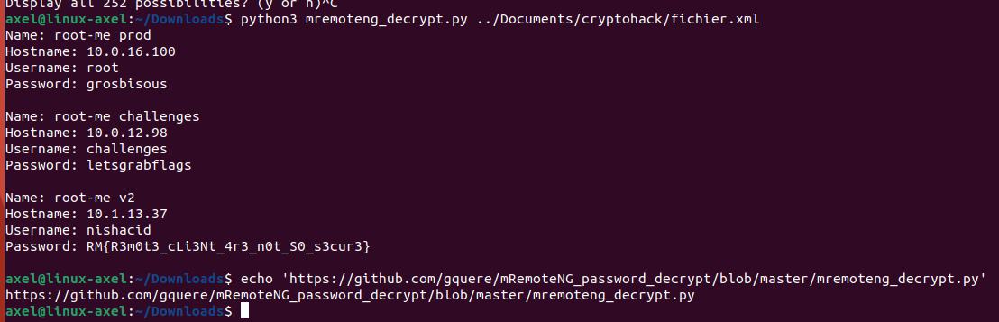

# The Christmas Thief (day9)

In this challenge, we were tasked with retrieving secrets stolen by a thief by analyzing a network capture file. No hints were provided about the type of data extracted, but it was suggested that it might be a configuration file. 

Hence, the very first thing I did was to look at the protocol hierarchy to identify over which procol the data had been extracted. It appeared that it was over http protocol. Indeed, I identified some files sent to external server through HTTP POST requests (namely few PNG and an xml which seemed to be a configuration file) : 

The PNG files didn't catch my attention but the XML file named confCons.xml did (packet N°7431 on the screenshot) . Indeed this file is actually a MremoteNg (a remote connection protocol) configuration and contains AES encrypted passwords. In the XML file I spotted 3 Node with 3 base64 encoded and AES encrypted passwords : 

- **root-me prod** : _XD6l5yfXJt4qrt68m2rODBDjmKoEYzxbA1k0IToc0TbqRmIvY2n0NVa98+Fe5zOEamig7UNUb3R2rQ==_
- **root-me challenges** : _OqJIc9IEBD8Q2pGWmrt/z2o+AeupVnesPQk3Mj1BANhzdP4o8jc3WV2QulpGc95WdBw+BlS72kTDrndkzQ==_
- **root-me v2** : _TWK/BPwZG5rXMQv0LH8mALWbdDguNCOi5UHE6oc108iLT+1V63HR/jqhq76QAkPNCm54CrLjSJPKwV4Nv+0dFKNGZeI3KO8s/oinc+wtZ7SwcqA=_

Actually those passwords were encrypted with AES GCM (counter mode) and all the elements required to decrypt them were available in the XML file, in their respective node tag. Indeed in confCons.xml file,for each encrypted password the salt, the nonce and the tag/Messager authentication code could be retreived. As a result, the key used can be computed and the cipher password decrypted. After a few research I found a script to retreive those password availabe <a href="https://github.com/gquere/mRemoteNG_password_decrypt/blob/master/mremoteng_decrypt.py">here</a>. After I ran it with the extracted.xml file given in input, I got the flag : 

  

Flag : _RM{R3m0t3_cLi3Nt_4r3_n0t_S0_s3cur3}_ , thanks _Nishacid_ for this Challenge ! 
