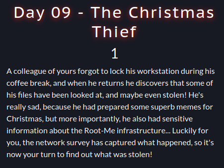
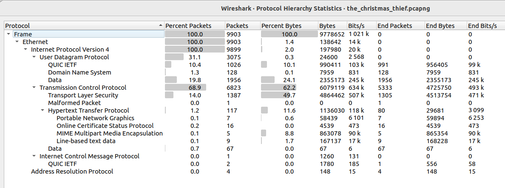
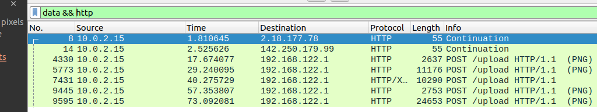
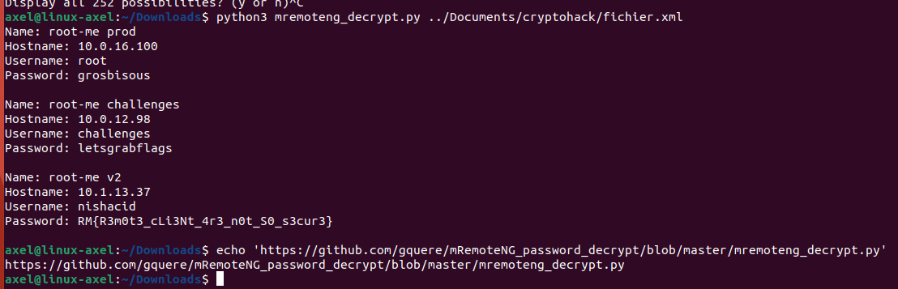

# The Christmas Thief (day9)
In this challenge, we were tasked with retrieving secrets stolen by a thief by analyzing a network capture file. No hints were provided about the type of data extracted, but it was suggested that it might be a configuration file.

Hence, the very first thing I did was to look at the protocol hierarchy to identify over which procol the data had been extracted. It appeared that it was over http protocol. Indeed, I identified some files sent to external server through HTTP POST requests (namely few PNG and an xml which seemed to be a configuration file) :

The PNG files didn't catch my attention but the XML file named confCons.xml did (packet N°7431 on the screenshot) . Indeed this file is actually a MremoteNg (a remote connection protocol) configuration and contains AES encrypted passwords. In the XML file I spotted 3 Node with 3 base64 encoded and AES encrypted passwords : 

- **root-me prod** : _XD6l5yfXJt4qrt68m2rODBDjmKoEYzxbA1k0IToc0TbqRmIvY2n0NVa98+Fe5zOEamig7UNUb3R2rQ==_
- **root-me challenges** : _OqJIc9IEBD8Q2pGWmrt/z2o+AeupVnesPQk3Mj1BANhzdP4o8jc3WV2QulpGc95WdBw+BlS72kTDrndkzQ==_
- **root-me v2** : _TWK/BPwZG5rXMQv0LH8mALWbdDguNCOi5UHE6oc108iLT+1V63HR/jqhq76QAkPNCm54CrLjSJPKwV4Nv+0dFKNGZeI3KO8s/oinc+wtZ7SwcqA=_

  

Flag : _RM{R3m0t3_cLi3Nt_4r3_n0t_S0_s3cur3}_ , thanks Nishacid for this Challenge ! 
