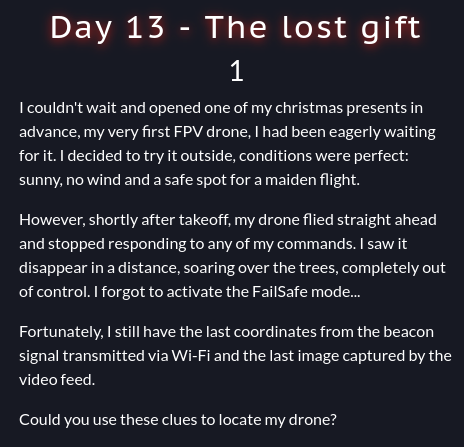
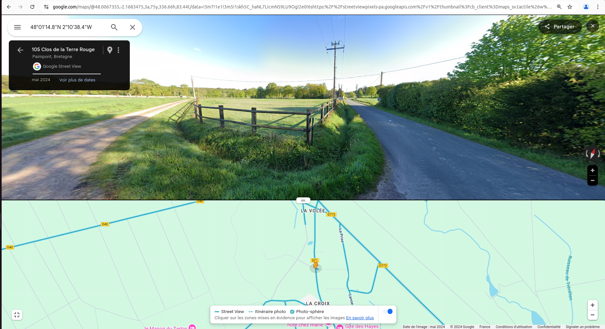

# The Lost Gift (day13)

This challenge  was an OSINT challenge, in which we were asked to retreive the the location of a fallen drone. To do so a network capture was provided containing the last data sent by the drone before turning off and also a picture of the last video frame captured by the drone. The flag is the name of the street where the drone landed. 

The network capture did contain IEE 802.11 protocol packets. By inspecting the content of those packets, I quickly managed to extract gps coordinates that helped me loct

Flag : _RM{closdeleterrerouge}_
