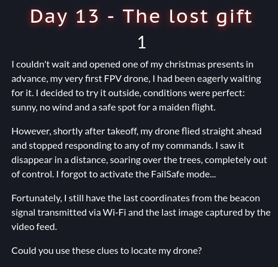
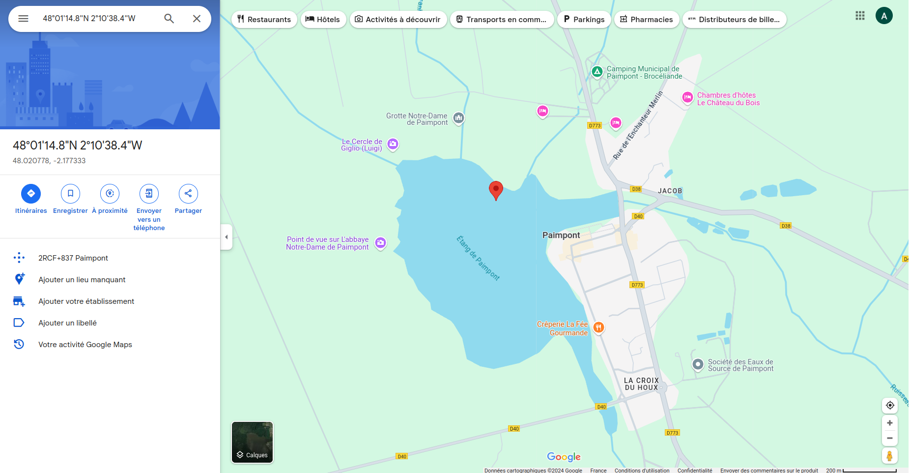
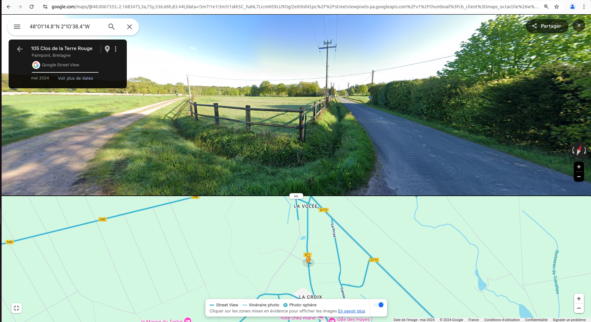

# The Lost Gift (day13)

  This challenge  was an OSINT challenge, in which we were asked to retreive the the location of a fallen drone. To do so a network capture was provided containing the last data sent by the drone before turning off and also a picture of the last video frame captured by the drone. The flag was the name of the street where the drone landed. 

  The network capture contained IEE 802.11 protocol packets. By inspecting the content of those packets, I quickly managed to extract gps coordinates that helped me mark out the area where the drone stopped transmitting : 

  On google map, coordinates indicated me that the drone did fall while flying over a lake. Considering that the flag was the name of a street, it was clear that those coordinates wern't the exact position where the drone had fallen. 

  Looking at the landscape one the picture provided and the location of the drone during last transmission I managed to identify the street thanks to street view feature : 
 

Flag : _RM{closdeleterrerouge}_ , thanks _Chic0s_ for this challenge ! 
