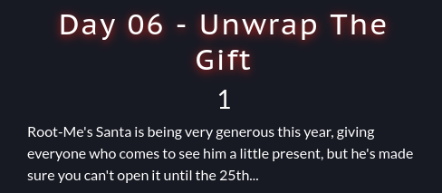

# Unwrap the gift (day6)

<p align="justify">This challenge was a crypto challenge, in which an AES oracle was available for wrapping gift, giving in the same time the encrypted flag. The source code was provided and is attached to this repo.</p> 

<p align="center"></p>

<p align="justify">Gifts  submitted to service were wrapped with the following python class :

````python
class Gift:
    """
    A custom class to wrap and unwrap gifts
    """
    def __init__(self):
        self.key = urandom(16)
        self.iv = urandom(12)
    
    def wrap(self, data):
        """
        Wrap the data with strong AES encryption
        """
        cipher = AES.new(self.key, 6, nonce=self.iv)
        data = data.encode()
        return hexlify(cipher.encrypt(pad(data, 16))).decode()
    
    def unwrap(self, data):
        """
        Unwrap the data
        """
        cipher = AES.new(self.key, 6, nonce=self.iv)
        return cipher.decrypt(bytes.fromhex(data)).decode()
````

<p align="justify">The cryptography weakness here was due to a mis-implementation of AES counter mode. Indeed, the key, the nounce and the IV were not renewed for flag encryption and for gift wrapping. Hence it was possible to exploit determinism and linearity of AES block encryption to retreive the flag. That is what I've done in the script available under exploit1.py in this repo. I guessed the flag using the AES oracle to wrap (encrypt) my payload and I compared it char by char with the encrypted flag received. My initial payload was 'RM{' to which I progressively added chars guessed to finaly retreive the flag (see the script for better understanding).</p>

Flag : _RM{D0NT_WR4P_YOUR_GIFTS_W1TH_W3AK_CRYPTOGRAPHY:(}_ , Thanks _Mika_ for this challenge ! 
