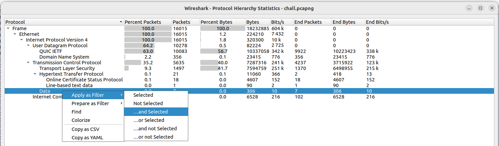
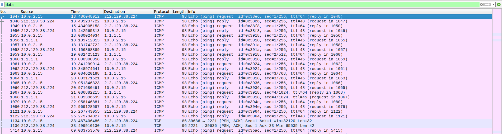
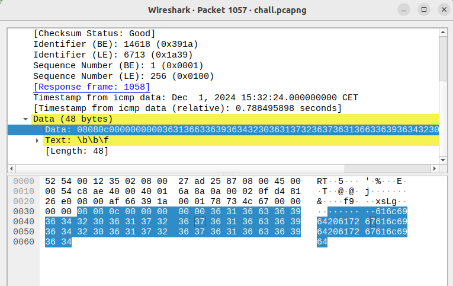

# Wrapped Packet (day2)

 In this 2nd challenge the goal was to retreive data that had been exfiltrated after endpoint compromission. Hence, a trafic capture (pcapng file) was provided in which I was likely to find data embedded in packets. The flag mights be something like RM{FLAG...} . 

  

I managed to flag within 5 minutes without scripting anything, even if the file appeared as quit long (16K packets). The very first thing I did, was to have a quick look at protocol hierarchy in Wireshark . What I was looking for were the packets in which data had been exfiltrated : 

  

Filtering on data significantly reduced the amount of packets and it seemed like the data had been exfiltrated through ICMP protocol. Indeed, a well-known exfiltration method is based on ICMP protocol, in which echo-reply packets can embed data : 

  

By inspecting very first packets, it seemed that the data exfiltrated had been padded (with 0) and sent through ICMP packets,in the data filed : 

  

 By copy-pasting data in a hexaTostr converter, I understood that the data wasn't encrypted, for instance for the very first packet I got the data : 

- **First Packet data :** 08080c000000000036313663363936343230363137323637363136633639363432303631373236373631366336393634
- **First convertion (hex->str) :** _garbage_ + 616c696420617267616c696420617267616c6964 (so a second hex string)
- **Second convertion** : alid argalid argalid (plain text)
  

By moving to the very last ICMP packet, I managed to retreive the chars below which looked like the end of a flag : 

- **Last Packet data :** 113903000000000034643333376430610000000000000000346433333764306100000000000000003464333337643061
- **First convertion (hex->str) :** _garbage_ + 4d337d0a + _garbage_ + _garbage_ + 4d337d0a
- **Second convertion :** M3} ... M3} ... M3}

So it seemed that it was possible to retreive the flag extracted by hand (because he is likely to be short, ~20 chars). By doing exactlty the same thing for upper packets starting from the last ICMP packet (with filter data in wireshark indeed) I could progressively retreive plain texts below : 

- _4s_R00T-4s_R00T-4s_R_
- __Chr1stM_Chr1stM_Chr_
- _RM{M3rryRM{M3rryRM{M_

It appeared that the different parts of the flag had been sent multiple times in different packets . After retreiving each part of the flag, I reconstructed it : 

Flag : _RM{M3rry_Chr1stM4s_R00T-M3}_ , thanks _MIKA_ for this challenge !
 

