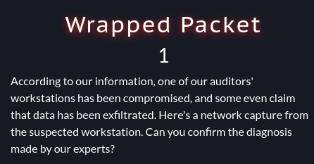
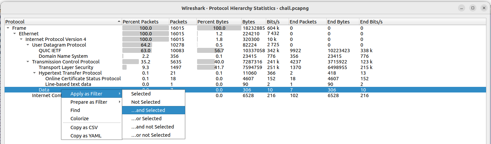
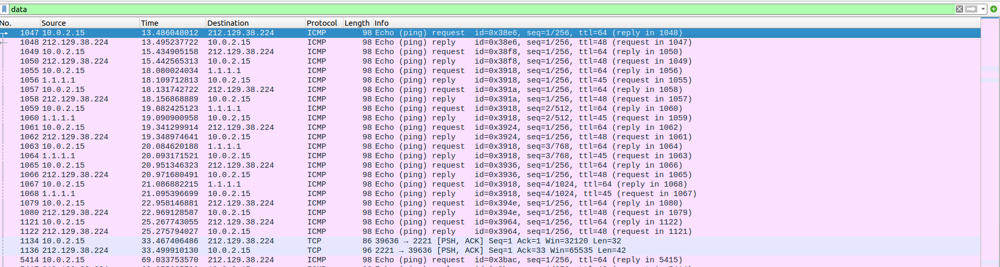

# Wrapped Packet (2nd)
In this 2nd challenge we were asked to retreive data that had been exfiltrated after endpoint compromission. Hence, a trafic capture (pcapng file) is provided in which we are likely to find data embedded in packets. The flag mights be something like _RM{FLAG...}_.

  

I managed to flag within 5 minutes without scripting anything, even if the file appeared as quit long (16K packets). The very first thing I did, was to have a quick look at protocol hierarchy in Wireshark . What I was looking for were the packets in which data had been exfiltrated) : 

  

Filtering on data significantly reduced the amount of packet and it seemed like the data had been exfiltrated through ICMP protocol. Indeed a well-known exfiltration method is based on ICMP protocol, in which echo-reply packets can embed data : 

  

