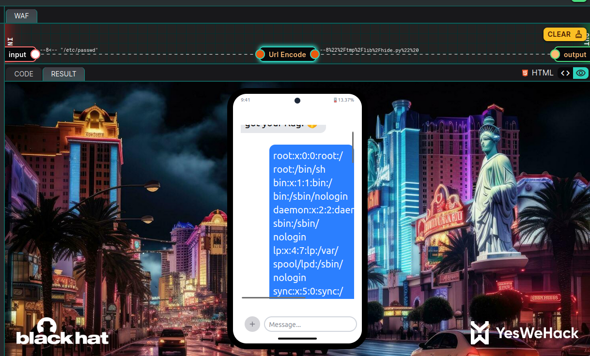
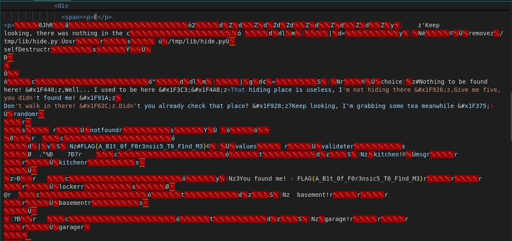

# YesWeHack BlackHat2025 Dojo - Hide&Seek Write Up

<p align="justify">This Write Up depicts vulnerabilities identified & exploited on <a href="https://dojo-yeswehack.com/challenge-of-the-month/blackhat-2025">BlackHat 2025 - hide & seek lab</a> on YWH Dojo challenge of the month, which led to information (flag) disclosure.It includes vulnerabilities explanations and a POC, namely methods used to retrieve the flag.</p>
<p align="justify">The application deployed lies on a python backend taking a user input and using pymdownx & markdown python lib to render it in a friendly interface replicating iphone messages. Below is a schema of the application folder based on source code:</p>

````txt
        /tmp
        ├── templates
        │   └── index.html
        ├── lib
        │   └── hide.py
        └── app.py
````

<p align="justify">As a matter of fact, the version details of Python & libs used (if available) in this application are :</p>

<div align="center">

| Packages | Version |
|:---------:|:---------:|
| Python    | 3.12.10 |
| pymdownx-extensions  | 9.11 |

</div>

## Source files analysis
<p align="justify"> Looking at source files, it seems the flag is dynamically stored in hide.py file which embeds various functions used by main python script & in which flag value is replaced dynamically with python format syntax, as depicted below :</p>

````python
with open('lib/hide.py', 'w') as f:
   f.write('''
 msg = "Keep looking, there was nothing in the "
 def selfDestruct():
   from os import remove
   remove("/tmp/lib/hide.py")   

 def notfound():
 from random import choice
 return choice([
   "...”
 ])

 def validate(value):
 return "{flag}" in value

 ***
 '''.format(flag=flag).strip())
````

The file hide.py contains 3 interesting functions used in main script : 

- selfDestruct function  : this function deletes hide.py filed dynamically generated at user post request 
- validate(value) : this function is used to validate the challenge and return true if the message given in input contains the flag.
- notFound() : this function is used to choose random failure message among fail messages list

<p align="justify">Now, looking at the main script, it’s interesting to understand how those functions are called.</p>
<p align="justify">First of all it seems that the file containing flag, namely hide.py, is removed from the server disk calling function hide.selfDestruct. Hence, even if arbitrary file read is exploitable, leaking hide.py content to get the flag will be impossible.</p>
<p align="justify">About the attack vector, the only way to process the exploit is by submitting a payload, which is then passed to markdown.markdown() function and rendered in the challenge page. To solve the challenge, the payload must contain the flag and be validated by the validate(msg) function imported from hide.py . markdown.mardown() function is used here to transform markdown content into html content and this function is combined with  pymdownx extension snippets used to insert markdown or html into another markdown file. </p> 
<p align="justify">Below is a snippet of the main script: </p>

````python
 def main():
   # Remove the flag - lets see if you can find me now!
   flag = ""
   hide.selfDestruct()


   payload = unquote("--8%22%2Ftmp%2Flib%2Fhide.py%22%20")


   msg = markdown.markdown(
       payload,
       extensions=['pymdownx.snippets'],
       extension_configs={
           'pymdownx.snippets': {
               'encoding': 'latin1'
           },
           'base_path': './templates',
           'check_paths': True
       }
   )
   resp = "You found the flag! &#x1F6A9;" if hide.validate(msg) else hide.notfound()

   print( template.render(msg=msg, msg_resp=resp) )
````

## CVE-2023-32309 :  arbitrary file read in pymdownx extension
<p align="justify"> The source code is vulnerable to arbitrary file read. The vulnerability comes from a CVE released in 2023 <a href="https://nvd.nist.gov/vuln/detail/CVE-2023-32309">(CVE-2023-32309)</a>. In the affected versions (prior to 10.0) of pymdownx extensions, a file read is possible using include syntax. The version of the application used here (9.3) is vulnerable.</p>
<p align="justify">The vulnerability can be tested easily in a python interpreter. Using the exact syntax of application code, /etc/passwd content can be leaked using include payload of CVE Proof of concept.</p>

<p align="justify">Which can be reproduced on challenge server: </p>

<p align="center"></p>

## Flag Read
<p align="justify"> To extract the flag from source files leveraging the vulnerability depicted before, hide.py can’t be displayed because at this step the file is no longer on the disk. Indeed as explained previously, the file had been removed before the payload was processed by the server.</p>

<p align="justify">Nonetheless, when python runs code, function definitions and variables declared are actually compiled and stored in a .pyc file (python bytes cache file) available under /tmp/lib/filename.cpython-version.pyc. It explains why functions defined in hide.py remains available while the file has been deleted.</p>

<p align="justify"> Below is the schema of the folder : </p>

````txt
                /tmp
                ├── templates
                │   └── index.html
                ├── lib
                │   ├── hide.py
                │   └── __pycache__
                │       └── hide.cpython-312.pyc
                └── app.py              
````

<p align="justify">Finally using the following payload, it was possible to disclose flag (according version of python using here and the name of the file) :</p>

````bash
--8<-- "/tmp/lib/__pycache__/hide.cpython-312.pyc"
````
<p align="center"></p>

_Flag : FLAG{A_B1t_0f_F0r3nsic5_T0_F1nd_M3}_ , thanks _BrumensYWH_ for this one !


